Depuis leur découverte en 1995, les exoplanètes font les gros titres des revues scientifiques. Les découvertes qui sont annoncées régulièrement en font actuellement un des points chauds de la science, avec à la clé des planètes qui pourraient éventuellement être habitables pour une quelconque forme de vie. L'espoir de la découverte d'autres mondes ou d'autres formes de vie est donc une motivation pour cette quête, et certains chercheurs n'hésitent pas à annoncer haut et fort dans les médias que la vie extraterrestre est à notre portée. Retour sur cette exploration.

# À propos des exoplanètes

## Qu'est-ce qu'une exoplanète ?

Une exoplanète[^note-nom-exoplanete] est une planète qui se situe hors de notre système solaire, c'est-à-dire qu'elle n'orbite pas autour de notre étoile, le Soleil. À ceci près, la définition d'une exoplanète est la même que celle d'une planète — à savoir un corps assez massif pour être sphérique et orbitant autour d'une étoile[^note-def-planete].

Dès que l'homme a réalisé que la Terre n'était pas le centre de l'univers et que son système solaire n'en était qu'un parmi les quelques [$10^{23}$](https://sciencetonnante.wordpress.com/2012/07/23/y-a-t-il-plus-detoiles-dans-lunivers-que-de-grains-de-sable-sur-terre/) présents dans l'univers, il a imaginé des planètes semblables ou non à la nôtre, accompagnées bien entendu de leurs habitants, les extraterrestres.

Beaucoup d'observateurs ont ainsi cru apercevoir ces fameuses exoplanètes, mais il faudra attendre le milieu des années 90 pour avoir les premiers résultats confirmés.
Le polonais Aleksander Wolszczan a bien déniché des exoplanètes en 1990, mais ce fut autour d'un pulsar (l'étoile à neutrons [PSR B1257+12](https://fr.wikipedia.org/wiki/PSR_B1257%2B12)) et non d'une étoile semblable au Soleil. La première vraie découverte est faite par l'équipe de Didier Queloz et Michel Mayor. Ils observent, depuis l'observatoire de Genève, leur première exoplanète autour de l'étoile [51 Pegasi](https://fr.wikipedia.org/wiki/51_Pegasi) en octobre 1995.

[^note-nom-exoplanete]: On parle aussi de _planète extrasolaire_.

[^note-def-planete]: Les connaisseurs diront probablement « hé, n'as-tu pas oublié que l'orbite des planètes doit être dégagée de tout astre concurrent ? ». C'est vrai, pour les planètes du système solaire. Pour les exoplanètes, on n'applique généralement pas cette règle pour de simples raisons technologiques : à l'heure actuelle, on n'arrive déjà pas à voir directement les exoplanètes, alors savoir si leur orbite est dégagée d'objets encore plus petits...  
De plus, cette définition exclue les planètes errantes, sans étoile, seules dans le grand vide de l'Univers ; de telles planètes existent, [potentiellement en très grand nombre d'ailleurs](https://www.jpl.nasa.gov/news/news.php?release=2011-147), mais leur étude est très différente des exoplanètes et sort du cadre de cet article. On parle d'ailleurs plus volontiers d'_objets libres de masse planétaire_, car il n'y a pas que des planètes dans le lot.

## Des exoplanètes aux multiples visages

Tout comme les planètes du système solaire, les exoplanètes peuvent prendre plein de formes différentes — encore plus même que celles de notre système — et nous allons ici décrire les plus courantes.

On classe fréquemment les planètes en se basant sur leur densité (ce qui nous permet de déterminer leur composition). Ainsi, on parle de **planètes telluriques** pour décrire les planètes de densité semblable à celle de la Terre (ou de Mercure, Vénus et Mars).

Parmi les planètes telluriques, notons en particulier les planètes océans, glacées (si la température est suffisamment faible) ou de lave (dans le cas opposé). Elles ne seraient constituées que d'un vaste océan d'eau, de glace ou de lave (on en soupçonne quelques-unes, comme [PSR B1257+12](https://fr.wikipedia.org/wiki/Gliese_1214_b), mais rien de certifié actuellement).

Il y a aussi les **super-terres** : des planètes telluriques, mais plus massives que la Terre (jusqu’à dix fois la masse de notre planète). Dans le système solaire, la planète rocheuse la plus lourde est la Terre, et la planète gazeuse la plus légère est Uranus, 14 fois plus massive. La frontière jusqu'ici très nette qui séparait les planètes rocheuses et gazeuses a volé en éclats avec la découverte de planètes rocheuses d'une dizaine de masses terrestres.

L'autre grande catégorie de planètes ? Les **géantes gazeuses** (pensez à Jupiter, Saturne, Uranus et Neptune). On trouve là encore plusieurs variantes spécifiques aux exoplanètes, notamment les *Jupiter chaudes*. Historiquement, ce sont les planètes que l'on détectait le plus facilement.
Ce sont des géantes gazeuses situées très proche de leur étoile. La formation d'une telle planète aussi proche de son étoile n'est pas possible : à cette distance, des vents solaires puissants expulsent le gaz et l’empêchent de s’agréger. De plus, quand bien même cela arriverait, l'atmosphère de la planète serait soufflée par les vents solaires et finirait par disparaitre.

Les modèles actuels ([modèle de Nice](https://fr.wikipedia.org/wiki/Mod%C3%A8le_de_Nice)) expliquent la présence de ces planètes par une migration de la géante gazeuse vers l'étoile. Formée loin, elle se rapproche, et elle est observée alors que son atmosphère n'a pas encore été soufflée.

On entend également — plus rarement — parler des **planètes chthoniennes[^note_def_chthonienne]**, bien qu'aucune planète de ce type ne soit connue avec certitude à l'heure actuelle[^note-chthonienne]. Il s'agit d'une ancienne géante gazeuse qui a perdu son atmosphère ; il ne reste alors que le noyau solide qui sied au centre de la plupart des planètes de gaz. Une telle planète ressemble (théoriquement) dans ses propriétés à une planète tellurique, même si son passé de géante conserve son influence. On devrait pouvoir observer, par exemple, une densité du noyau plus élevée.

[^note-juste-tellurique]: Les planètes *purement* telluriques sont également appelées _planètes de silicates_, car ces corps (dont la Terre, Mars, Vénus...) sont essentiellement constitués de roches à base de... silicates.

[^note_def_chthonienne]: Cet adjectif est originellement relatif aux divinités apparentées aux enfers ou à la terre dans la mythologie grecque.

[^note-chthonienne]: On soupçonne certaines exoplanètes d'être d'un tel type, mais à l'heure actuelle rien n'est sûr ; dans le doute, préférons être prudents.

## Une détection impressionnante

Avec l'arrivée à maturité des techniques de détection (détaillées dans la partie suivante) et un intérêt accru porté à ces planètes, le nombre de détections augmente de manière exponentielle. Le 10 mai 2016, la NASA [a révélé en avoir découvert 1 284 nouvelles](https://exoplanets.jpl.nasa.gov/news/1346/) dans le cadre de la mission Kepler. De manière globale, au 1^er^ février 2018, on a détecté près de **3 600 exoplanètes**[^ref-nombre-exo].

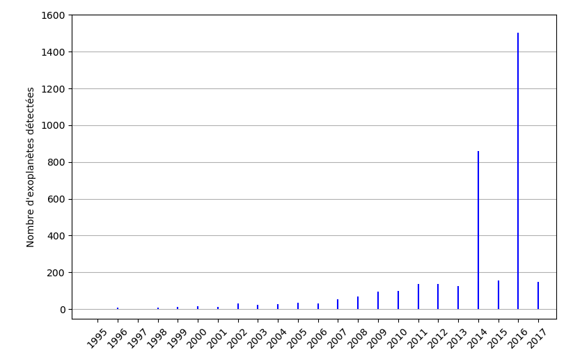
Figure: Nombre d'exoplanètes détectées chaque année depuis 1995. Le pic en 2014 est causé par la publication de 715 exoplanètes découvertes par le satellite Kepler. Ce dernier remet ça en 2016 avec 1 284 autres planètes.

Cela dit, on est encore très, très loin du compte : on estime qu'il y a plus de 100 milliards d'exoplanètes rien que dans la Voie lactée.

[^ref-nombre-exo]: D'après [l'_Exoplanet Archive_](https://exoplanetarchive.ipac.caltech.edu/docs/counts_detail.html) ; nombres annuels via [la base de données publique de l'archive](https://exoplanetarchive.ipac.caltech.edu/cgi-bin/TblSearch/nph-tblSearchInit?app=ExoTbls&config=exomultpars).

## La nomenclature des exoplanètes

Savez-vous comment on nomme les exoplanètes ? Bien entendu, ces suites de lettres et de chiffres (telles que BD202457c, HD11964b, HD4208b, etc.) ne sont pas données au hasard. Pour commencer, on se base sur le nom de l'étoile, qui comporte en premier une suite de lettres. Cette partie désigne le catalogue d'étoiles.

Par exemple, Gliese est un catalogue qui recense toutes les étoiles se situant à moins de 25 parsecs de la Terre. Parmi les autres catalogues souvent utilisés, notons le catalogue Henry Draper (HD) et l'*International Celestial Reference Frame* (IRCF).

Ensuite, les numéros suivants sont attribués soit par ordre de découverte des étoiles, soit en rapport avec la date ou l'heure de la découverte, ou bien le plus souvent par rapport aux coordonnées spatiales de l'étoile, en faisant un découpage du ciel par tranches. Ces deux parties assemblées nous donnent la dénomination de l'étoile.

Enfin, pour avoir le nom de l'exoplanète, on ajoute une lettre de l'alphabet, dans l'ordre de découverte d'exoplanètes autour de l'étoile concernée. Certains noms de planètes ne prennent pas leur nom à partir d'un catalogue, mais à partir du nom du télescope spatial qui les a découvertes, à l'instar de Kepler-10b.

# Comment détecte-t-on les exoplanètes ?

Repérer des planètes a jusqu'à présent été, dans notre système solaire, _relativement_ simple.
La majorité d’entre elles ont été découvertes par observation directe[^note-planetes-observables-directement] et celles restantes par observation de leur influence sur des corps visibles[^note-planetes-observables-indirectement].
Pour les exoplanètes c'est une autre histoire : du fait de leurs distances très importantes à la Terre, il n'est généralement pas possible de les observer directement en pointant un télescope. Il faut donc trouver d'autres moyens pour les détecter, et on a mis du temps à pouvoir le faire.

On distingue deux grandes catégories de méthodes utilisées pour détecter les exoplanètes : les méthodes _directes_ et _indirectes_. Les méthodes indirectes sont ainsi nommées, car on observe uniquement les conséquences de la présence de l'exoplanète, sans jamais voir la planète en elle-même.

[^note-planetes-observables-directement]: Mercure, Vénus, Mars, Jupiter, Saturne et Uranus (bien qu'on ait mis du temps pour cette dernière).
[^note-planetes-observables-indirectement]: À ce jour, parmi les planètes, seule Neptune a été détectée ainsi (en constatant qu'elle perturbait l'orbite d'Uranus). Ce fut également le cas de Pluton, perturbatrice de Neptune, mais cette dernière n'est plus qu'une planète naine.

## La méthode du transit

L'idée de la méthode des transits est simple : lorsqu'une planète passe devant son étoile, l'étoile brille un peu moins fort — de la même façon que si vous mettez votre poing devant une lampe, vous allez être moins éclairé par cette dernière. On observe donc des étoiles en cherchant des diminutions régulières de luminosité ; si sur plusieurs années on vérifie que le phénomène est bien périodique — vu qu'il doit se reproduire à chaque fois que la planète passe devant son étoile —, alors on peut affirmer avoir découvert une exoplanète.

En bonus, cette méthode permet également d'estimer la taille de la planète par rapport à celle de l'étoile, en regardant à quel point l'étoile est occultée par cette dernière.

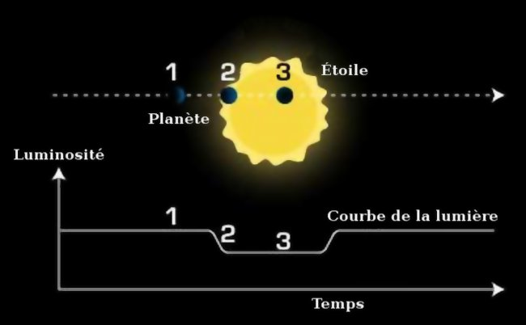
Figure: Illustration simplifiée de la méthode des transits. Lorsqu'une planète passe devant son étoile, elle l'occulte partiellement ; cette occultation est visible depuis la Terre. Source : traduction d'une [illustration de la NASA](http://web.archive.org/web/20070711043415/http://planetquest.jpl.nasa.gov/images/transit.jpg) (lien d'archive).

Ce n'est malheureusement pas toujours aussi simple. Les planètes sont rarement seules autour de leur étoile (regardez notre système solaire qui en a huit, par exemple). Dans de tels cas, on observe de multiples variations d'intensité se superposant ; il faudra alors réussir à séparer les différentes planètes.

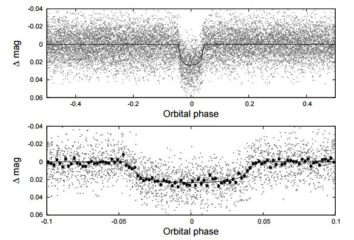
Figure: Variation de l'intensité lumineuse (magnitude, « mag ») telle qu'observée par un télescope, ici sur une Jupiter chaude. Le graphique en dessous est un zoom de la vue d'ensemble au dessus.[^ref-graph-variations]

[^ref-graph-variations]: Source : [_HATS-18b: An extreme short-period massive transiting planet spinning up its star_, Penev et al., arXiv](http://arxiv.org/pdf/1606.00848v2.pdf).

Un des pionniers dans le domaine a été le télescope spatial franco-européen CoRoT. L'étude des exoplanètes n'était pas son but unique, mais il a réussi brillamment cette partie de sa mission entre son lancement fin 2006 et sa désactivation en 2014.

Un autre instrument assez connu est plus récent. Il s'agit du télescope spatial Kepler, lancé en mars 2009, en orbite autour du Soleil. Celui-ci utilise principalement la méthode du transit, mais aussi dans un moindre mesure la méthode des vitesses radiales.

Des successeurs possibles pourraient être les projets européens Gaia et PLATO, bien que ce dernier ait été reporté une première fois. Le premier, déjà en service depuis 2013 et qui devrait le rester jusqu'en 2020, ne se concentre pas sur les exoplanètes, son objectif étant plus largement de cataloguer (un petit bout de) la Voie Lactée. Le second, dédié, lui, à la recherche de planètes extra-solaires, devrait être lancé vers 2024.

### En savoir un peu plus sur les planètes ?

La méthode du transit permet d'avoir directement deux informations sur l'exoplanète détectée :

- la **période de révolution** autour de l'étoile, qui vient directement de la durée séparant deux observations de baisse d'intensité similaires ;
- la **taille de l'exoplanète relativement à l’étoile** : la baisse d’intensité correspond à la proportion de la surface apparente de l’étoile couverte par l’exoplanète.

C'est un bon début, mais si on connaît un peu l'étoile autour de laquelle orbitent les planètes, on peut aller plus loin. Avec la taille de l'étoile, on peut facilement connaître la taille de la planète, en la déduisant de la proportion de la lumière occultée par la planète. Mais ce n'est pas tout.

Si la masse de l'étoile est connue, et qu'on la suppose très grande devant celle de la planète, on peut aussi connaître la forme de l'orbite de la planète. En effet, les planètes décrivent une ellipse autour de leur étoile, et il existe une relation, appelée la _troisième loi de Kepler_, qui relie le _demi-grand-axe_ de l'ellipse (sur la figure ci-dessous, $a$) à la durée que met la planète à en faire le tour[^note-troisieme-loi-kepler].

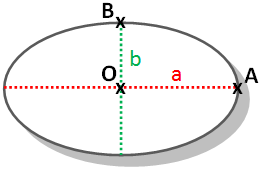
Figure: Une ellipse. Le _demi-grand axe_ correspond à la distance entre les points $O$ et $A$, $a$.

[^note-troisieme-loi-kepler]: Plus précisément, la troisième loi de Kepler dit que le carré de la période — c’est-à-dire la durée au bout de laquelle la planète a fait un tour — est proportionnel au cube du demi-grand-axe, autrement dit $T^2=k \cdot a^3$ (où $T$ est la période et $k$ un nombre que l'on peut calculer). Si vous voulez en savoir plus sur les lois de Kepler, vous pouvez [consulter ce cours](https://www.uu.edu/dept/math/SeniorPapers/09-10/DavisEmily.pdf) qui en donne une description et une démonstration (nécessite un petit bagage mathématique cela dit ; en anglais), ou plus simplement [l'article de l'encyclopédie Wikipédia sur le sujet](https://fr.wikipedia.org/wiki/Lois_de_Kepler) (en français).

### Limites de la détection par transit

Cette méthode est très efficace pour détecter les exoplanètes ; cependant, elle ne peut s'appliquer que dans certains cas précis. En effet, l'inclinaison de l'orbite de l'exoplanète autour de son étoile doit approcher les 90°, c'est-à-dire qu'on doit voir le système étoile-planète par la tranche. Si ce n'est pas le cas, on ne pourra pas voir depuis la Terre la planète passer devant l'étoile, rendant cette méthode inutilisable. Cette méthode favorise la détection des planètes grosses orbitant proche de leur planète.

## La méthode des vitesses radiales

Lorsqu'une planète tourne autour d'une étoile, l'étoile attire bien entendu la planète à elle, mais l'inverse est également vrai : la gravité marche dans les deux sens. En conséquence, une étoile ayant des planètes n'est pas parfaitement fixe : elle tourne autour d'une toute petite orbite, comme [illustré de manière exagérée sur cette animation](https://zestedesavoir.com/media/galleries/2377/0ffe00c6-5838-41fd-b8b5-11baf091895c.gif)[^ref-animation-influence-reciproque], sa position étant influencée par ses planètes.

Vu de la Terre, en supposant que l'on voit le système à peu près [par la tranche](https://zestedesavoir.com/media/galleries/2377/341b8974-1230-457e-947b-d20b01fd08e8.gif)[^ref-animation-influence-reciproque], on observe l'étoile s'approcher et s'éloigner en boucle, régulièrement. Sa _vitesse radiale_[^note-vitesse-radiale] change en continu. On ne peut pas observer directement la modification de distance en pointant un télescope et en se contentant de regarder — la variation de luminosité est bien trop faible. Cela dit, grâce à l'effet _Doppler-Fizeau_[^note-doppler-ambulances], on peut détecter ces mouvements de l'étoile et ainsi savoir si une ou plusieurs planètes se cachent autour d'elle. Explications.

L’effet Doppler fonctionne ainsi : un rayon lumineux a une longueur d’onde associée ; on pourrait de manière simpliste prendre la métaphore d’une mer avec des vagues extrêmement régulières dans le temps. En courant vers la mer, on rencontrera plus de vagues qu’en restant immobile : de notre point de vue, la durée entre deux vagues diminue. En restant immobile, on en rencontrera plus qu’en courant vers les terres. Eh bien, pour les rayonnements lumineux, c’est la même chose : si l’étoile s’éloigne de nous, la longueur d’onde grandit, et la lumière sera décalée vers le rouge. Si l’étoile s’approche, la longueur d’onde diminue, et la lumière sera décalée vers le bleu. Ainsi, en regardant la variation de longueur d'onde de la lumière, on peut en déduire la vitesse radiale de l'étoile.

Pour la suite, il nous faut savoir d'où vient la lumière des étoiles. La _loi de Planck_ précise que tout objet émet des radiations, et que ces radiations sont d'autant plus intenses et avec une longueur d'onde faible que l'objet est chaud (c'est pourquoi un humain à 37 °C émet un peu d'infrarouges et très peu d'autres ondes, et que le Soleil émet beaucoup plus, avec un pic dans le domaine du visible). Les éléments présents dans l'étoile vont cependant absorber des rayonnements à des fréquences précises, ce qui laisse des marques (des _raies_) si on trace l'énergie des radiations en fonction de leur longueur d'onde sur un graphique (un _spectre_), comme présenté ci-dessous.

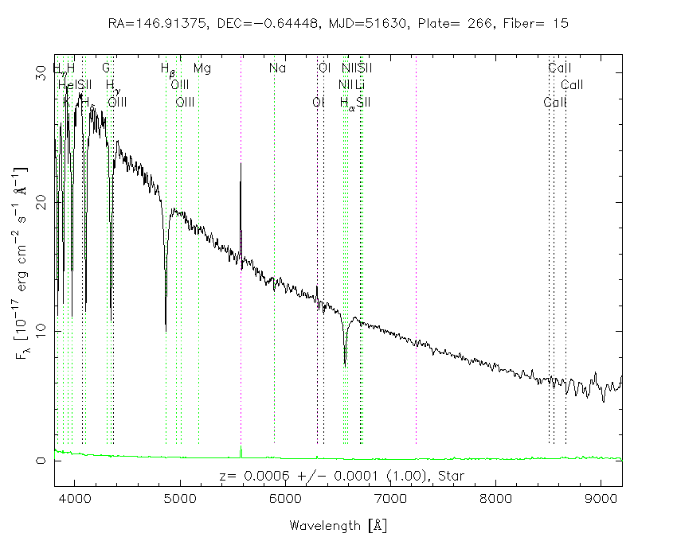
Figure: Des raies lumineuses pas si lumineuses. Source : _Sloan Digital Sky Survey_.

Toute seule, cette propriété permet déjà de connaître la composition de l'étoile, en associant les raies aux éléments dont on connaît la signature sur un spectre comme celui ci-dessus. On peut également déterminer la température de l'étoile grâce à la loi de Wien[^ref-loi-wien]. Mais on peut aller plus loin — c'est ici que l'effet Doppler-Fizeau entre en jeu.

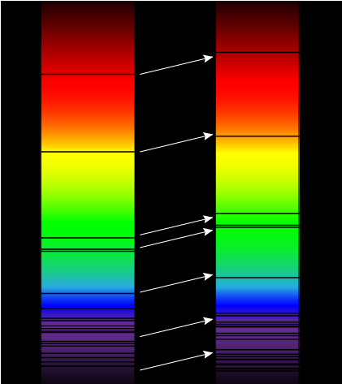
Figure: Décalage du spectre d'absorption. Les traits noirs sont les raies d'absorption mentionnées plus haut. À gauche, les raies sont représentées telles qu'on les voit si l'étoile est immobile. À droite, si l'étoile est en train de s'éloigner de nous. Les raies sont décalées vers le rouge. Crédit : physiquement-chimique.fr.

Si la longueur d’onde des raies d’absorption varie régulièrement dans le temps, on peut donc en déduire que l’étoile s’éloigne parfois plus rapidement de nous, et parfois moins rapidement, et qu’il y a un astre orbitant autour de l'étoile qui cause cet effet. En effet, les raies se décalent de la même manière que le spectre de l'étoile et sont plus facile à observer que le décalage du spectre entier. On a ainsi détecté une planète !

Pour mesurer ces raies lumineuses, on utilise un appareil de mesure nommé spectromètre (ou spectrographe) qui détermine les longueurs d'onde associées aux raies. Un des chasseurs d'exoplanètes les plus efficaces aujourd'hui est justement un spectromètre : il s'agit de l'instrument HARPS, appartenant à l'ESO et situé à La Silla, dans le désert d'Atacama au Chili. D'autres installations plus anciennes, qui n'avaient pas pour but originel la chasse aux exoplanètes, sont par exemple l'observatoire américain Keck, installé à Hawaï ou le Californien Lick, ou encore l’ancêtre suisso-européen de HARPS, CORALIE, également installé au Chili.

### Limites de la méthode des vitesses radiales

Cette méthode semblait être la plus efficace pour dénicher les exoplanètes, jusqu'à ce que Kepler trouve sa vitesse de croisière. Cependant, elle a ses restrictions : les exoplanètes découvertes sont d'une grande taille et d'une grande masse, et généralement proches de leur étoile, parce qu'il n'existe à l'heure actuelle pas d'instruments assez précis pour mesurer les variations créées par des planètes de la taille de la Terre ou trop éloignées. C'est pourquoi on a essentiellement découvert des Jupiter chaudes avec cette méthode. D'autre part, les étoiles doivent être assez lumineuses, afin d'avoir une résolution spectrale permettant la mesure précise des raies lumineuses.

[^ref-animation-influence-reciproque]: Animations créées par Reyk ([vu de dessus](https://commons.wikimedia.org/wiki/File:Doppspec-above.gif), [de côté](https://commons.wikimedia.org/wiki/File:Dopspec-inline.gif)) et publiées dans le domaine public.

[^note-vitesse-radiale]: La vitesse radiale d'un objet par rapport à un autre (ici, d'une étoile par rapport à la Terre) est la vitesse de déplacement de l'objet en ligne droite entre les deux objets uniquement, sans tenir compte des autres déplacements. Autrement dit, c'est la vitesse à laquelle se rapproche ou s'éloigne l'étoile de la Terre.

[^note-doppler-ambulances]: Oui oui, le même que celui des ambulances, si vous connaissez.

[^ref-loi-wien]: La loi du déplacement de Wien dit que la longueur d'onde maximale sur un spectre d'absorption est reliée à la température du corps associé. En termes mathématiques, $T = \frac{b}{\lambda_{max}}$ où $T$ est la température du corps, $\lambda_{max}$ la longueur d'onde maximale, et $b = 2,898 \cdot 10^{-3} \text{m}\cdot\text{K}$ une constante appelée la [_constante de Wien_](http://physics.nist.gov/cgi-bin/cuu/Value?bwien).

## L'effet de micro-lentille gravitationnelle

Les étoiles sont massives, très massives même. La théorie de la relativité générale prédit (et on le vérifie) que ces astres dévient la lumière qui passe à proximité. C'est lié, en simplifiant, au fait que la lumière suit la courbure de l'espace-temps déformé par la masse de l'étoile (comme illustré ci-dessous).

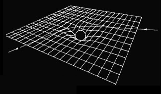
Figure: La lumière suit le plus court chemin dans l'espace-temps. Ce dernier étant sensiblement déformé par les étoiles, massives, la lumière y est déviée. Crédit : astropolis.fr.

Lorsqu'une autre étoile se trouve _derrière_ l'étoile que l'on veut observer, sa lumière est donc déviée, déformée par l'étoile observée. Celle-ci se comporte alors comme une lentille, comme illustré ci-dessous. L'effet de micro-lentille gravitationnelle fait que l'on reçoit plus de lumière, comme si le système était plus gros qu'il ne l'est vraiment. Ce phénomène permet de faciliter la détection des planètes orbitant autour de l'étoile lentille, qui ne réémettent que peu de lumière.

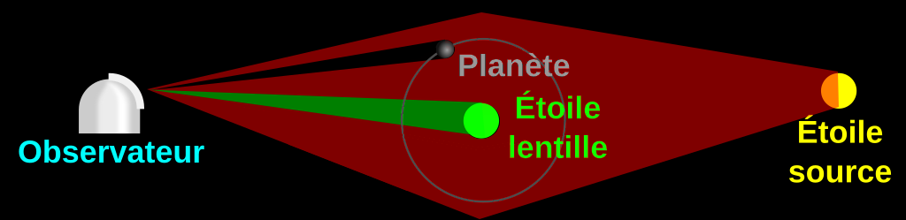
Figure: La lumière est déviée autour de l'étoile centrale que l'on cherche à observer. La déviation grossit l'image d'éventuelles planètes et augmente leur luminosité, ce qui permet de les voir. Crédit : traduction et adaptation d'une [illustration de la NASA](https://commons.wikimedia.org/wiki/File:Gravitational_micro_rev.svg) placée dans le domaine public.

Cependant, cet effet n'est visible que lorsque le système étoile lentille -- Terre (observateur) est aligné, exactement comme sur un banc d'optique. Comme l'alignement n'arrive qu'une seule fois, la mesure ne peut pas être répétée, donc il n'y a pas de confirmation de la découverte possible par cette technique. Il faut alors en utiliser une autre, ce qui fait que l'effet de micro-lentille gravitationnelle reste très peu utilisé pour détecter des planètes. Cela dit, les observations faites par micro-lentilles servent aussi à d'autres domaines, comme la détection de la matière noire ou bien l'étude de la structure de notre galaxie.

Il n'y a guère que quelques projets actifs, dont PLANET/RoboNet, un réseau international de télescopes ayant pour but l'observation de planètes par micro-lentille, et OGLE, un projet polonais qui se concentrait initialement sur la détection de matière noire, mais qui a également permis de découvrir plusieurs exoplanètes.

## La photographie directe

Cette méthode est dite directe, car on cherche à observer directement des exoplanètes. On utilise pour ce faire de gros télescopes, comme le VLT[^note-vlt], situés à terre, dans des déserts en altitude comme celui d'Atacama au Chili, afin de réduire au maximum les effets perturbateurs de l'atmosphère terrestre sur les images prises. On peut aussi utiliser des télescopes spatiaux placés en orbite qui ne sont pas soumis à ce problème, à l'instar d'Hubble ou de son futur successeur, James Webb[^note-james-webb].

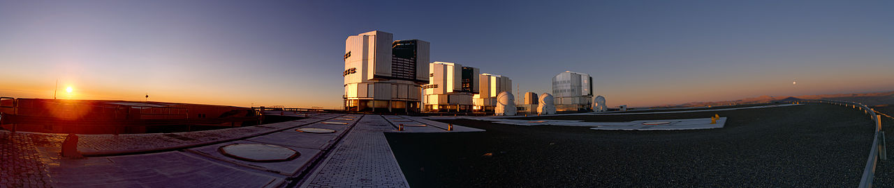
Figure: Le VLT (_Very Large Telescope_) de l'ESO. Crédit : [ESO/Y. Beletsky](http://www.eso.org/public/unitedkingdom/images/yb_vlt_pan_sunset_cc/) sous licence CC BY 4.0.

Pour avoir une chance d'observer des exoplanètes de cette manière, il faut occulter l'étoile qui émet trop de lumière et nous cache les éventuelles exoplanètes passant à ses côtés. Des instruments sont ou seront installés sur les principaux télescopes pour voir des exoplanètes. On trouve notamment le module SPHERE[^ref-sphere] sur le VLT, dans cet objectif.

Si ça peut sembler simple, c'est en réalité loin d'être trivial : lorsque l'on tente d'occulter un objet si petit (une étoile lointaine) de manière si précise (il ne faut cacher que l'étoile, pas les planètes...), la lumière se comporte bizarrement et complexifie l'observation (problématiques de diffraction notamment). Les modules d'observation tel que SPHERE doivent tenir compte de cette problématique en truchotant afin de contourner le problème.

[^note-vlt]: _Very Large Telescope_. Vous avez dit originalité ?

[^note-james-webb]: Le télescope [James Webb](https://fr.wikipedia.org/wiki/James-Webb_(télescope_spatial)) devrait être mis en orbite d'ici ~~2016~~ ~~2018~~ ~~2020~~ 2021 au point de Lagrange L2, pour remplacer Hubble qui commence à se faire vieux.

[^ref-sphere]: Vous trouverez plus d'informations sur SPHERE [sur cette page de l'ESO](https://www.eso.org/sci/facilities/paranal/instruments/sphere.html) (en anglais).

## D'autres méthodes de détection

Les techniques sus-citées sont celles qui sont majoritairement utilisées pour détecter des exoplanètes ; cela dit, il y en a d'autres, certes moins efficaces (référez-vous aux statistiques en fin de section pour vous en convaincre...).

Si on connaît déjà une exoplanète autour d'une étoile, on peut en détecter d'autres en utilisant une variante de la méthode des transits. S'il y a plusieurs planètes, elles vont se perturber les unes les autres, de la même façon qu'une planète perturbe la position de son étoile. Ainsi, la durée de rotation autour de son étoile de la planète connue varie légèrement. Cette méthode a l'avantage d'être extrêmement précise : on peut détecter des planètes de type Terre avec. Cependant, on a moins d'informations sur les planètes que par la méthode des transits.

Certaines planètes orbitent autour d'un pulsar, une étoile à neutrons qui a pour particularité d'émettre un rayonnement radio de manière extrêmement régulière (d'où son nom : l'étoile _pulse_). Si une telle étoile a une ou plusieurs planètes, il se produit la même chose que pour la détection par vitesse radiale : le pulsar est balloté par sa planète, et ce mouvement sera visible, car il perturbera le cycle sinon parfaitement régulier de rayonnements radio.

D'autres étoiles variables ont également une telle pulsation suffisamment régulière pour se voir appliquer une technique similaire à celle des pulsars ; cela dit, ça reste moins précis, car la période n'est pas aussi exacte que celle d'un pulsar.

Il y a encore d'autres méthodes, mais qui sont soit très similaires aux méthodes sus-citées, soit bien moins efficaces que celles citées dans cet article. À ce propos...

## Quel succès pour ces méthodes ?

Comme mentionné plus haut, toutes ces techniques ne se valent pas en termes d'efficacité. Deux d'entre elles se distinguent tout particulièrement : la méthode des transits et celle des vitesses radiales. Les autres méthodes, bien qu'utiles, n'ont pas permis la détection d'autant de planètes.

Le tableau qui suit précise combien de planètes ont été détectées par chacune des méthodes existantes[^ref-methodes-detection].

Méthode | Planètes détectées 
------|-----
Transit | 2 788
Vitesse radiale | 664
Microlentille | 53
Photographie | 44
Variation du moment de transit | 15
Variation de la durée d'éclipse | 9
Modulation de la luminosité orbitale | 6
Variations infimes de la périodicité des pulsars | 6
Variation de la période de pulsation des étoiles variables | 2
Astrométrie | 1

Au début des techniques de détection, la méthode des vitesses radiales était la meilleure dans les faits ; cela dit, elle s'est fait supplanter par la méthode des transits, bien plus efficace depuis qu'elle est au point.

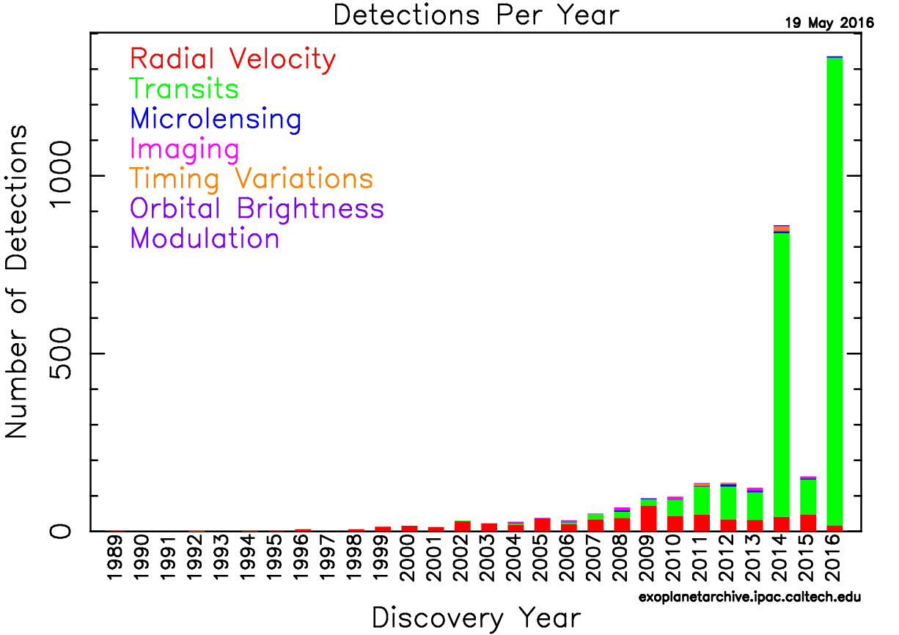
Figure: Le succès des différentes méthodes de détection au fil des années.

[^ref-methodes-detection]: Au 1^er^ février 2018. Source : [_NASA Exoplanet Archive_](http://exoplanetarchive.ipac.caltech.edu/docs/counts_detail.html).

# Les exoplanètes et la vie

La présence de la vie hors de la Terre est un sujet qui passionne [depuis longtemps](https://fr.wikipedia.org/wiki/Canaux_martiens), et la découverte d'exoplanètes relance l'espoir. Posons-nous donc les questions suivantes : existe-t-il de la vie ailleurs que sur Terre ? Nous nous bornerons à « une vie telle que nous la connaissons » ; en effet, s'il existe une vie basée sur des mécanismes très différents, nous ne connaissons pas les conditions favorables à l'émergence de cette vie.

## La zone d'habitabilité

L'idée de la zone d'habitabilité est que la vie a besoin d'eau liquide (donc assez d'énergie, mais pas trop), d'une atmosphère... pour apparaitre et survivre. On peut définir pour chaque étoile une limite de distance basse et haute dans laquelle les planètes seraient potentiellement habitables. Dans le système solaire, cette zone commence, selon les versions, un peu avant ou après Vénus, et s’arrête derrière Mars.

Ce concept de zone d'habitabilité, bien que très courant, est-il intéressant ? Pour vérifier cela, nous allons nous intéresser à une planète, Mars, et un satellite de Jupiter, Europe.

Premièrement, Mars est dans la zone d'habitabilité du système solaire. Pourtant, la surface de Mars n'est pas dans les bonnes conditions aujourd'hui pour voir apparaitre et se maintenir de la vie (faible température et pression empêchant la présence durable d'eau liquide). Être dans la zone habitable ne garantit pas la possibilité d'avoir de l'eau liquide.

Quant à Europe, un satellite de Jupiter, elle ne se trouve pas dans la zone d'habitabilité du système solaire. Pourtant, elle possède un océan liquide sous sa surface. En effet, si la présence de la vie sur place nous est inconnue, on sait qu'il est possible d'avoir de l'eau liquide sur un corps céleste situé très au-delà de la zone d'habitabilité. Dans le cas d'Europe, cela serait permis par les forces de marée dues à la présence très proche de Jupiter.

Bref, être dans la zone d'habitabilité ne semble ni suffisant, ni nécessaire. Cette zone ne tient compte ni de l'atmosphère (Vénus est très chaude avant tout à cause de son atmosphère très dense, Mars très froide entre autres à cause de la quasi-absence d'effet de serre) ni de la possibilité d'avoir de l'énergie autrement que par l'étoile (comme les effets de marée sur Europe).

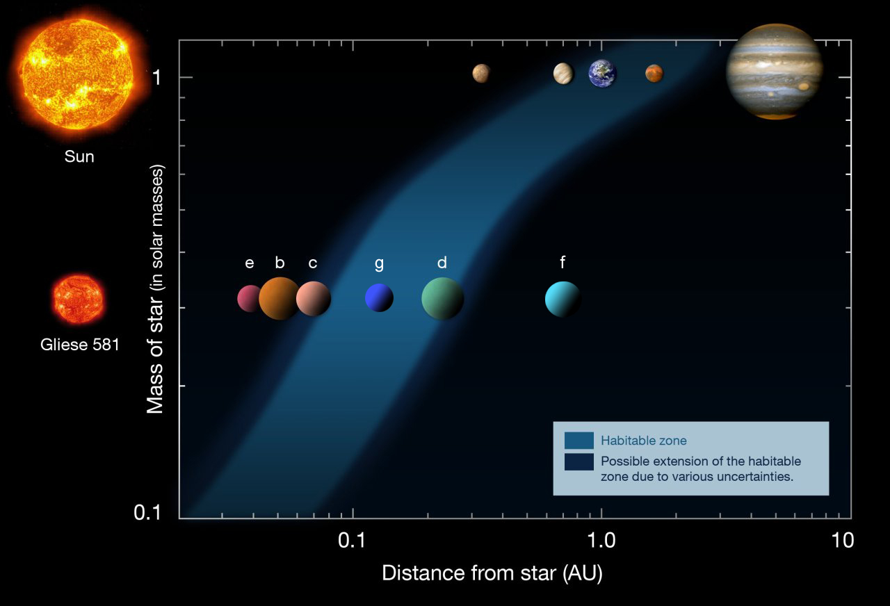
Figure: Zone d'habitabilité pour le système solaire et le système Gliese 581. [Source](https://commons.wikimedia.org/wiki/File:Gliese_581_-_2010.jpg?uselang=fr), par ESO, sous licence CC-BY 3.

[[question]]
| Mais peut-on détecter la présence de la vie ?

Concernant la vie elle-même, on ne peut pas la détecter directement. Par contre, on peut détecter, dans certains cas, la composition de l'atmosphère d'une planète. Il existe plusieurs biomarqueurs, des molécules dont la présence trahit une forte probabilité de vie à la surface de la planète. Certains, comme le dioxygène ou le méthane gazeux, sont détectables. Notons là encore des limitations, puisque le méthane peut être émis par des sources purement géologiques.

## Les possibles jumelles de la Terre

La vie telle que nous la connaissons pourrait donc apparaitre sur des planètes différentes de la Terre et ne pas apparaitre sur des planètes semblables (comme Mars). Cela ne nous empêche pas de nous demander s'il existe des jumelles à la Terre.

- Au titre de planète qui ressemble le plus à la Terre, HD 85512b est certainement en première ligne. C'est une super-Terre, à peine 40 % plus grande que notre planète, qui n'est pas particulièrement bien positionnée par rapport à son étoile (bien que dans la zone habitable), mais une couverture nuageuse renvoyant approximativement 50 % de l'intensité lumineuse pourrait lui permettre de posséder des températures au sol égales à celles de la Terre.
- Dans la même catégorie, on trouve Kepler-442 b. Elle a un rayon similaire à HD 85512b et est très proche de la zone habitable de son étoile. C'est l'une des planètes les plus similaires à la Terre.
- Une autre candidate au titre d'exoterre est Gliese 581d, découverte en 2007 et annoncée potentiellement habitable quatre ans plus tard. Parmi les quatre autres planètes orbitant autour de son étoile, une naine rouge, elle seule se trouve à une position qui lui permettrait, en ayant un fort effet de serre rendu possible par une atmosphère riche en CO~2~, d'avoir des températures vivables. Sauf que son statut est aujourd'hui considéré comme douteux, et sa détection est possiblement une erreur de mesure...
- Kepler 22b, dont la découverte a été annoncée en grande pompe par la NASA, était effectivement dans la zone habitable autour de son étoile. En revanche, sa taille ne fait aucun doute sur sa nature : possédant une atmosphère épaisse, et d'une masse 30 fois supérieure à celle de la Terre, elle devrait un peu ressembler à Neptune et être entièrement recouverte d'un océan.
- Enfin, on a un moment cru que Gliese 667Cc était une bonne candidate. Hélas, [elle subirait un verrouillage gravitationnel](https://arxiv.org/pdf/1311.4831.pdf) : la durée de la journée serait très proche de celle de l'année. Cela signifierait dans son cas que la même face pointerait toujours vers l'étoile, ce qui poserait des problèmes pour l'apparition de la vie. Les simulations prédisent même que la planète devrait fondre au moins en partie, ce qui ne semble cependant pas être le cas pour une raison inconnue, mais laissant toutefois peu d'espoir quant à son habitabilité. 

Bref, trouver une jumelle de la Terre est loin d'être facile ; trop grosse, trop loin, tournant mal autour de son étoile... Les raisons sont multiples. Et quand bien même on trouverait une telle jumelle, rien ne dit que l'on aurait une Terre et non pas une Mars, et rien ne dit que la vie serait effectivement apparue dessus.

------

S'il reste encore beaucoup de chemin à parcourir, notons le chemin accompli : nous sommes capables aujourd'hui de détecter des planètes à plusieurs dizaines d'années-lumière de la Terre, et d'estimer leur taille, masse et distance à leur étoile ! Des planètes de types jusqu'ici inconcevables ont été découvertes, remettant en question les modèles de formation des systèmes planétaires.

Un très grand merci à [adri1](https://zestedesavoir.com/membres/voir/adri1/) pour ses retours lors de la béta et à [Anto59290](https://zestedesavoir.com/membres/voir/Anto59290/) et à [Aabu](https://zestedesavoir.com/membres/voir/Aabu/) pour la valeureuse validation de ce très long article. :)

*[CoRoT]: COnvection, ROtation et Transits planétaires
*[HARPS]: High Accuracy Radial velocity Planet Searcher
*[PLATO]: PLAnetary Transits and Oscillations of stars
*[PLANET]: Probing Lensing Anomalies Network
*[RoboNet]: Robotic Telescope Network
*[OGLE]: Optical Gravitational Lensing Experiment
*[VLT]: Very Large Telescope
*[ESO]: European Southern Observatory
*[SPHERE]: Spectro-Polarimetric High-contrast Exoplanet REsearch