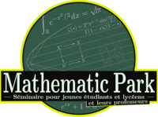
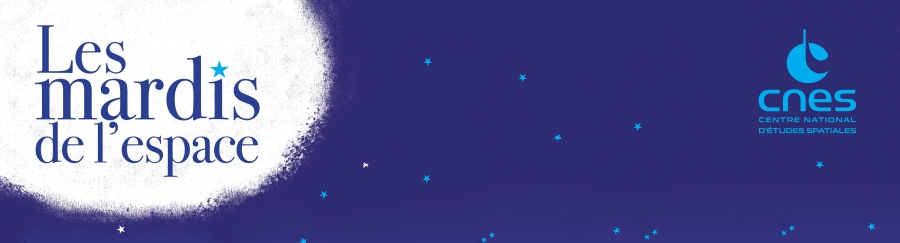
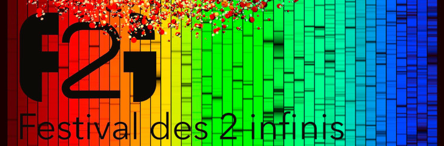
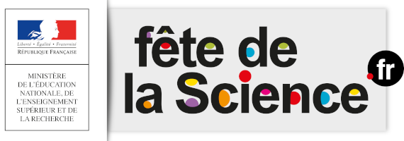
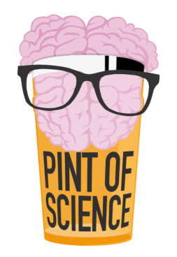

Paris est depuis la nuit des temps une ville rayonnante dans le domaine des sciences sur le plan mondial. Ce que l'on sait moins, c'est que ce qui s'y passe n'est pas seulement réservé à l'élite intellectuelle. De nombreuses conférences pour se mettre à la page ou explorer de nouveaux domaines sont ouvertes à tous les curieux et les curieuses !

Mais dans la jungle des sites scientifiques, il peut être compliqué de trouver ce que l'on cherche. Voici donc un petit récap' d'événements, la plupart cycliques, auxquels vous pouvez participer dans les domaines qui vous intéressent. La majorité d'entre eux sont gratuits (et ceux qui ne le sont pas sont très accessibles) afin que la culture reste à portée de tous.

# Les événements autour des mathématiques

## Mathematic Park

_Mensuel – 1h30 – Institut Henri Poincaré, Paris_

Organisé depuis 2011 à l'Institut Henri Poincaré, [Mathematic Park](http://www.ihp.fr/fr/seminaire/mathematic-park) (plus souvent appelé _Math Park_) propose **des conférences d'environ 1h30 sur des sujets très variés**. Destiné à un public ayant un niveau en mathématiques minimum de bonne Terminale S, il attire de tous les âges lors de ses événements organisés plusieurs samedi après-midi par an. L'inscription est gratuite mais demeure obligatoire. Il existe une newsletter pour se tenir au courant des prochains évènements.

->  <-

Intrigué ? Voici quelques-unes des dernières rediffusions pour vous donner une idée de ce à quoi cela ressemble : 
- [_Baisers apolloniens_](https://youtu.be/HLJfWGwa6Y4) d'Antoine Chambert-Loire
- [_Le transport optimal_](https://www.youtube.com/watch?v=Vyjf7TnUYKk) de Gabriel Peyré
- [_Le retournement de la sphère_](https://youtu.be/Gaqic4JOtf8) de Patrick Massot
- [_Automates cellulaires et correction d'erreurs_](https://youtu.be/o5n55dKvoJU) d'Irène Marcovici
- [_Marches aléatoires et réseaux éléctriques_](https://youtu.be/5Koo30bTddA) de Nicolas Curien

[[information|Je ne peux pas me déplacer…]]
| Ces conférences sont retransmises en direct, donc amis de la brousse[^brousse] (tout ce qui est à l'extérieur du grand Paris) vous savez quoi faire !  
| Au-delà du direct, Math Park existe aussi [à Rennes](http://www.ihp.fr/fr/seminaire/mathpark-rennes) ; de plus, un événement fortement inspiré est [organisé à Lyon](http://sml.ens-lyon.fr).

## Une question, un chercheur

_Biannuel – Institut Henri Poincaré, Paris_

Une à deux fois par an, l'Institut Henri Poincaré organise _Une question, un chercheur_, **rencontre entre élèves de classes préparatoires ou de licence et chercheurs sur des thématiques scientifiques diverses** — des thématiques qui se limitent rarement aux mathématiques. Comme pour MathPark, ces conférences sont gratuites, mais il est nécessaire de s'y inscrire pour y assister.

Vous pourrez trouver les liens pour s'y inscrire ainsi que la liste de toutes les conférences depuis la création d'_Une question, un chercheur_ en 2008 [sur le site internet de l'Institut Henri Poincaré](http://www.ihp.fr/fr/conference/question-chercheur).

[[information|Je ne peux pas me déplacer…]]
| _Certaines_ de ces conférences sont rediffusées sur le site de l'IHP (lien plus haut). Dans la liste des anciennes conférences, cherchez le lien « Visionner ». Sinon… eh bien, c'est dommage :( .

## Séminaire d'histoire des mathématiques de l'Institut Henri Poincaré

_Cinq fois l'an – Institut Henri Poincaré, Paris_

On reste à l'Institut Henri Poincaré (décidément, que ferions-nous sans eux ?), mais pour un événement avec une histoire bien plus longue car fondé en 1948. Le _séminaire d'histoire des mathématiques_ organise 5 séances par an le vendredi dont l'objectif est d'être **un lieu d'échange entre mathématiciens et historiens**. Ces évènements ne sont donc pas simplement les hôtes de conférences sur les avancées de la recherche en mathématiques d'un certain sujet, mais aussi de tables rondes et de discussions. [Plus d'informations sur le programme par ici](http://www.ihp.fr/fr/seminaire/SHM-programme) !

[[information|Je ne peux pas me déplacer…]]
| Depuis quelques années, les séminaires sont généralement [filmés et rediffusés sur YouTube](https://www.youtube.com/playlist?list=PL9kd4mpdvWcBqlCTU03tGTGKQPF0kq2pJ).

## Un texte, un mathématicien

_Trimestriel – Institut Henri Poincaré, Paris_

La Banque Nationale Française ainsi que la Société Mathématique de France organisent quatre fois par an à la Bibliothèque Nationale de France une lecture d'un texte mathématique datant d'au moins plusieurs dizaines d’années afin de mieux comprendre les problématiques actuelles. Destinées au grand public, aux professeurs du second degré, aux lycéens et étudiants, retrouvez toutes les informations concernant les précédentes lectures et surtout les suivantes [sur le site de la Société Mathématique de France](http://smf.emath.fr/cycle_texte_mathematiciens).

[[information|Je ne peux pas me déplacer…]]
| _Certaines_ de ces conférences sont rediffusées sur le site de la SMF (lien plus haut)  
| Les conférences ont parfois lieu dans d'autres villes que Paris.

## Betty B et N. Bourbaki

_Tous les quelques mois – ENS Ulm_

Plus récents que les autres séminaires puisqu'il a démarré fin 2017, [Betty B](http://www.bourbaki.ens.fr/seminaires/2019/index.html#seminairebettyb) propose **des conférences aux jeunes mathématiciens** se tenant à l'ENS ou à l'IHP. C'est une prolongation d'un séminaire existant, le séminaire N. Bourbaki créé par l'ancêtre de Betty Bourbaki, qui est à destination des mathématiciens et mathématiciennes chevronnées. Betty B reprend les mêmes sujets que le N. Bourbaki en les abordant de façon plus accessible, de quoi permettre aux étudiants d'approcher certains pans plus ardus des mathématiques !

Pour rester informé des prochains séminaires, le plus simple est de suivre [le compte Twitter de Betty B](https://twitter.com/Betty_Bourbaki).

[[information|Je ne peux pas me déplacer…]]
| Il ne semble pas exister de moyen de suivre ces séminaires sans être physiquement présent sur place, malheureusement.

*[ENS]: École Normale Supérieure
*[IHP]: Institut Henri Poincaré
*[SMF]: Société Mathématique de France

[^brousse]: Soyons fiers de ne pas être parisiens <3

# Les événements autour de la physique

## Les _Mardis de l'Espace_

_Mensuel, tous les troisièmes mardis du mois – Deux heures – Quartier du Pont Neuf, Paris_

Organisés depuis 2011 tous les troisièmes mardis du mois[^troisieme] par le CNES, les _Mardis de l'Espace_ sont **des discussions traitant de sujets variés liés à l'espace** et généralement aux activités du CNES, **entre plusieurs chercheurs travaillant directement sur la question**, et le public bien sûr.

Le sujet varie tous les mois. On peut y parler de missions spatiales (Cassini, BepiColombo, InSight/SEIS…), de satellites (Galileo, CFOSAT, Taranis…), de sujets plus larges (les astéroïdes et la façon dont le CNES les étudie, …) voire à la limite du politique (Charte Espace…) ou philosophique (“Comment vivra-t-on dans l'espace ?”). En plus de tout cela, un pianiste improvisateur ponctue la soirée d'intermèdes musicaux et de parodies de chansons franchement bien faites en se basant sur la conversation du moment.

->  <-

Les sujets sont présentés pour le grand public : cela se veut **accessible à tous**, sans aucun prérequis. N'hésitez donc pas ! Et pour les personnes connaissant déjà le sujet, les chercheurs se font généralement un plaisir d'aller plus loin.

C'est gratuit[^gratuit] et en accès libre (aucune inscription nécessaire), de 19h30 à 21h30 au cœur de Paris : au [_Café du Pont Neuf_](https://www.openstreetmap.org/#map=19/48.85884/2.34132) d'octobre à décembre 2018, puis au [_Café Le Lutèce_](https://www.openstreetmap.org/#map=19/48.85269/2.34347) de janvier à juin 2019. Cela dit, d'expérience, je recommande d'arriver un peu en avance pour avoir des places assises.

[Le programme de la saison 2018 – 2019 est **disponible en ligne**.](https://cnes.fr/fr/mardis-de-lespace-2018-2019)

[[information|Je ne peux pas me déplacer…]]
| Si vous êtes dans cette situation, deux options s'offrent à vous.
| - Tout d'abord, les Mardis sont systématiquement retransmis en direct [sur Twitter](https://twitter.com/search?f=tweets&vertical=default&q=%23CNESTweetup&src=tyah) en suivant le mot-dièse officiel [#CNESTweetup](https://twitter.com/search?f=tweets&vertical=default&q=%23CNESTweetup&src=tyah). On perd la musique, mais le reste y est !
| - Ensuite, un peu plus tard, un enregistrement audio des Mardis est rediffusé en podcast sur [iTunes](https://geo.itunes.apple.com/fr/podcast/les-mardis-de-lespace/id1078192698?mt=2) ou [votre lecteur de flux RSS favori](http://www.cnes-multimedia.fr/podcast/mardi-espace.xml).

*[CNES]: Centre National d'Études Spatiales
*[InSight]: INterior exploration using Seismic Investigations, Geodesy and Heat Transport
*[SEIS]: Seismic Experiment for Interior Structure
*[CFOSAT]: Chinese-French Oceanic SATellite
*[Taranis]: Tool for the Analysis of Radiation from lightning and Sprites (mais aussi le dieu gaulois de la foudre et du tonnerre)

[^troisieme]: Enfin, sauf exceptions…
[^gratuit]: Le café hébergeant la soirée _peut_ exiger une consommation.

## Le festival des deux infinis

_Annuel – Septembre à octobre – Paris (lieux multiples)_

Tous les ans, autour de la Fête de la Science (voir plus bas), l'Association française d'Astronomie organise le [_Festival des Deux Infinis_](https://www.afastronomie.fr/festival-2-infinis) à Paris — l'infiniment grand et l'infiniment petit. C'est une très bonne occasion si on est intéressé par l'astronomie : un très grand nombre de manifestations seront rassemblées pendant un mois à Paris, avec beaucoup d'occasions de découvrir, ou re-découvrir, des choses qu'on a pas forcément l'occasion de voir. Le festival est notamment constitué, en fonction des goûts de chacun :

- d'un **marathon de conférences** sur des sujets variés (mais néanmoins liés à l'astronomie ou aux sciences physiques) pendant deux jours, sur le campus Pierre et Marie Curie de Sorbonne Université[^SU] ;
- de **plusieurs nuits et journées d'observation** des étoiles et du Soleil au parc Montsouris ;
- de multiples **portes ouvertes, conférences…** dans des clubs d'astronomie, laboratoires… ;
- des **randonnées astronomiques dans Paris**, organisées autour du patrimoine astronomique riche de la capitale…

Ainsi que parfois des concours, défis, et autres animations occasionnelles.

->  <-

Le Festival est organisé par l'AFA, une association basée à Paris qui organise beaucoup d'autres événements à Paris et ailleurs. N'hésitez pas à aller voir [sur leur site web](https://www.afastronomie.fr) pour voir ce qui existe à d'autres moments de l'année ou près de chez vous !

[[information|Je ne peux pas me déplacer…]]
| Les conférences sont souvent diffusées en direct sur internet, ou enregistrées pour être rediffusées par la suite sur le site de l'AFA. Par contre, les portes ouvertes et autres conférences ne sont pas rediffusées : il faut être sur place. Quant aux séances d'observation, si vous voulez mon avis, préférez profiter du ciel hors de Paris : il y a de grandes chances qu'il soit meilleur…
|
| Au-delà de ça, l'AFA organise beaucoup d'événements hors de Paris (ainsi que des voyages astronomiques). N'hésitez pas à consulter [leur site](https://www.afastronomie.fr) qui est très complet !

*[AFA]: Association Française d'Astronomie

[^SU]: Anciennement campus Jussieu de l'Université Pierre et Marie Curie.

## La _Yuri's Night_

_Annuel – 12 avril – Soirée – Dernier bar avant la fin du monde, Châtelet, Paris_

Yuri ? Gagarine, bien sûr ! La _Yuri's Night_ est **une soirée organisée en l'honneur de Youri Gagarine tous les 12 avril**, date du lancement historique de ce dernier à bord de Vostok 1 dans l'espace en 1961. À Paris, elle se tient généralement au _Dernier Bar avant la Fin du Monde_ et accueille des personnalités du domaine de l'exploration spatiale ou de la science, pour des conférences ou discussions autour du sujet.

->  <-

Beaucoup plus informelle que d'autres soirées conférences, elle permet des interactions très directes et passionnantes pour qui s'intéresse à l'exploration spatiale ou aux sciences qui lui sont associées. [N'hésitez pas !](https://yurisnight.net/events/gagarine-party-au-dernier-bar-avant-la-fin-du-monde/)

[[information|Je ne peux pas me déplacer…]]
| Pas sur Paris ? Aucun problème ! **La _Yuri's Night_ est un événement mondial.** Vous pourrez donc peut-être trouver un événement organisé [près de chez vous](https://yurisnight.net/events/) (ou même en [organiser un](https://yurisnight.net/events/edit/?action=edit)) !

## Les conférences de la _Cité des Sciences_ et du _Palais de la Découverte_

_Plusieurs fois par mois – Généralement une à deux heures_

La Cité des Sciences et le Palais de la Découverte, lieux de prédilection pour les sorties scolaires de tant d'établissements de la région, sont chacun **organisateurs de conférences grand public** sur des thèmes proches de **la physique pour le Palais de la Découverte** et **un peu plus général pour la Cité des Sciences**.

[Rendez-vous ici pour voir les prochaines conférences à la Cité des Sciences](http://www.cite-sciences.fr/fr/au-programme/animations-spectacles/conferences/), et [là pour celles du Palais de la Découverte](http://www.palais-decouverte.fr/fr/au-programme/activites/conferences/). À partir de ces pages, il est possible de s'inscrire à la newsletter vous informant des prochaines conférences.

L'entrée est gratuite et, sauf contre indication sur un évènement particulier, aucune inscription n'est nécessaire.

[[information|Je ne peux pas me déplacer…]]
| La Cité des Sciences et le Palais de la Découverte proposent d'assister en direct aux conférences sur le site de la Cité des Sciences au moment de la diffusion. Les rediffusions des conférences des deux centres [sont disponibles ici](http://www.cite-sciences.fr/fr/ressources/conferences-en-ligne/).

## Les conférences de l'*Institut d'Astrophysique de Paris*

*Un mardi par mois (sauf en juillet et août) – Entre une heure et une heure et demi – 14^ème^ arrondissement de Paris*

Un mardi de chaque mois, l'Institut d'Astrophysique de Paris organise **une conférence grand public dans le domaine de l'astrophysique** (la physique de l'infiniment grand : planètes, étoiles, trous noirs, entre autres…). Pendant une heure environ, **une chercheuse ou un chercheur parle d'un sujet qu'il connaît bien, avec des mots compréhensibles par le commun des mortels**. Ici, pas question d'équations à la craie sur un tableau noir, mais plutôt d'images et d'explications ! C'est l'occasion d'aborder les grandes questions de la Physique moderne, à l'instar de [la conférence _Relativité et quanta, l'impossible mariage ?_](https://www.canal-u.tv/video/iap/relativite_et_quanta_le_mariage_impossible.41059), ou bien de parler de l'actualité et des dernières découvertes, comme [cette conférence sur les ondes gravitationnelles](https://www.canal-u.tv/video/iap/premiere_detection_de_l_emission_gravitationnelle_et_lumineuse_d_une_fusion_d_etoiles_a_neutrons_la_naissance_d_une_nouvelle_astronomie_a_plusieurs_messagers.40165).

Sur le site web de l'IAP, [vous trouverez **la liste des prochaines conférences**](http://www.iap.fr/science/conferences/conferences.php?annee=2019) avec un résumé pour chacune d'elles et un lien vers un enregistrement vidéo pour les précédentes. L'accès aux conférences est gratuit, mais la réservation est obligatoire[^resa-iap]. Attention, certaines conférences succombent de leur succès, il s'agit d'être réactif !

[[information|Je ne peux pas me déplacer…]]
| Ne vous en faites pas ! Chaque conférence est enregistrée et disponible sur Internet quelques jours après. Cette page recense [tous les enregistrements de l'Institut d'Astrophysique de Paris](https://www.canal-u.tv/producteurs/iap), et ce n'est pas le choix qui manque !

*[IAP]: Institut d'Astrophysique de Paris

[^resa_iap]: La réservation est possible à partir du lendemain de la précédente conférence. Et souvent, uniquement  pendant quelques jours (car ça a du succès)…

# Les événements autour de… la science

Certains événements sont tellement larges qu'ils peuvent difficilement rentrer dans les deux catégories précédentes…

## _Science Shakers_

_Mensuel, chaque dernier mardi du mois – Soirée – Dernier bar avant la fin du monde[^sshk-lieu], Châtelet, Paris_

Plus une rencontre ouverte qu'une réelle conférence, [_Science Shakers_](https://iscpif.fr/projects/science-shakers/) est **une soirée qui vise à rassembler, faire connaître et ouvrir la discussion autour d'un thème généralement lié aux sciences**, en évitant d'y mettre trop de barrières. L'objectif ? Permettre **une rencontre enrichissante** entre passionnés et acteurs du domaine, ainsi que le partage d'expériences, d'idées… dans un cadre dynamique où [tout le monde a une voix](https://twitter.com/ScienceShakers/status/1065236289484664833) s'il le souhaite.

L'événement est organisé à la fin de chaque mois le mardi, dans le centre de Paris. Il est soutenu par l'ISCPIF.

[[information|Je ne peux pas me déplacer…]]
| …C'est dommage. À tout hasard, vous pouvez vérifier si un événement n'est pas organisé près de chez vous, mais sinon aucune retransmission n'est faite. Éventuellement, les soirées sont parfois _live-tweetés_ (surveillez le compte [@ScienceShakers](https://twitter.com/ScienceShakers)).

*[ISCPIF]: Institut des Systèmes Complexes de Paris île-de-France

[^sshk-lieu]: Sauf rares exceptions. Vérifiez sur leur site au cas où ;) .

## La Fête de la Science

_Annuel – France entière_

Chaque année, vers octobre, a lieu pendant une semaine la Fête de la Science. C'est un moment un peu particulier où **beaucoup d'écoles et institutions scientifiques ouvrent leur portes** et organisent des ateliers grand public dans le but de promouvoir la science. Sans forcément traiter de sujets particulièrement poussés, c'est pourtant une bonne occasion de rencontrer des gens qui viennent de sciences variées. Aussi, si vous avez des enfants (ou si vous en êtes un), **des contenus spécifiquement pensés pour les jeunes sont généralement proposés** un peu partout — ce qui peut faire une bonne initiation au monde de la science et pourquoi pas, de la recherche.

La fête de la science se déroule partout en France au même moment (mais est légèrement décalé en date pour les territoires d'outre-mer). Il y a très probablement des choses dans votre ville, donc n'hésitez pas à consulter le site de votre mairie !

->  <-

[[information|Je ne peux pas me déplacer…]]
| L'événement étant national, couvrant même l'outre-mer, il y aura probablement quelque chose près de chez vous :) .

## _Pint of Science_

_Festival annuel en mai – Soirées (environ 2h) – Monde entier – 2 €/$/£/ø_

Le Pint of Science est né d'un constat : l'univers pointu et distant des labos de recherche ou des universités donne l'impression que tout cela est terriblement compliqué, ennuyeux ou inaccessible. Sauf que non ! Pour briser ce stéréotype, **_Pint of Science_ invite des vrais chercheurs dans des cadres détendus** (généralement des bars) afin de démystifier tout ça et de faire découvrir au grand public la recherche scientifique — la vraie.

Organisé initialement en Angleterre, c'est aujourd'hui un festival mondial [présent dans 21 pays différents](https://pintofscience.com/) qui a lieu en mai (cette année, du 20 au 22 mai 2019). Rien qu'en France, l'an dernier, on trouvait des soirées [dans près d'une cinquantaine de villes](https://pintofscience.fr/).

Les soirées sont généralement découpées en séances de présentation de leurs travaux par un ou deux chercheurs, discussions ouvertes et accessibles avec le public, et quizz ou autres animations ponctuant tout cela. Et bien sûr en restant **accessible à tous les niveaux d'étude** (enfants compris, généralement) :) .

Une légère contribution financière est demandée, à l'opposé des autres événements présentés ici, afin de soutenir les frais d'organisation (2 € ou équivalent dans les monnaies locales).

Des soirées _Pint of Science_ sont parfois organisées hors du festival de mai, et sont alors généralement gratuites. Irrégulières, elles sont annoncées [sur Twitter](https://twitter.com/pintofscienceFR). Le _Pint_ s'invite aussi parfois à la Fête de la Science présentée plus haut.

[[information|Je ne peux pas me déplacer…]]
| À moins que vous n'ayez pas de chance et que vous viviez dans un pays dans lequel aucune soirée _Pint of Science_ n'est organisée, il y en a probablement une pas trop loin de chez vous. Sinon, certaines sont diffusées en direct (selon les possibilités) et beaucoup sur Twitter (surveillez [@PintOfScienceFR](https://twitter.com/pintofscienceFR) ou les comptes Twitter PintOfScience pour les autres pays).

## La Nuit européenne des Chercheur⋅e⋅s

_Annuel, en septembre – Europe_

L'objectif de la Nuit Européenne des chercheur⋅e⋅s se rapproche de celui du _Pint of Science_ : **reconstruire le lien entre les chercheurs dans leur monde scientifique, et le grand public**. Organisé par l'Union Européenne et présent dans une centaine de villes de l'UE (dont 12 en France), le thème change chaque année mais reste dans cette optique de partage et d'ouverture à tous.

Pour ce qui est de la France, [vous trouverez des détails sur le site officiel français](https://nuitdeschercheurs-france.eu). Concernant les autres pays, je vous invite à chercher directement sur internet — il n'y a pas de site global à l'échelle européenne récapitulant tout ce qui existe.

[[information|Je ne peux pas me déplacer…]]
| La majorité des conférences et soirées ne semblent pas être retransmises ou filmées, malheureusement. N'hésitez pas à vous renseigner au cas où, étant donné que ça peut varier en fonction des années.

## _Ma thèse en 180 secondes_

_Annuel – Pays francophones_

_Ma thèse en 180 secondes_ est **un concours de vulgarisation scientifique accessible aux doctorants francophones**, qui ont pour devoir de présenter leur sujet de thèse de façon accessible au grand public… en trois minutes. Ça en fait au passage **un bon moyen de découvrir ce qui se fait aujourd'hui en recherche scientifique** (du moins, en partie). Le concours existe [dans plusieurs pays francophones](https://fr.wikipedia.org/wiki/Ma_th%C3%A8se_en_180_secondes#Organisation), dont la France bien sûr.

Vous trouverez des détails sur les sites des différentes éditions (par exemple pour la [France](http://mt180.fr) ou la [Belgique](https://mt180.be/)), ou sur internet plus largement.

[[information|Je ne peux pas me déplacer…]]
| Si vous êtes anglophone, ce concours s'inspire de [_Three Minutes Thesis_](https://threeminutethesis.uq.edu.au/), littéralement son équivalent dans la langue de Shakespeare. Dans les deux langues, certaines des performances sont filmées et/ou diffusées en direct.

# Les rencontres informelles

Au fur et à mesure des conférences, les mêmes personnes ont tendance à se retrouver… et à vouloir se revoir dans un autre cadre plus détendu ! C'est ainsi que sont nées les rencontres plus informelles entre personnes intéressées par certains sujets.

## _The Last Jeudi_

Amis du spatial, prenez un siège et installez-vous confortablement ! Le _Last Jeudi_ est une soirée mensuelle (tous les derniers jeudis du mois — on dirait presque que c'est nommé exprès) de **rencontres, discussions, parfois présentations**, entre personnes intéressées par le spatial. Ouverte à tous dans des lieux conviviaux, c'est une très bonne occasion pour rencontrer des personnalités intéressantes et parfois influentes dans ce milieu !

->  <-

L'organisation se fait essentiellement [sur Twitter (@TheLastJeudi)](https://twitter.com/TheLastJeudi). Concrètement, et sauf changements[^changements], la soirée prend place au [Deux Point Zéro](https://www.openstreetmap.org/#map=19/48.86856/2.35433), dans le 2^ème^ arrondissement de Paris.

[[information|Je ne peux pas me déplacer…]]
| Si vous êtes dans une de ces villes, le _Last Jeudi_ est également présent [à Toulouse](https://twitter.com/TheLastJeudiTLS), [Cannes](https://twitter.com/TheLastJeudiCAN) et [Bordeaux](https://twitter.com/TheLastJeudiBDX) !

[^changements]: Si changements il y a, ils sont annoncés sur Twitter.

## Les agrumes rencontrent le savoir

[[question]]
| Les quoi ?

La communauté de Zeste de Savoir compte de nombreux passionnés de science. C'est la raison pour laquelle il est fréquent que plusieurs membres se retrouvent à des conférences et aillent prendre un verre par la suite. Vous pensez aller à une de ces conférences et voulez savoir s'il y aura d'autres zesteux ? **Toutes les informations sont sur le forum, [diffusées via ce sujet](https://zestedesavoir.com/forums/sujet/11712/les-agrumes-rencontrent-le-savoir/)**.

# Et en dehors de Paris ?

Tout ce que nous avons présenté ici est basé à Paris… malheureusement, la capitale est une plaque tournante rassemblant une bonne partie des événements. Mais ! Tout espoir n'est pas perdu si vous n'êtes pas en Île-de-France. Au-delà des nombreuses possibilités citées plus haut d'accès à distance aux contenus parisiens[^pas-me-déplacer], certains incontournables sont présents dans le reste de la France uniquement.

Sans forcément tout lister[^tout-lister], **on trouve pas mal de choses organisées dans les grandes villes françaises**, par exemple Lyon ou Toulouse, que ce soit par des institutions déjà axées sur la diffusion des sciences (observatoires, planétariums, musées… — telle l'incontournable Cité de l'Espace à Toulouse), ou de façon plus informelle.

À Toulouse, on pourra notamment citer l'[**Eurêkafé**](https://www.eurekafe.fr), qui non content d'héberger le _Last Jeudi_ sus-mentionné, est plus largement un **café des sciences et des curiosités** qui se fera un plaisir de vous offrir culture, science, événements (près d'une quinzaine par mois pour tous les goûts) et rencontres pour quelques euros, à deux pas du Capitole.[^eurekafe-paris]

Au delà de ça, **des festivals sont régulièrement organisés un peu partout en France**. Il y en a beaucoup, je vous invite donc à vous renseigner sur ce qui existe autour de chez vous, mais on pourrait mentionner notamment les ***[NightScapades](https://www.chasseursdenuits.eu/menu-fr/nightscapades/)***, un festival organisé à Lourdes, scientifique et culturel, autour de l’iconographie astronomique, du paysage nocturne et d’astrophotographie. Mais aussi le **[Festival d'astronomie de Fleurance](http://www.festival-astronomie.com)** (dans le Gers), un festival majeur autour de l'astronomie en France proposant de multiples rencontres, conférences, ateliers, etc. Et tant d'autres !

[^pas-me-déplacer]: Référez-vous aux encarts _Je ne peux pas me déplacer_.
[^tout-lister]: Déjà parce que je ne connais pas tant que ça le détail, étant basé à Paris, mais aussi car ça prendrait encore plus de temps que tout cet article ^^ .
[^eurekafe-paris]: C'est quand qu'on a ça à Paris, nous ?

------

Évidemment, cette liste ne sera jamais exhaustive. Il se passe tellement de choses qu'il est difficile de tout lister, un choix a donc été fait. Si vous trouvez qu'un événement manque dans cette liste (que vous en soyez ou non l'organisateur), n'hésitez pas à nous contacter.

Si vous voulez en voir encore plus, vous pouvez tenter de voir du côté d'associations visant à promouvoir la culture scientifique, tel que le [Collectif Conscience](https://collectifconscience.org) (par exemple [sur cette page](https://www.facebook.com/groups/115100272448413/)), ou [SpaceUP](https://www.spaceup.fr), une association organisant pas mal d'événements liés au spatial (dont le _Last Jeudi_).

Il n'existe pas de calendrier unifié de tous les événements qui existent, mais SpaceUP tient à peu près à jour [un calendrier spécifique à ce secteur](https://www.spaceup.fr/eventfrance/). N'hésitez pas à vous en servir ou à le compléter :) .

Alors, convaincu ? Inscrivez-vous, venez, et [préparez-vous à y voir d'autres zesteux](https://zestedesavoir.com/forums/sujet/11712/les-agrumes-rencontrent-le-savoir/) !