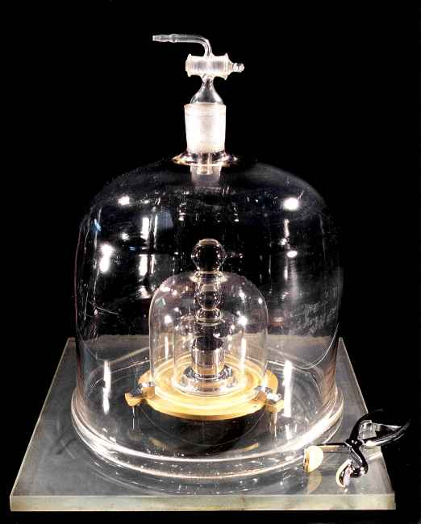
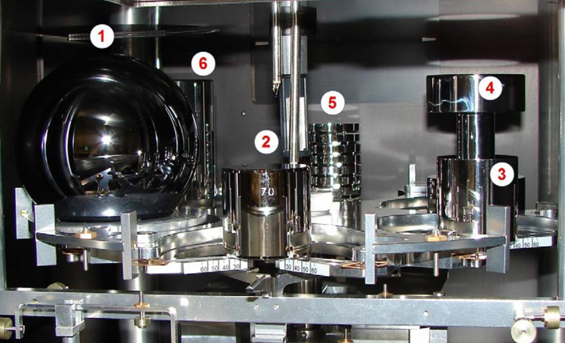

Pendant des dizaines d'années, le kilogramme a officiellement été défini comme la masse d'un objet stocké sous cloche et haute précaution dans la banlieue parisienne. Oui, vraiment ! C'est certes assez simple comme définition, mais pas vraiment pratique ou rigoureux… Il fallait changer ça !

Et ça tombe bien : du 13 au 16 novembre 2018 à Versailles, s'est tenue la 26^e^ réunion de la Conférence Générale des Poids et Mesures. Lors de cette grand-messe de la métrologie internationale, et après une dizaine d'années de travail, **une nouvelle définition du kilogramme a été adoptée**, accompagnée de nouvelles définitions pour l'ampère, la mole et le kelvin, **qui entrent en vigueur le 20 mai 2019**. La nouvelle définition du kilogramme ne change pas pour autant sa valeur, comme nous l'expliquerons dans cet article.

# Avant le 20 mai 2019, l'ancienne définition

Jusqu’à présent, une masse de 1 kg était définie comme la masse d’un objet appelé « prototype international du kilogramme » ou PIK, aussi surnommé « le grand $\mathbb{K}$ ». Autrement dit, **un kilogramme était la masse d’un certain objet pris pour référence**, dont la masse est *par définition* un kilogramme sans avoir besoin de le peser.

Ce prototype a été fabriqué à la fin du XIXᵉ siècle, est un cylindre constitué d’un alliage de 90 % de platine et 10 % d’iridium, qui lui donne une grande dureté, une bonne résistance à l’oxydation et une grande densité. Ces caractéristiques sont intéressantes pour assurer une soliditéet stabilité, et pour limiter sa taille. Le cylindre mesure 39,17 mm de haut et de diamètre, ce qui permet de minimiser la surface du cylindre exposée à l'air (et donc susceptible de s'abîmer). C'est plus petit qu'une balle de golf[^golf] !

## Pourquoi ça pose problème

Oui après tout, pourquoi ne pas se contenter de cette définition ? Eh bien elle pose plusieurs problèmes.

Tout d'abord, le prototype du kilogramme est un… objet, un vrai, physique et tout[^localisation-prototype], donc **comme tout objet sa masse peut changer.** Rayures, usure, ou même dépôt de poussières ou de molécules présentes dans l'air à sa surface… sont autant de facteurs pouvant causer des variations de masse. Oh, il est protégé, y'a pas de soucis à ce niveau, mais le problème, c'est que c'est **la** référence ! Comme par définition il pèse un kilogramme tout le temps, s'il gagne ou perds de la masse, c'est tous les kilogrammes du monde qui suivent. Gênant, un peu, surtout quand on sait que concrètement sa masse évolue.

En effet, on a des copies du prototype qu'on pèse régulièrement pour les comparer à l'original et… la différence existe et se creuse avec le temps, dans les deux sens ! Difficile donc de savoir précisément comment il a évolué, car il faudrait le comparer avec lui-même… Concrètement et à cause de ça, **la connaissance du kilogramme est limité à quelques microgrammes près**, ce qui peut sembler tout à fait satisfaisant dans la vie de tous les jours, mais pas du tout pour des usages scientifiques plus avancés.

Le second gros problème, c'est que comme le prototype est unique, il est **difficilement accessible**. D'autres unités (tel que le mètre, la seconde…) peuvent être reproduites dans n'importe quel laboratoire équipé, mais ce n'est pas le cas du kilogramme dans le cadre de cette vieille définition. Techniquement, pour connaître le kilogramme, on était obligé d'avoir le Prototype sous la main… ce qu'est un privilège extrêmement rare : il n'est sorti de ses coquilles, pour le comparer avec les copies et en faire de nouvelles, que tous les 50 ans !

Certes, il y a les copies pour compenser, mais comme on l'a vu, il n’est pas garanti que la masse de la copie soit véritablement proche de celle du prototype. Or **tout le système de métrologie dépend du prototype** : les copies servaient aux laboratoires nationaux, qui possèdent les balances les plus précises, qui servaient elle-même à calibrer les balances des laboratoires de métrologie plus nombreux mais moins précis, qui servaient à leur tour à calibrer les appareils communs dans les laboratoires industriels ou académiques, qui sont utilisés pour (enfin) peser des choses !

Ces problèmes étaient anticipés depuis bien longtemps, mais ils devenaient de plus en plus lourds à porter pour la communauté scientifique. Il fallait faire mieux ! Mais comment ?

[^golf]: Une balle de golf mesure 42 millimètres de diamètre, soit 3 de plus que le prototype.
[^localisation-prototype]: Il est dans le sud de Paris, si vous voulez tout savoir.

# Comment redéfinir le kilogramme

On a deux grands critères mentionnés dans la partie précédente :

1. la définition ne doit pas dépendre d'un objet matériel qui peut s'abîmer ;
2. elle doit pouvoir être reproductible partout sans contrainte (autre que la disponibilité du matériel).

Quand on se retourne vers l'histoire de la métrologie[^métrologie], on constate que ce problème est loin d'être nouveau : on avait rencontré le même avec le mètre, la seconde[^anciennes-définitions-mètre-seconde]… Et dans tous ces cas (et d'autres !), la solution retenue qui a bien marché c'est de se baser sur des **constantes fondamentales**.

Une constante fondamentale, c'est une valeur physique universelle et… constante. Par exemple, la vitesse de la lumière en est une : c'est la même valeur partout, depuis toujours, et pour toujours. C'est donc un très bon choix pour ce qu'on veut faire : c'est indépendant d'un objet matériel et reproductible partout (vu que les constantes sont les mêmes dans tout l'univers). En plus, c'est par essence super durable (beaucoup plus qu'un cylindre de platine). Bingo !

> Même si le repère cylindrique du kilogramme est abrité dans un coffre spécial, dans des conditions contrôlées au BIPM,  **sa masse (théorique) peut dériver légèrement au fil des ans** et il est  sujet à des modifications de masse (théorique) en raison de la  contamination, la perte de matériau de surface par nettoyage, ou  d'autres effets.
>
> **Une propriété de la nature est, par définition, toujours la même** et peut en théorie être mesurée n'importe où, **alors que le kilogramme au BIPM pourrait être endommagé ou détruit**.
Source: J. C. Maxwell (1831 – 1879), physicien (il a notamment travaillé sur [l'électromagnétisme](https://fr.wikipedia.org/wiki/%C3%89quations_de_Maxwell))

## Quelle constante choisir ?

Pour la seconde, on a utilisé la vibration des atomes de césium[^seconde]. C'est extrêmement précis, parfaitement régulier, et connu avec finesse : tout pour plaire ! En ce qui concerne le mètre, c'est la lumière qui fait son office : un mètre est la distance parcourue par la lumière, dans le vide, en 1⁄~299 792 458~ de seconde. La constante utilisée, ici, c'est la vitesse de la lumière, fixée à 299 792 458 mètres par seconde, tout simplement.

On va en fait utiliser l'exacte même logique que la définition du mètre. La logique est la suivante.

1. On a une vieille définition du mètre. Avec, on peut mesurer la vitesse de la lumière.
2. On mesure le plus précisément possible la vitesse de la lumière avec cette vieille définition.
3. Quand on a un niveau de précision suffisant, on décide (arbitrairement) de fixer la vitesse de la lumière à une valeur donnée.
4. On inverse alors la définition : considérant la constante fixée (dans le cas du mètre, $c = 299\, 792\, 458\ m \cdot s^{-1} $), on définit l'unité à partir d'elle.

Ainsi, pour mesurer le mètre, on peut maintenant observer quelle distance parcourt la lumière en 1⁄~299 792 458~ de seconde. Et voilà !

[[q|Attends, on reprend une valeur “au pif” pour redéfinir précisément les unités ? C'est pas gênant ? Ça ne risque pas de rendre le mètre (ou le kilogramme) faux ?]]
| Cette question est naturelle, mais non pas du tout. En fait, il faut bien comprendre que **les unités sont par essence arbitraires** : elles nous servent à mettre le monde réel en nombres et en équations, mais **les valeurs sont en soit sans importance, tant que tout le monde est d'accord**. Il n'y a qu'à voir le nombre absurde de systèmes de mesure différents (métrique, impérial, anciens…) !
|
| Dans le cas des unités qu'on utilise presque partout dans le monde (le système métrique, aussi appelé SI pour _Système International_), tout le monde est bel et bien d'accord, car un organisme unique standardise et “impose” les unités et leurs définitions : le Bureau International des Poids et Mesures (BIPM), basé en France dans le sud de Paris.
|
| Ici, l'effort de mesure de précision avant redéfinition est surtout réalisé afin de ne pas perturber l'usage : avant et après la redéfinition, un mètre reste un mètre, et un kilogramme reste un kilogramme. Mais techniquement, on aurait pu repartir de zéro et changer la longueur d'un mètre (par exemple en fixant $c = 300\, 000\, 000\ m\cdot s^{-1}$ tout pile) — ça aurait causé un bordel monstre pour faire la transition entre l'ancien et le nouveau mètre, mais on aurait pu.

Le nouveau kilogramme suit, donc, la même logique, et le concernant, **c'est la [constante de Planck](https://fr.wikipedia.org/wiki/Constante_de_Planck) qui a été choisie** pour sa redéfinition. Mais qu'est-ce donc que la constante de Planck et quel rapport avec le kilogramme ?

## Kilogramme et constante de Planck

La constante de Planck est une valeur introduite par le physicien allemand [Max Planck](https://fr.wikipedia.org/wiki/Max_Planck) dans le cadre de la physique quantique. Elle est liée à la quantité d'énergie la plus faible que l'on puisse mesurer et sert notamment à quantifier l'énergie de particules (l'électron, par exemple). Curieusement, on peut la relier au kilogramme, et c'est là que les choses deviennent intéressantes…

$$h \approx 6,626 \times 10^{−34}\, \text{J s}$$
Equation: La constante de Planck

Le fait est que l'unité de la constante de Planck (les Joules – secondes, $J\, s$) peut être reliée à une mesure en kilogrammes. Concrètement, ça veut dire qu'**il est possible, en mesurant une masse connue dans des conditions particulières, de trouver la valeur de la constante de Planck**. On peut aussi faire l'inverse : trouver la valeur d'une masse en effectuant une mesure particulière, à condition de connaître la constante de Planck, autrement dit après avoir fixé une bonne fois pour toutes ladite constante de Planck ! Bingo, nous avons notre constante universelle et immuable, il ne reste plus qu'à fixer sa valeur. Mais quelle valeur choisir ?

[[i]]
| L'explication de cette équivalence est disponible [dans la version complète de l'article](./plus#kilogramme-et-constante-de-planck).

[^métrologie]: La métrologie est la science de la mesure, qui s'occupe de définir les grandes unités et qui les approche le plus précisément possible avec des expériences.
[^anciennes-définitions-mètre-seconde]: Pendant un temps, le mètre a été défini comme la longeur d'un étalon en platine, posant les mêmes problèmes que le kilogramme avant le 20 mars 2019. La seconde, quant à elle, était définie en fonction de la durée d'une rotation terrestre, mais on s'est rendu compte que ce n'était pas si régulier que ça…
[^seconde]: Si vous voulez [la définition exacte](https://www.bipm.org/fr/publications/si-brochure/second.html), la seconde est la durée de 9 192 631 770 périodes de la radiation correspondant à la transition entre les deux niveaux hyperfins de l’état fondamental de l’atome de césium 133 au repos, à une température de 0 K. Oui c'est un peu technique, mais que voulez-vous, on a besoin de précision !

# Fixer la constante de Planck : toute une aventure

Le travail de détermination puis de fixation de la constante de Planck a été de longue haleine : il a commencé plus de dix ans avant la rédéfinition officielle ! En effet, le Bureau International des Poids et Mesures exigeait que la mesure expérimentale soit très précise. Il fallait la faire en plus de deux façons différentes, histoire d'être vraiment sûr.

Ces deux méthodes sont la **balance de Kibble** et la **diffraction à rayons X** (XRCD). Voyons en quoi cela consiste.

[[i]]
| Ces quelques paragraphes ne présentent que l'idée des deux méthodes de mesure. Si vous voulez plus de détails (incluant certains calculs mathématiques), [consultez la version complète de cet article](./plus#première-étape-mesurer-la-constante-de-planck).

## Balance de Kibble

Imaginez une vieille balance à plateaux. D'un côté, on met ce qu'on a à peser, par exemple quelque marchandise. Et sur l'autre plateau, on place des petites masses, jusqu'à ce que les deux plateaux s'équilibrent : alors, la masse est la même des deux côtés, et on peut peser ce qu'on voulait. Si on y réfléchit un peu, une balance est un outil pour comparer deux forces, ici, les poids des contenus des deux plateaux.

L'idée d'une balance de Kibble est similaire, sauf que la seconde force n'est plus un poids : **c'est une force électromagnétique**.

Concrètement, pour peser avec une balance de Kibble, on équilibre le poids qu'on veut avec la force d'un champ magnétique produit par un courant circulant dans une bobine (un électroaimant). Le champ magnétique va attirer à lui le plateau, et quand les deux plateaux sont équilibrés, que les forces se compensent, on peut déduire le poids de l'objet.

À partir du poids, connaissant très, très précisément la pesanteur locale, on extrait la masse de l'objet.

On a besoin d'une très grande précision dans la mesure de la force électromagnétique, afin que la mesure soit fine. Pour ce faire, on utilise deux effets quantiques : l'effet Jefferson et l'effet Hall quantique, qui, assemblés, permettent de déterminer avec une très, très bonne précision, l'intensité qui circule dans la bobine, et donc le champ magnétique, car ils sont liés.

Or, les calculs en utilisant ces effets font intervenir la constante de Planck ! La boucle est bouclée, et en renversant les calculs, on peut calculer la-dite constante en pesant le prototype du kilogramme (ou une de ses copies), et la fixer une bonne fois pour toute.

Figure: La balance de Kibble du BIPM. Je l'admets, ça ne ressemble pas des masses à une balance usuelle. Tout est toujours plus compliqué en sciences, faut croire… ([Source](https://www.bipm.org/en/bipm/mass/watt-balance/))

## Diffraction à rayons X

L'idée derrière cette méthode peut sembler complètement folle… et pourtant ! Il s'agit de, littéralement, compter les atomes dans un objet pour déterminer sa masse ; ou, dans un objet dont on connaît très précisément la masse, déterminer la constante de Planck, qui intervient dans le calcul.

Bien sûr, on ne va pas compter les atomes un à un avec un super-microscope, car ce ne serait pas vraiment possible. Et puis, il y en a beaucoup, des atomes, dans un solide. Comprendre, _beaucoup_ : une goutte d'eau contient environ mille six-cent milliards de milliards d'atomes. Juste une goutte d'eau !

Pour compter, on fabrique un objet parfait (ou le plus parfait possible) afin qu'on puisse déterminer le nombre d'atomes en le mesurant. On fabrique une sphère de silicium très pur[^pourquoi-silicium] et la plus ronde possible. Vraiment très ronde : ces sphères sont en fait devenues les objets les plus ronds jamais fabriqués — rien que ça ! Pour vous donner une idée, si la sphère avait la taille de la Terre, la plus haute montagne s'élèverait d'environ *deux mètres*.

Figure: La sphère en silicium, à gauche. (Source disponible [dans l'article complet](./plus#diffraction-à-rayons-x).)

Une fois qu'on a notre sphère, et qu'on l'a mesurée très précisément, connaissant la structure du silicium pur et les propriétés des atomes, on peut assez facilement compter ces derniers. Et c'est là que Planck arrive !

En effet, le but ultime reste de déterminer la *masse* la sphère (car c'est aussi une méthode de mesure). Or certaines équations de la physique fondamentale nous permettent de connaître la masse d'un électron en fonction de la constante de Planck ! La boucle est donc bouclée.

En fabriquant une sphère de précisément un kilogramme (en la fabriquant puis comparant sa masse avec une copie du prototype), comme on connait sa masse (1 kg) et son nombre d'atomes, on peut ajuster la valeur de la constante de Planck dans la formule qui donne la masse d'un électron afin que ça tombe juste. Et voilà !

[^pourquoi-silicium]: Pourquoi du silicium ? Car l'industrie des semi-conducteurs (életronique, processeurs…) en utilise massivement et sait donc très bien réaliser des masses très, très pures de silicium. Il était donc malin de réutiliser les connaissances : plus la sphère est pure, meilleure est la mesure.

# La nouvelle définition

Après plus de dix ans d'expériences, d'affinements, de mesures multiples, et d'efforts, une valeur définitive et fixée de la constante de Planck a été choisie par le BIPM.

[[neutre|La valeur de la constante de Planck qui a été choisie est]]
| $$h = 6{,}626\,070\,15 \times 10^{−34} \text{J s}$$

Cette fois, ce n'est plus une approximation : la constante de Planck a _exactement_ cette valeur, _par définition_.

**Fixer la valeur de la constante de Planck revient à fixer le kilogramme.** En effet, donner une valeur fixe à la constante de Planck définit précisément l'unité joule-seconde qui correspond à des kg.m^2^.s^-1^. Comme le mètre et la seconde sont eux-mêmes précisément définis, cela définit la valeur du kilogramme comme étant :

$$ 1 kg = \left( \frac{h}{6{,}626\,070\,15 \times 10^{−34}} \right) m^{-2} s $$

Et cela transforme par la même occasion la balance de Kibble d'un appareil mesurant la constante de Planck **en une balance de précision extrême**, car elle pèse littéralement avec la constante de Planck, donc en utilisant directement la définition du kilogramme !

[[i]]
| Il existe un équivalent dans une autre unité : les horloges atomiques pour la seconde. La seconde, on l'a mentionné plus haut, est définie comme la durée nécessaire pour que l'atome de Césium 133 “oscille” 9 192 631 770 fois. Certaines horloges atomiques ont donc du césium en leur sein, et comptent les oscillations. Dés lors que 9 192 631 770 ont été comptées, une seconde est passée !

## Mais concrètement, comment peser avec cette définition bizarre ?

Il est vrai que si l'ancienne définition avait moulte défauts, elle avait au moins l'avantage d'être bien plus compréhensible. Du coup comment pèse-t-on ?

En réalité, le commun des mortels n'utilisera jamais cette définition — tout comme il n'utilise pas la définition du mètre en fonction de la vitesse de la lumière ! Ce sont les **laboratoires de métrologie**, garants des mesures de précisions, qui, à l'aide de balances de Kibble (ou d'autres méthodes, comme XRCD), **réaliseront des étalons d'un kilogramme extrêmement précis qui serviront à étalonner les balances grand public ou d'autres laboratoires**. On trouve des laboratoires de métrologie dans tous les pays, par exemple le [LNE](https://www.lne.fr) en France (mais ce n'est pas le seul).

Ce sont aussi ces laboratoires de métrologie qui peuvent certifier la conformité  et la précision d'appareils de mesure grand public (par exemple, les vignettes vertes sur les balances de commerçants). Ils utiliseront la nouvelle définition pour étalonner et vérifier, mais ça s'arrêtera là, et les balances usuelles ne changeront pas.

[[question]]
| Comment ça, un étalon ? On ne vient pas de rappeler en long, en large et en travers à quel point ce n'est pas pratique ?

Oui… en tant que définition ! Sinon, ça reste bien plus utilisable dans la vie courante, à condition d'être capable d'en fabriquer à la précision voulue sans dépendre de personne. Concrètement, pour beaucoup d'applications, on utilise encore des étalons du mètre, alors que sa définition a changé en 1983… et ça ne pose absolument aucun problème.

D'autant plus qu'il y a des étalons de précisions variée : de très, très précis pour des applications très fines, à beaucoup plus grossier pour la vie de tous les jours, où une telle précision est de toute façon inutile.

Désormais, la définition est telle que, dans l'absolu, **n'importe qui peut fabriquer son kilogramme sans devoir aller dupliquer celui du BIPM**. Certaines expériences de physique ayant besoin de plus grande précision peuvent même utiliser directement la définition sans passer par un étalon.

Finalement, ce changement permet une grande pérennité de la définition du kilogramme, mais pour la majorité des mesures concrètes de masse, cela ne changera pas grand chose. Et tant mieux, en soit ! C'est une preuve que la redéfinition a été bien faite. ^^

[[i]]
| Le kilogramme n'est pas le seul à avoir été redéfini à cette occasion. En réalité, toutes les définitions des unités de base du système international d'unités ont reçu a minima un *lifting*, et pour certaines, une définition complètement nouvelle. [Plus d'informations sont disponibles dans une section dédiée de l'article complet](./plus#rédéfinitions-dautres-unités-liées-au-kilogramme).

---

Si l'on résume les nouvelles relations entre les diverses unités à l'aide d'un diagramme tel que le précédent, on obtient le résultat ci-dessous.

![Les relations entre les nouvelles unités. La seconde est liée à l'ampère, au mètre, au kelvin, à la candela et au kilogramme. Le kilogramme est lié à la candela et au kelvin. Le mètre est lié au kilogramme, à la candela et au kelvin. Les autres unités ne sont pas liées à d'autres, et la mole est complètement indépendante. Le graphique présente aussi pour chaque unité, la constante fondamentale qui la définit : la période de radiation du Césium pour la seconde ; le nombre d'Avogadro pour la mole ; la constante de Planck pour le kilogramme ; l'efficacité lumineuse d'une source d'une fréquence donnée pour la candela, la constante de Boltzmann pour le kelvin ; la vitesse de la lumière pour le mètre ; et enfin la charge élémentaire pour l'ampère.](plus/les-relations-entre-les-nouvelles-unites.png)
Figure: Les nouvelles relations entre les unités, ainsi que les constantes fondamentales auxquelles elles sont désormais dépendantes. ([Source](https://commons.wikimedia.org/wiki/File:Relations_between_New_SI_units_definitions.svg?uselang=fr))

La mole se retrouve indépendante, comme précisé plus haut, et les autres unités ne dépendent plus les unes des autres de la même façon. Notablement, et c'était l'un des objectifs principaux, **toutes les unités dépendent désormais d'une constante fondamentale fixée** : il n'y a plus aucun étalon physique ; la précision des valeurs est donc maximisée, et sera beaucoup plus stable dans le temps !

*[BIPM]: Bureau International des Poids et Mesures
*[SI]: (Unité⋅s du) Système International

------

Le kilogramme était la dernière unité qu'il restait à redéfinir grâce aux constantes fondamentales de la physique.  **C'est maintenant chose faite, ce qui achève une page de l'histoire du système international d'unités.**

Pour autant, les travaux visant à améliorer la métrologie ne s'arrêtent pas là. Les expériences de physique les plus poussées demandent des précisions grandissantes qui stimulent les méthodes de mesure, en particulier pour la seconde. Cette unité se rapproche graduellement d'une redéfinition, car les meilleures horloges sont désormais plus précises que la définition ! Le futur réserve d'ailleurs sûrement d'autres surprises.

Nous tenons à remercier @**Hugo ROTA**, @Rockaround, @etherpin pour la relecture ; et @qwerty pour la validation de cet article !

# Liens et sources

* [Documents](https://www.bipm.org/fr/cgpm-2018/) à propos de la 26^e^ CGPM sur le site web du BIPM.
* Présentation de la [balance de Kibble du BIPM](https://www.bipm.org/en/bipm/mass/watt-balance/) (en anglais).

[[i]]
| Les sources de cet article sont disponibles [à la fin de la version complète](./plus#liens-et-sources).

*[BIPM]: Bureau International des Poids et Mesures
*[SI]: (Unité⋅s du) Système International
*[ppm]: Partie par million : un millionième
*[XRCD]: X-Ray Crystal Density (mesure de la densité d'un cristal par diffraction de rayons X)