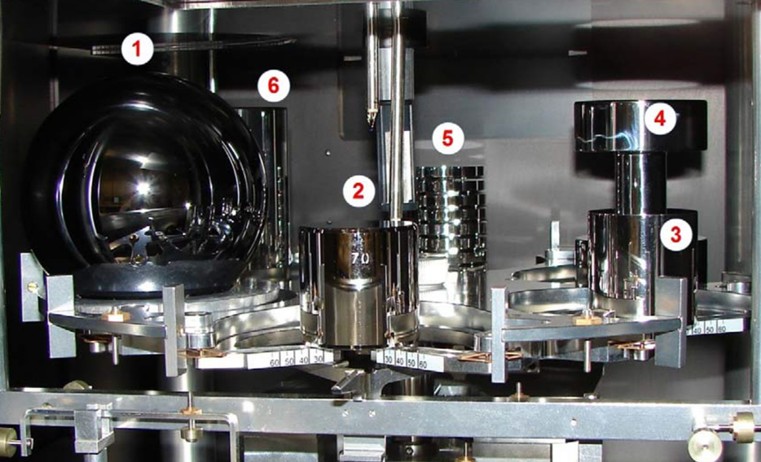

Du 13 au 16 novembre 2018 à Versailles, s'est tenue la 26^e^ réunion de la Conférence Générale des Poids et Mesures. Lors de cette grand-messe de la métrologie internationale, **une nouvelle définition du kilogramme a été adoptée**, accompagnée de nouvelles définitions pour l'ampère, la mole et le kelvin, **qui entrent en vigueur le 20 mai 2019**. La nouvelle définition du kilogramme ne change pas pour autant sa valeur, comme nous l'expliquerons dans cet article (et il en est de même pour les autres unités).

Cette redéfinition ne s'est pas faite en un jour — l'adoption officielle de la nouvelle définition par la CGPM marque l'aboutissement de travaux scientifiques de longue haleine. Il s'agit de la continuité d'un long processus visant à **faire reposer le système international d'unités**, souvent appelé le SI, **sur des constantes fondamentales de la physique** plutôt que sur des objets physiques.

Le kilogramme était en effet la dernière unité définie par référence à un objet physique, à savoir le prototype international du kilogramme. Le mètre, jadis défini comme étant la longueur du mètre-étalon, avait déjà été redéfini en 1983 sur la base de la vitesse de la lumière et de la durée de la seconde.

Cet article vous présentera les principes guidant la définition du système international d'unités, à travers l'exemple de la redéfinition du kilogramme, qui nous permettra de répondre aux questions suivantes.

 * Pourquoi une définition basée sur un artefact n'est pas satisfaisante pour la métrologie ?
 * Comment définit-on un système d'unités à l'aide de constantes fondamentales ?
 * Comment choisir les valeurs de ces constantes sans bouleverser les habitudes de tout un chacun ?

C'est parti !

*[CGPM]: Conférence Générale des Poids et Mesures

# L'ancienne définition du kilogramme

## Le prototype international du kilogramme

Jusqu’à présent, une masse de 1 kg était définie comme la masse d’un objet appelé « prototype international du kilogramme » ou PIK, aussi surnommé « le grand $\mathbb{K}$ ». Autrement dit, **un kilogramme était la masse d’un certain objet pris pour référence**, dont la masse est par définition un kilogramme sans avoir besoin de le peser.

Le prototype international du kilogramme, fabriqué à la fin du XIXᵉ siècle, est un cylindre constitué d’un alliage de 90 % de platine et 10 % d’iridium, qui lui donne une grande dureté, une bonne résistance à l’oxydation et une grande densité. Ces caractéristiques sont intéressantes pour assurer une bonne solidité, une bonne stabilité chimique, et limiter sa taille. Le cylindre mesure 39,17 mm de haut et 39,17 mm de diamètre, ce qui permet de minimiser la surface du cylindre exposée. Pour vous faire une idée de sa compacité, sachez qu’une balle de golf fait environ 42 mm de diamètre !

Il est conservé précieusement sous une triple cloche de verre dans un coffre-fort à l’environnement contrôlé dans les locaux du BIPM, à Sèvres, dans la banlieue parisienne. Pour éviter de l’altérer, sa manipulation est limitée : on ne le sort du coffre-fort que tous les 50 ans afin de le comparer à ses copies, stockées dans des conditions similaires.

Pour les usages plus réguliers, on utilise les copies attribuées aux différents pays. Ces prototypes nationaux servent à calibrer les quelques laboratoires de métrologie les plus précis dans chaque pays, qui servent de références au sein du système de métrologie de chaque pays. Les copies servent aussi aux comparaisons internationales, comme nous le verrons après.

## Dérive du kilogramme

Le prototype du kilogramme présente des inconvénients liés à sa nature d’objet tangible : sa masse peut changer ! Au cours du temps, il peut ainsi gagner ou perdre de la matière par différents phénomènes, ce qui n’est pas sans poser problème.

Parmi les phénomènes qui peuvent lui faire gagner de la matière, on peut citer l’adsorption de molécules présentes dans l’environnement. En effet, malgré les multiples barrières autour du PIK, on ne peut pas empêcher quelques molécules de coller à sa surface. Il faut donc le laver très précautionneusement pour éliminer les contaminations. Une procédure précise est utilisée, et [décrite dans un document](https://www.bipm.org/utils/common/pdf/monographies-misc/Monographie1990-1-FR.pdf) auquel je vous conseille de jeter un œil.

Au contraire, d’autres phénomènes peuvent lui faire perdre de la matière : corrosion, usure par frottement, rayures… C’est pourquoi on évite de manipuler le PIK et qu’on utilise plutôt ses copies.

Le problème de l’utilisation d’un objet comme référence, c’est qu’on ne sait finalement pas si le PIK a minci ou maigri *par rapport à lui-même*. On peut seulement le comparer à ses copies, ce qui a été fait une poignée de fois, comme le montre la figure ci-dessous. On voit que le PIK, désigné par la lettre $\mathbb{K}$ et représenté par l’abscisse à zéro, a tendance à être plus léger que ses copies, à l’exception de la copie 39 qui a dû être endommagée.

![Dérive de la masse des prototypes du kilogramme. Graphique avec l'année en abscisse (de 1900 à 1989) et la variation de masse en microgrammes en ordonnée, le prototype international étant en 0 (par définition). On y lit que l'essentiel de la dizaine de copies présentées ont tendance à s'alourdir avec le temps, avec une différence s'étalant de manière assez homogène entre +2 et +75 microgrammes, sans compter deux exceptions à +132 microgrammes (pour la copie 23) et -665 microgrammes (pour la copie 39).](derive-de-la-masse-des-prototypes-du-kilogramme.jpg)
Figure: Dérive de la masse des prototypes du kilogramme. ([Source](https://commons.wikimedia.org/wiki/File:Prototype_mass_drifts.jpg))

La dérive de la masse du PIK et la dispersion entre les copies font que la connaissance du kilogramme était limitée à quelques dizaines de microgrammes près, à cause de sa définition.

## Problème d’accès à la référence

Le PIK est un objet qui n’existe qu’en un seul exemplaire, ce qui n’est pas pratique du tout. 

D’autres unités peuvent être réalisées par n’importe quel laboratoire équipé, comme la seconde ou le mètre, car elles reposent sur des phénomènes physiques reproductibles n’importe où. Par contre, pour le kilogramme, c’était impossible ! Pour connaître la masse d’un kilogramme, on était obligé d’avoir le PIK sous la main…

Les copies pallient partiellement ce problème, mais comme nous l’avons vu dans la partie précédente, il n’est pas garanti que la masse de la copie soit véritablement proche de celle du PIK, et une comparaison n’est faite, grossièrement, que tous les 50 ans. L’information obtenue par la comparaison devient donc rapidement ancienne, voire obsolète.

**Tout le système de métrologie de masse reposait sur le PIK** : ses copies servaient aux laboratoires nationaux, qui possèdent les balances les plus précises, qui servaient elle-même à calibrer les balances des laboratoires de métrologie plus nombreux mais moins précis, qui servaient à leur tour à calibrer les appareils communs dans les laboratoires industriels ou académiques, qui sont utilisés pour (enfin) peser des choses !

*[BIPM]: Bureau International des Poids et Mesures
*[PIK]: Prototype international du kilogramme

# Pourquoi et comment changer ?

Les problèmes de dérive et d'accès à la référence  du kilogramme étaient lourds à porter pour la communauté scientifique, devant le besoin grandissant de précision dans la définition des unités du système international d'unités. Il fallait trouver mieux !

## L'objectif : une définition universelle et immuable

D'autres unités ont présenté des soucis de définition, parce qu'elles étaient elles aussi initialement définies à partir soit d'objets physiques appelés *étalons*, soit de mesures imprécises. Par exemple, le mètre a longtemps été basé sur la circonférence de la Terre, difficile à mesurer précisément. Similairement, la seconde était définie auparavant à partir de la durée moyenne du jour terrestre, qui s'est avérée ne pas être aussi constante qu'on le croyait.

Pour résoudre ces problèmes, la stratégie a presque toujours été la même : tenter de **ramener les définitions de ces unités à des grandeurs physiques** que l'on peut calculer ou mesurer de façon extrêmement précise, et qui sont stables dans le temps. Ainsi, il devient possible de facilement[^reproduction-facile] reproduire les mesures de ces unités partout dans le monde (et au-delà) sans limite de précision et sans dépendre d'un objet physique fragile !

> Même si le repère cylindrique du kilogramme est abrité dans un coffre spécial, dans des conditions contrôlées au BIPM,  **sa masse (théorique) peut dériver légèrement au fil des ans** et il est  sujet à des modifications de masse (théorique) en raison de la  contamination, la perte de matériau de surface par nettoyage, ou  d'autres effets.
>
> **Une propriété de la nature est, par définition, toujours la même** et peut en théorie être mesurée n'importe où, **alors que le kilogramme au BIPM pourrait être endommagé ou détruit**.
Source: J. C. Maxwell (1831 – 1879), physicien (il a notamment travaillé sur [l'électromagnétisme](https://fr.wikipedia.org/wiki/%C3%89quations_de_Maxwell)). Cette réflexion n'est donc pas toute récente !

Pour reprendre l'exemple de la seconde, sa définition actuelle est, pour faire simple, la durée de 9 192 631 770 vibrations de l'atome de césium 133 au zéro absolu[^seconde], ce qui est une valeur extrêmement précise et stable dans le temps, les propriétés des atomes étant immuables. Avec une telle définition, il devient possible de reproduire cette mesure partout et n'importe quand avec une horloge atomique[^horloge-atomique].

La définition du mètre, quant à elle, se base aujourd'hui sur la vitesse de la lumière : il s'agit de la distance parcourue par la lumière dans le vide en 1⁄~299 792 458~ seconde — la seconde étant définie très précisément, et la vitesse de la lumière dans le vide parfaitement constante, on connaît la valeur d'un mètre avec une très grande précision.

Le nouveau kilogramme suit la même logique, et le concernant, **c'est la [constante de Planck](https://fr.wikipedia.org/wiki/Constante_de_Planck) qui a été choisie** pour sa redéfinition. Mais qu'est-ce donc que la constante de Planck et quel rapport avec le kilogramme ?

[^reproduction-facile]: « Facilement » quand on dispose d'une équipe compétente et d'un laboratoire avec le matériel nécessaire.

[^seconde]: Si vous voulez [la définition exacte](https://www.bipm.org/fr/publications/si-brochure/second.html), la seconde est la durée de 9 192 631 770 périodes de la radiation correspondant à la transition entre les deux niveaux hyperfins de l’état fondamental de l’atome de césium 133 au repos, à une température de 0 K.

[^horloge-atomique]: Les horloges atomiques s'appellent ainsi car leur fonctionnement implique des atomes. Il existe différentes technologies, dont celle de la définition officielle : des horloges qui comptent les vibrations d'atomes de césium 133. Quand on en a compté 9 192 631 770, alors une seconde est passée.

## Kilogramme et constante de Planck

La constante de Planck est une valeur introduite par le physicien allemand [Max Planck](https://fr.wikipedia.org/wiki/Max_Planck) dans le cadre de la physique quantique. Elle est liée à la quantité d'énergie la plus faible que l'on puisse mesurer et sert notamment à quantifier l'énergie de particules (l'électron, par exemple). Curieusement, on peut la relier au kilogramme, et c'est là que les choses deviennent intéressantes…

$$h \approx 6,626 \times 10^{−34}\, \text{J s}$$
Equation: La constante de Planck

Comme vous pouvez le voir ci-dessus, la constante de Planck $h$ s'exprime en joules-secondes (symbole $\text{J s}$). Par le jeu des définitions des unités, les joules-secondes sont équivalents à des kilogrammes-mètres carrés par seconde (symbole $\text{kg m}^2 \text s^{-1}$). Cela signifie qu'il est possible, en mesurant une masse connue dans des conditions particulières, de trouver la valeur de la constante de Planck. On peut aussi faire l'inverse : trouver la valeur d'une masse en effectuant une mesure particulière, à condition de connaître la constante de Planck, autrement dit après avoir fixé une bonne fois pour toutes ladite constante de Planck ! Bingo, nous avons notre constante universelle et immuable, il ne reste plus qu'à fixer sa valeur. Mais quelle valeur choisir ?

[[information|Pourquoi cette équivalence d'unités ?]]
| Le [joule](https://fr.wikipedia.org/wiki/Joule) est une unité de mesure d'énergie. C'est par exemple l'unité de [l'énergie cinétique](https://fr.wikipedia.org/wiki/%C3%89nergie_cin%C3%A9tique), qui quantifie l'énergie d'un corps en mouvement.
| 
| L'énergie cinétique $E_c$ s'exprime comme, $m$ étant la masse du corps, en kg, et $v$ sa vitesse, en $\text{m} \cdot \text{s}^{-1}$ (mètres par seconde) :
|
| $$E_c = {1 \over 2} m v^2$$
|
| Si on remplace les valeurs par leurs unités, pour obtenir les équivalences entre les différentes unités existantes, on trouve[^pareil-enstein] :
| 
| $$\text{J} = \text{kg} \cdot \text{m}^2 \cdot \text{s}^{-2}$$
|
| Ce qui nous amène bien à la conclusion attendue : 
|
| $$\text{J s} = \text{kg} \cdot \text{m}^2 \cdot \text s^{-1}$$
|
| Mais si tout cela n'est pas trop clair pour vous, n'hésitez pas à nous croire sur parole. ^^

[^pareil-enstein]: On serait arrivé à la même conclusion en utilisant la célèbre équation $E = mc^2$, $E$ étant une énergie en joules, $m$ une masse en kilogrammes et $c$, la vitesse de la lumière, en mètres par seconde. Les équivalences entre unités obtenues sont exactement les mêmes (et heureusement !).

*[BIPM]: Bureau International des Poids et Mesures
*[SI]: (Unité⋅s du) Système International
*[ppm]: Partie par million : un millionième
*[XRCD]: X-Ray Crystal Density (mesure de la densité d'un cristal par diffraction de rayons X)

# Petit guide sans prétention pour figer la constante de Planck

La méthode retenue par la communauté scientifique pour figer la constante de Planck est similaire à ce qui a été fait pour d'autres unités du SI. En l'état actuel des choses, on sait mesurer la constante de Planck, comme précisé ci-dessus. Il s'agit donc de la mesurer de façon extrêmement précise à partir de la définition actuelle (c'est-à-dire à partir du prototype international du kilogramme), puis de décider que la constante de Planck vaut _la valeur ainsi mesurée_. On inverse alors la perspective : avant, on calcule la constante de Planck à partir du kilogramme, maintenant on fixe cette constante et on calcule le kilogramme avec celle-ci.

Un grand avantage de cette méthode, c'est que **dans la vie courante, un kilogramme reste un kilogramme** : la définition change mais pas la masse, et aucune balance grand public n'a besoin de mise à jour. Scientifiquement, la définition est plus précise et prête pour l'avenir ; pour le grand public, le changement est imperceptible.

## Première étape : mesurer la constante de Planck

Le travail de détermination puis de fixation de la constante de Planck a été de longue haleine : il a commencé plus de dix ans avant la rédéfinition officielle ! Le Bureau International des Poids et Mesures avait donné plusieurs exigences[^bipm-exigences-planck] quant à la mesure de la constante de Planck : 

- des mesures par **trois expériences indépendantes**, validées par le BIPM, utilisant au moins **deux méthodes de mesure différentes** (balance de Kibble et XRCD — nous détaillerons cela juste après) ;
- **une précision de la mesure[^fidélité-mesure] de $\pm 5 \times 10^{-8}\ \text{J s}$** pour chacune de ces expériences (soit une mesure à un vingt-millionnième près !) ;
- **au moins une de ces expériences avec une précision[^fidélité-mesure] de $\pm 2 \times 10^{-8}\ \text{J s}$** (ce qui fait cette fois une mesure à un cinquante-millionnième près) ;
- et enfin, que la valeur mesurée soit **cohérente** avec le prototype international du kilogramme.

Voyons en quoi ces expériences consistent, et comment on peut calculer la constante de Planck avec.

[[attention|Une formule peut en cacher une autre]]
| Bien qu'une attention particulière soit prêtée à l'accessibilité, la section suivante de l'article rentre dans des détails mathématiques et physiques. Si cela ne vous intéresse pas et que vous acceptez d'admettre que « ça marche », sautez cette partie sans remords, ou lisez-la en ignorant les formules. À l'inverse, si vous avez des questions ou besoin de plus de détails, manifestez-vous dans les commentaires !

[^bipm-exigences-planck]: Les exigences du BIPM sont précisées dans la [_Recommandation G1 – Sur une nouvelle définition du kilogramme_](https://www.bipm.org/utils/common/pdf/CC/CCM/CCM14.pdf#page=34) (2013) ; elles ont été considérées comme remplies par ledit bureau dans la [_Recommandation G1 – Pour une nouvelle définition du kilogramme en 2018_](https://www.bipm.org/cc/CCM/Allowed/16/06F_Final_CCM-Recommendation_G1-2017.pdf) (2017).

[^fidélité-mesure]: En métrologie, en réalité, on n'aime pas trop le terme de précision, lui préférant celui de « fidélité » d'une mesure, correspondant donc à l'écart entre la valeur mesurée expérimentalement et la valeur réelle. J'utilise malgré tout le terme de précision par soucis de claireté. (Cf. onzième source en conclusion.)

### Balance de Kibble

Une balance de Kibble (anciennement « balance du watt ») est un appareil de mesure de précision extrême dans lequel on équilibre le poids d'un étalon par une force électromagnétique bien définie. Les lois physiques permettent de déduire des mesures la valeur de la constante de Planck, à condition de mesurer précisément le courant, la tension, l'accélération gravitationnelle locale $g$ et la vitesse.

Figure: La balance de Kibble du BIPM. ([Source](https://www.bipm.org/en/bipm/mass/watt-balance/))

La mesure se fait en deux temps. Dans un premier temps, **on équilibre l'étalon de masse $m$ et de poids $w = m g$ par une force électromagnétique** (dite de Lorentz) générée par un courant $I$ circulant dans une boucle conductrice dans un champ magnétique $B$. Le réglage de la force est fait à l'aide du courant, le champ magnétique restant constant. Le courant peut être mesuré très précisément, mais pas la longueur de la boucle $L$ ni l'intensité du champ magnétique, dont dépend pourtant la force, ce qui rend nécessaire la deuxième étape. On déduit de cette première étape la relation suivante (où le facteur $B L$ n'est pas connu), car les forces sont équilibrées, donc égales :

$$w  = m g = B L I$$

Dans un second temps, on déplace la boucle conductrice à une vitesse fixe $v$ dans le champ magnétique. Or, par un effet symétrique au précédent, déplacer une bobine dans un champ magnétique génère une tension $U$ par induction, tension qu'il est possible de mesurer précisément. Les lois d'induction magnétique de Faraday permettent de déduire une relation entre la tension et la vitesse de la boucle :

$$U = B L v$$

En combinant les deux relations, on élimine $BL$ et on en déduit : 

$$U I = m g v$$

La relation ci-dessus permet d'obtenir une mesure de la masse à partir d'une tension, d'un courant, de l'accélération gravitationnelle locale et d'une vitesse, comme promis au départ.

On entre dans les subtilités. Pour les mesures de haute précision de U et I, on utilise les [unités électriques conventionnelles](https://fr.wikipedia.org/wiki/Unit%C3%A9_%C3%A9lectrique_conventionnelle), proches mais différentes de celles du SI, fondées sur la constante de Josephson $K_J$ et la constante de von Klitzing $R_K$.

[[information|Les unités électriques _conventionnelles_ ? Quelle différence avec les unités SI habituelles ?]]
| Les unités électriques conventionnelles sont des unités qui divergent légèrement de leurs homologues classiques car **leurs valeurs ne sont pas mesurées de la même façon**. Par exemple, si la tension en volts classiques est mesuré avec un voltmètre, le volt _conventionnel_ l'est en utilisant l'[effet Josephson](https://fr.wikipedia.org/wiki/Effet_Josephson). De même, la résistance en ohms conventionnels se mesure grâce à [l'effet Hall quantique](https://fr.wikipedia.org/wiki/Effet_Hall_quantique_entier). Les valeurs sont très légèrement différentes, mais [on peut les retrouver en unités “classiques”](https://fr.wikipedia.org/wiki/Unit%C3%A9_%C3%A9lectrique_conventionnelle#Conversion_en_unités_SI) via les deux constantes sus-mentionnées ($K_J$ et $R_K$).
| 
| À l'origine, l'intérêt est d'avoir des mesures *beaucoup plus exactes* qu'avec les unités classiques, les méthodes de mesure permettant d'avoir un niveau de précision sans commune mesure avec celui de leurs homologues classiques. Mais dans le cas présent, l'intérêt est surtout que **les constantes $K_J$ et $R_K$ sont liées à la constante de Planck**, ce qui va nous permettre de relier cette dernière et le kilogramme !
| 
| Les valeurs en unités conventionnelles sont notées avec « 90 » en indice[^conventionnel-unite-90] ; par exemple, la tension $U$ en classique devient $U_{90}$ en conventionnel, et la valeur de $K_J$ exprimée en unités classiques devient $K_{J - 90}$ en conventionnel.

[^conventionnel-unite-90]: Car ces unités sont entrées dans l'usage le premier janvier 1990.

On obtient ainsi deux valeurs $U_{90}$ et $I_{90}$ (en unités conventionnelles), reliées à $U$ et $I$ (en unités SI) à l'aide des fameuses constantes, exprimées en unités conventionnelles et en unités SI. En l'occurrence, on peut écrire :

$$K_\text{J}^2 R_\text{K} = K_\text{J–90}^2 R_\text{K–90}\frac{UI}{U_{90}I_{90}}$$

Et en remplaçant $UI$ par l'équation vue précdémment :

$$K_\text{J}^2 R_\text{K} =  K_\text{J–90}^2 R_\text{K–90}\frac{mgv}{U_{90}I_{90}}$$

Il vient maintenant un point crucial : les constantes de Josephson et de von Klitzing sont liées à la constante de Planck — et c'est bien pour ça qu'on s'en sert :

$$h = \frac{4}{K_\text{J}^2 R_\text{K}}$$

La relation ci-dessus est au cœur du principe de la balance de Kibble, car elle permet d'écrire : 

$$h = 4 \frac{U_{90}I_{90}}{K_\text{J–90}^2 R_\text{K–90} mgv}$$

On peut donc déterminer expérimentalement, et avec une grande précision, la valeur de la constante de Planck avec une balance de Kibble ! L'objectif est atteint.

Cette valeur est obtenue avec des incertitudes liées à la mesure de la tension, du courant, de l'accélération gravitationnelle et de la vitesse, qui donne une fenêtre de tir pour la constante de Planck. La masse n'a pas d'incertitude associée s'il s'agit du prototype international du kilogramme, dont la masse est de 1 kg, par définition.

### Diffraction à rayons X

Le BIPM exigeait au moins deux méthodes distinctes pour mesurer la constante de Planck. La méthode de diffraction à rayons X, connue sous le nom _x-ray-crystal-density method_ (ou XRCD en anglais), a été utilisée à cet effet.

Le fonctionnement de cette méthode est très différent de la précédente balance. Ici, on ne cherche pas à peser un objet (une façon certes assez intuitive de retrouver sa masse), mais à… compter les atomes qui le composent. *Eh* bien oui : en connaissant cette valeur précisément, on peut déduire une masse précisément. Et la constante de Planck dans tout ça ? Patience, elle arrive.

La méthode XRCD permet également de déterminer et fixer $N_A$, le nombre d'Avogadro, ce qui permet de redéfinir la mole, mentionnée en introduction.

[[information|Qu'est-ce que le nombre d'Avogadro ?]]
| Le nombre d'Avogadro ($N_A$) est lié à la *mole*, une unité moins connue du système international. **Une mole, c'est un paquet d'environ $6 \cdot 10^{23}$ éléments** (un $6$ avec vingt-trois zéros derrière !) — par exemple, une mole de pomme, c'est $6 \cdot 10^{23}$ pommes. Concrètement, on s'en sert pour compter des molécules ou des atomes, qui sont présents en quantités faramineuses ; par exemple, une mole d'atomes de carbone ne pèse qu'environ douze grammes.
| 
| Dans tout ça, **$N_A$ c'est le nombre d'éléments dans une mole** : $N_A \approx 6 \cdot 10^{23}\ \text{mol}^{-1}$.

Nous serions bien incapables de compter les atomes du premier bloc de matière trouvé dans la nature. Par contre, c'est tout à fait possible dans un cadre très contrôlé, sur un élément fabriqué spécialement pour cette occasion et dont on connaît la composition précisément. Cette composition doit être **simple** pour pouvoir aboutir plus facilement, parce que quitte à maîtriser le processus, autant se simplifier la vie, hein ? La précision n'en sera que meilleure, et c'est le critère numéro un !

Ce qu'on utilisera a été quelque peu divulgâché dans le nom de la méthode (du moins, celui en anglais). _X-Ray **crystal** density_. Yep ! On utilisera un cristal. Mais attention, un cristal au sens *physique* du terme. Oubliez le classique [verre fin enrichi au plomb](https://fr.wikipedia.org/wiki/Cristal_(verre)) que l'on trouve dans nos élégants services, et entrez avec moi dans le monde des minuscules structures atomiques…

#### Partons d'un cristal

Si l'on zoome beaucoup sur un objet, au bout d'un moment, on finira par voir ses atomes[^voir-atomes]. Et là selon les matériaux, on aura affaire à plusieurs cas de figure… Parfois, les atomes sont un peu en vrac, ou assemblés en molécules plus ou moins bien rangées les unes par rapport aux autres. Ça pourrait être le cas d'un bois, par exemple. Mais dans certains cas, il n'y a que des atomes[^cristaux-atomes] bien rangés, régulièrement ordonnés, se répétant à l'infini (dans les limites de la taille du matériau que l'on regarde, bien sûr) : on appelle ça un **cristal**. Ces matériaux sont beaucoup plus simples à étudier de part la simplicité de leur structure, c'est pourquoi on va s'en servir.

Des cristaux, dans la vie de tous les jours, il y en a beaucoup. Le sel est un cristal de chlore et de sodium, mais on pourrait également citer le sucre, la neige, les pierres précieuses (le diamant est un cristal de carbone, par exemple)… et les métaux.

Figure: La structure atomique du sel de table est très régulière : c'est bien un cristal. Sur une grille cubique, les ions Na^+^ (en vert) et Cl^-^ (en rouge) s'alternent. ([Source](https://commons.wikimedia.org/wiki/File:Ionlattice-fcc.svg))

Les métaux de la vie courante sont des cristaux, et c'est ce qu'on utilisera ici. En effet, **on va compter les atomes d'une sphère de silicium pur**[^pourquoi-silicium] fabriquée pour l'occasion. On taillera une sphère d'approximativement un kilogramme[^approximativement-un-kilogramme] (ce qui lui fait un diamètre approximatif de 93,6 millimètres) dans un cristal brut de silicium fabriqué en laboratoire, dont on vérifiera qu'il est bien en silicium extrêmement pur[^vérification-pureté-silicium]. Au-delà de la composition, toute la difficulté ici est de produire une sphère la plus parfaite possible, la plus *ronde* possible : de la précision de la sphère dépend celle des mesures qui suivront, notamment le calcul de son volume. En l'état, cette méthode a impliqué la conception des matériaux les plus parfaitement sphériques jamais fabriqués — rien que ça ! Pour vous donner une idée, si la sphère avait la taille de la Terre, la plus haute montagne s'élèverait d'environ *deux mètres*.

[^voir-atomes]: Oui, je sais. On ne peut pas techniquement voir les atomes en zoomant sur un matériau, car la longueur d'onde de la lumière est bien trop grande. Il est en réalité bien difficile de les voir directement, et ça ne fait pas si longtemps qu'on sait réaliser une telle tâche. Mais de une c'est hors sujet, et de deux c'est juste une image. Donc chut, les tatillons. c:
[^cristaux-atomes]: Il existe en fait des cristaux d'atomes, mais aussi de molécules ou d'ions. Le sel de table est un cas typique de cristal d'ions.
[^pourquoi-silicium]: On utilise le silicium pour réaliser les sphères car l'industrie des semi-conducteurs dispose déjà des technologies permettant de réaliser de gros cristaux de silicium extrêmement purs. C'est donc une des meilleures options disponibles sur le marché du cristal, dans un but de précision maximale. La méthode de production du cristal de silicium ne sera pas détaillée ici, mais vous pouvez vous référer à la sixième source en conclusion pour en savoir plus (en anglais).
[^approximativement-un-kilogramme]: Inutile d'être précis — en soit, la méthode marcherait dans tous les cas. En effet, l'idée ici n'est pas de produire un kilogramme, mais de mesurer la constante de Planck, et pour ce faire, il nous faut “juste” le nombre d'atomes : tant qu'on arrive à déterminer avec une très grande précision le volume de la sphère, il n'importe que peu qu'il soit égal à un kilogramme. Par contre, on peut également utiliser cette méthode pour créer par mesures et ajustements successifs une sphère d'un kilogramme précisément, mais ce n'est pas ici l'objectif.
[^vérification-pureté-silicium]: Il s'agit de s'assurer qu'il n'y a que des atomes de silicium dans le cristal — en effet, il n'est pas rare que des atomes de carbone, d'oxygène, ou d'azote (entre autres) se glissent au milieu des autres au cours des différentes étapes de création du cristal. Afin de vérifier que le cristal est bien pur, on utilise un mélange de [spectroscopie DLTS](https://en.wikipedia.org/wiki/Deep-level_transient_spectroscopy) et d'[analyse par activation neutronique](https://fr.wikipedia.org/wiki/Analyse_par_activation_neutronique).

#### Mesurons ce cristal sous tous ses angles

C'est bien beau d'avoir une jolie sphère ! On va en mesurer très précisément le diamètre — à moins de 0,3 nm près, ce qui correspond à l'épaisseur d'une couche d'atomes.

Pour obtenir une valeur si précise, on utilise une technologie appelée [interférométrie optique](https://fr.wikipedia.org/wiki/Interf%C3%A9rom%C3%A9trie), qui permet notamment de faire des mesures de distance extrêmement précises. Le diamètre de la sphère est mesuré sous une multitude d'angles afin d'en extraire un diamètre moyen $D$ qui servira à calculer le volume de la sphère. De là, grâce à des techniques classiques de géométrie, on peut extraire le volume de la sphère :

$$V = {\pi \over 6} D^3$$

On mesure ensuite la masse de la sphère, en utilisant une copie existante de l'étalon du kilogramme — on veut qu'un kilogramme reste un kilogramme, il faut donc partir de l'étalon, tout comme nous avions utilisé l'étalon pour déterminer la constante de Planck dans le cadre de la méthode précédente. Il y a plusieurs méthodes pour ce faire. Ici, vus nos besoins de précision, on utilise des comparateurs de masse de très haute résolution pour comparer la masse d'un étalon et de la sphère de silicium.

Figure: La chambre de pesée d'un comparateur de masse de haute précision. On y voit la sphère de silicium **(1)**, un kilogramme-étalon (le soixante-dixième) **(2)**, et divers autres poids d'ajustement afin de rapprocher les deux masses (la mesure étant plus précise dans un tel cas) et de compenser d'autres imperfections (tel que l'impact de l'air lui-même sur la mesure). (Source 6 en conclusion, figure 26, page A41.)

#### …et comptons ses atomes (plus ou moins)

Promis, on y est presque ! Pour connaître le nombre d'atomes, et en déduire indirectement (vous verrez) la constante de Planck et tout le reste, on va devoir rapidement se pencher sur à quoi ressemble un cristal de silicium de près. Vous vous souvenez que les atomes d'un cristal sont structurés de façon très régulière ? Eh bien voici la structure d'un cristal de silicium.

Figure: La structure d'un cristal de silicium, avec en bleu des atomes de silicium. Cette structure se répète à l'infini dans le cristal. (Source 6 en conclusion, figure 1, page A20.)

En réalité, ce qu'on mesurera, ce n'est pas directement le nombre d'atomes mais la taille de ce cube qui se répète (en cristallographie, on parle de *[maille](https://fr.wikipedia.org/wiki/Maille_(cristallographie))* : c'est la plus petite structure qui se répète).

On note $a$ la longueur d'un côté de ce cube — cette valeur s'appelle le _paramètre cristallin_, ou encore _paramètre de maille_. Le connaissant, et connaissant le volume de la sphère, on peut calculer le nombre total d'atomes, et de là *la masse d'un atome* par simple division. En effet, une maille compte huit atomes en moyenne[^huit-atomes-par-maille], on peut donc calculer le nombre total d'atomes comme ceci, où $V$ est le volume de la sphère calculé précédemment : 

$$N = {8V \over a^3}$$

En utilisant de l'interférométrie optique à rayons X, on peut mesurer la valeur de $a$ avec une très grande précision (de l'ordre de 0,000 000 001 mètre près), et donc calculer une très bonne estimation du nombre d'atomes $N$. Partant de là, on en déduit que la masse $m_{\text{Si}}$ d'un atome vaut :

$$m_{\text{Si}} = {m \over N} = {m a^3 \over 8V}$$

…où $m$ est la masse de la sphère mesurée plus haut.

Connaissant la masse molaire $M$ du silicium (il s'agit de la masse d'une mole de silicium, donc d'environ $6 \cdot 10^{23}$ atomes de silicium, tout simplement), on peut aisément calculer la quantité de matière $n$ dans notre sphère, c'est à dire le nombre de moles qu'elle contient :

$$n = {m \over M}$$

On a désormais toutes les informations nécessaires pour calculer $N_A$, le nombre d'Avogadro, avant-dernière étape avant de retrouver la constante de Planck ! En effet, $N_A$ est la division de $N$, le nombre total d'atomes, par $n$, le nombre total de moles (ce qui nous donne bien le nombre total d'atomes dans une mole). Cela dit, nous aimerions avoir cette valeur en fonction de valeurs qu'on a mesuré extrêmement précisément.

Parmis ces valeurs, on peut noter la **densité du cristal**. La densité représente en quelques sortes la compacité du cristal : plus il est compact, plus les atomes sont serrés les uns avec les autres, plus le cristal est dense. Il se calcule en divisant la masse totale par le volume total :

$$\rho_m = {m \over V}$$

Alors :
$$
\begin{array}{rcccccl}
\\N_A &=& {N \over n} &=& {NM \over m}&\text{car}& n = {m \over M}\\
&&&=& {NM \over V \rho_m} & \text{car} & \rho_m = {m \over V}\\
&&&=& {8M \over \rho_m a^3} & \text{car} & {N \over V} = {8 \over a^3}
\end{array}
$$
On a donc finalement une expression du nombre d'Avogadro en fonction de paramètres que l'on sait mesurer précisément : $a$, la taille d'une maille, $\rho_m$, la densité de la sphère, et $M$, sa masse molaire. Vous pouvez aussi mieux comprendre le nom anglais de la méthode désormais : *X-Ray ^(utilisés pour les mesures de haute précision de $a$ et $V$)^ crystal ^(on travaille avec un cristal)^ density ^(on utilise la densité dans le calcul)^*.

$$N_A = {8M \over \rho_m \cdot a^3}$$
Equation: La valeur expérimentale du nombre d'Avogadro, qui va nous permette de déterminer avec haute précision la constante de Planck.

[^huit-atomes-par-maille]: Bien sûr, il y a plus de huit atomes dans la maille présentée ci-dessus. Mais certains sont présents dans plusieurs mailles : les atomes des coins sont présents chacun dans huit mailles (les huit cubes se touchant à ce coin), et ceux au centre de chaque face du cube, dans deux (les deux cubes côte à côte). En prenant cela en compte (considérant ⅛ d'atome à chaque coin et ½ atome pour ceux au centre des faces), on trouve huit atomes par maille en moyenne. Ce calcul ignore les mailles qui sont situées au bord du cristal (et qui ne sont donc pas entourées de tous les côtés par d'autres mailles), mais la différence est complètement négligeable : il y a **beaucoup** de mailles.

#### Enfin, retrouvons Planck (d'aucuns diront : « pas trop tôt »)

Certaines équations de la physique fondamentale nous permettent de connaître la masse d'un électron en fonction de la constante de Planck $h$ (ouf) et de pleins d'autres termes barbares :

$$m_e = {2hR_\infty \over c \alpha^2}$$

Les termes barbares sont :

- $R_\infty$, la [constante de Rydberg](https://fr.wikipedia.org/wiki/Constante_de_Rydberg), qui est une constante physique connue de façon extrêmement précise ;
- $c$, la vitesse de la lumière dans le vide, dont on connaît la valeur exacte ; et
- $\alpha$, la [constante de structure fine](https://fr.wikipedia.org/wiki/Constante_de_structure_fine), également connue avec une grande précision.

Comme, en notant $M_e$ la *masse molaire des électrons* (donc la masse des électrons dans une mole), $N_A = M_e / m_e$, et comme on a déterminé $N_A$ avec une grande précision, on peut déterminer $h$ (enfin !), étant donné que :

$$N_A = {M_e \over m_e} = {M_u \cdot A_r(e) \over m_e} = {c \cdot M_u \cdot A_r(e) \cdot \alpha^2 \over 2 R_\infty \cdot h}$$

Oui, encore de nouveaux termes barbares (c'est pas moi c'est la physique), les derniers promis. :D

- $M_u = 1 \text{ g/mol}$, c'est la constante de masse molaire — ça sert à ce que les unités restent correctes ;
- $A_r(e)$ c'est la [masse atomique](https://fr.wikipedia.org/wiki/Masse_atomique) de l'électron — concrètement, sa masse, mais dans une unité un peu différente. Rien de bien méchant.

On a, finalement, **la valeur de la constante de Planck en fonction d'éléments connus avec une grande fidélité expérimentale**. On y est ![^simplifications-xrcd] \o/

$$h = {c \cdot M_u \cdot A_r(e) \cdot \alpha^2 \over 2 R_\infty \cdot N_A}$$
Equation: La constante de Planck, en fonction de tout un tas de trucs précis.

[^simplifications-xrcd]: **La méthode de détermination de la constante de Planck avec la méthode XRCD a été simplifiée.** Notamment, la mesure du volume du cristal tient compte des irrégularités même minimes de la sphère, des impuretés présentes dans le cristal de silicium lors de la création de ce dernier, et de la fine couche d'oxydation recouvrant la sphère. Aussi, le calcul de la masse molaire du silicium se fait par rapport à la sphère elle-même (on n'utilise pas les valeurs standard, trop imprécises), et en tenant compte, après mesure, de la présence des trois isotopes naturels du silicium (^28^Si, ^29^Si et ^30^Si) dans la sphère, ce qui complexifie le calcul. Il en est de même pour le calcul de la densité de la sphère, qui doit prendre les impuretés en compte. **Si vous êtes intéressé⋅e par les implications de ces considérations sur la méthode XRCD, référez-vous à la sixième source en conclusion** (en anglais), dont les premières parties sont assez accessibles (et le reste, selon votre niveau et votre motivation). Les parties 1 et 2 y décrivent la méthode dans son ensemble, et les parties suivantes détaillent chacune des étapes.

## Seconde étape : choisir une valeur de la constante de Planck

[[neutre|La valeur de la constante de Planck qui a été choisie est]]
| $$h = 6{,}626\,070\,15 \times 10^{−34} \text{J s}$$

Dés lors, il n'y a plus d'imprécision de mesure qui tienne. Par convention, le BIPM fixe, définitivement, la valeur de la constante de Planck à cette valeur ci-dessus, précisément, sans aucune incertitude — de la même façon que la vitesse de la lumière l'avait été en 1983. **Désormais, _par définition_ et non par mesure, la constante de Planck a cette valeur.**

Cette valeur n'est pas choisie au hasard. De nombreuses expériences de mesure ont été réalisées, autant avec une balance de Kibble que par diffraction à rayons X, et une valeur a été sélectionnée en regardant celle qui semblait la plus cohérente en fonction des différents résultats obtenus, les meilleurs étant rassemblés sur le graphique ci-dessous.

Figure: Expériences de mesure de la constante de Planck et incertitudes. En violet, les mesures réalisées avec une balance de Kibble ; en bleu, celles grâce à la méthode XRCD ; de haut en bas du plus ancien au plus récent. Le trait en pointillés correspond à la valeur finale retenue. (Source 10 en conclusion, figure 1, page L15.)

L'objectif était de prendre et de **fixer une valeur pour cette constante qui reste cohérente avec nos observations, nos mesures, et tout le reste**. C'est pour cela que, tel que rappelé plus haut, le BIPM imposait une mesure à un vingt-millionième près, ce que représente la bande verte. Avec cette valeur soigneusement choisie, les mesures associées à la constante de Planck, et notamment la valeur d'un kilogramme, ne changeront pas, ou presque. En tous les cas, pour le grand public, ce changement sera totalement **imperceptible** !

D'autres constantes fondamentales ont été fixées au passage : 

- **le nombre d'Avogadro** que l'on a croisé plus haut est fixé à exactement $N_A = 6,022\,140\,76 \times 10^{23}\ \text{mol}^{-1} $, en utilisant la méthode XRCD pour choisir sa valeur ;
- **la charge élémentaire** (à savoir la charge d'un proton, ou l'opposé de celle d'un électron), est fixée à exactement $e = 1,602\, 176\, 634 \times 10^{-19}$ [Coulombs](https://fr.wikipedia.org/wiki/Coulomb), en cohérence avec les autres définitions, via un processus de fixation similaire à celui détaillé pour $h$ et $N_A$ dans cet article, [en utilisant les unités électriques conventionnelles](https://www.lne.fr/fr/comprendre/systeme-international-unites/ampere) mentionnées dans le cadre de la balance de Kibble.

De plus et en conséquence, une autre constante fondamentale se retrouve fixée, car dépendante uniquement de constantes désormais fixées ou connues avec une très grande précision : la **constante de Boltzmann**, qui vaut désormais exactement $k_B = 1,380\, 649 \times 10^{-23}\,\ \text s^{-2}\, \text m^2\, \text{kg}\, \text K^{-1}$ (oui l'unité est tordue). On la recroisera en fin d'article. ;)

*[BIPM]: Bureau International des Poids et Mesures
*[SI]: (Unité⋅s du) Système International
*[ppm]: Partie par million : un millionième
*[XRCD]: X-Ray Crystal Density (mesure de la densité d'un cristal par diffraction de rayons X)

# La nouvelle définition du kilogramme

**Fixer la valeur de la constante de Planck revient à fixer le kilogramme.** En effet, donner une valeur fixe à la constante de Planck définit précisément l'unité joule-seconde qui correspond à des kg.m^2^.s^-1^. Comme le mètre et la seconde sont eux-mêmes précisément définis, cela définit la valeur du kilogramme comme étant :

$$ 1 kg = \left( \frac{h}{6{,}626\,070\,15 \times 10^{−34}} \right) m^{-2} s $$

Et cela transforme par la même occasion la balance de Kibble d'un appareil mesurant la constante de Planck **en une balance de précision extrême**, grâce à la relation :

$$ m =  \frac{UI}{gv}  $$

$g$ et $v$ ainsi que $U$ et $I$ peuvent être mesurés de manière ultra précise. La mesure de $U$ et $I$ se faisant en unités conventionnelles, la fixation de la constante de Planck permet la conversion vers les unités SI sans ajouter d'incertitudes à cause des constantes. De même, la méthode XRCD permet de réaliser des sphères de silicium d'une masse extrêmement précise, en l'utilisant “dans l'autre sens”, considérant la constante de Planck fixée et déterminant la masse.

Le Bureau International des Poids et Mesure formule la nouvelle définition du kilogramme en ces termes :

> Le kilogramme, kg, est l'unité de masse ; sa valeur est définie  en fixant la valeur numérique de la constante de Planck à exactement $6,626\, 070\, 15 \times 10^{-34}$ quand elle est exprimée en s^−1^ m^2^ kg, ce qui correspond à des J s.

## Mais concrètement, comment peser avec cette définition bizarre ?

Il est vrai que si l'ancienne définition avait moulte défauts, elle avait au moins l'avantage d'être bien plus compréhensible. Du coup comment pèse-t-on ?

En réalité, le commun des mortels n'utilisera jamais cette définition — tout comme il n'utilise pas la définition du mètre en fonction de la vitesse de la lumière ! Ce sont les **laboratoires de métrologie**, garants des mesures de précisions, qui, à l'aide de balances de Kibble (ou d'autres méthodes, comme XRCD), **réaliseront des étalons d'un kilogramme extrêmement précis qui serviront à étalonner les balances grand public ou d'autres laboratoires**. On trouve des laboratoires de métrologie dans tous les pays, par exemple le [LNE](https://www.lne.fr) en France (mais ce n'est pas le seul).

Ce sont aussi ces laboratoires de métrologie qui peuvent certifier la conformité  et la précision d'appareils de mesure grand public (par exemple, les vignettes vertes sur les balances de commerçants). Ils utiliseront la nouvelle définition pour étalonner et vérifier, mais ça s'arrêtera là, et les balances usuelles ne changeront pas.

[[question]]
| Comment ça, un étalon ? On ne vient pas de rappeler en long, en large et en travers à quel point ce n'est pas pratique ?

Oui… en tant que définition ! Sinon, ça reste bien plus utilisable dans la vie courante, à condition d'être capable d'en fabriquer à la précision voulue sans dépendre de personne. Concrètement, pour beaucoup d'applications, on utilise encore des étalons du mètre, alors que sa définition a changé en 1983… et ça ne pose absolument aucun problème.

D'autant plus qu'il y a des étalons de précisions variée : de très, très précis pour des applications très fines, à beaucoup plus grossier pour la vie de tous les jours, où une telle précision est de toute façon inutile.

Désormais, la définition est telle que, dans l'absolu, **n'importe qui peut fabriquer son kilogramme sans devoir aller dupliquer celui du BIPM**. Certaines expériences de physique ayant besoin de plus grande précision peuvent même utiliser directement la définition sans passer par un étalon.

Finalement, ce changement permet une grande pérennité de la définition du kilogramme, mais pour la majorité des mesures concrètes de masse, cela ne changera pas grand chose. Et tant mieux, en soit ! C'est une preuve que la redéfinition a été bien faite. ^^

*[BIPM]: Bureau International des Poids et Mesures

# Rédéfinitions d'autres unités liées au kilogramme

Les sept unités de base du SI, qui permettent de définir toutes les autres unités, sont : le kilogramme (kg), la seconde (s), le mètre (m), le candela (cd), le kelvin (K), l'ampère (A) et la mole (mol).

Les définitions des unités de base du SI sont interdépendantes : si on modifie certaines unités, on modifiera alors d'autres unités en conséquence. Le diagramme ci-dessous illustre l'interdépendance des anciennes définitions en vigueur *avant* mai 2019.

Figure: Interdépendances entre les sept unités de base du SI avant le 20 mai 2019. ([Source](https://commons.wikimedia.org/wiki/File:SI_base_unit.svg))

Avec la révision du SI, **la mole passe d'une définition basée sur le kilogramme à une totalement indépendante**, car comme on l'a vu, $N_A$ a désormais une valeur exacte.

> La mole, mol, est l'unité de quantité de matière d'une entité élémentaire spécifique, qui peut être un atome, une molécule, un ion, un électron ou n'importe quelle autre particule ou groupe particulier de ces particules ; sa valeur est définie en fixant la valeur numérique du nombre d'Avogadro à exactement $6,022\, 140\, 76 \times 10^{23}$ quand elle est exprimée en mol^-1^.
Source: Nouvelle définition de la mole par le BIPM à partir du 20 mai 2019.

**L'ampère est redéfini en fonction de la charge élémentaire $e$**, désormais parfaitement définie, plutôt qu'à partir d'une force (c'est-à-dire indirectement de la masse). On aura ainsi une définition de l'ampère indépendante du kilogramme.

> L'ampère, A, est l'unité du courant électrique ; sa valeur est définie en fixant la valeur numérique de la charge élémentaire à exactement $1,602\, 176\, 634 \times 10^{-19}$ quand elle est exprimée en A s, ce qui correspond à des [C](https://fr.wikipedia.org/wiki/Coulomb).
> Source: Nouvelle définition de l'ampère par le BIPM à partir du 20 mai 2019.

À l'inverse, **la définition du kelvin, actuellement indépendante, sera reliée à celle du kilogramme**, via la constante de Boltzmann. Le kelvin était auparavant défini comme $1/273,16$ de la température du point triple de l'eau (la température à laquelle les trois phases solide, liquide et gaz cohabitent, environ 0,01 °C) — la définition change donc fondamentalement.

La constante de Boltzmann $k_B$ relie l'énergie d'un corps à sa température, avec dans les cas simples, $E = ½ \ k_B T$. La fixer permet donc de définir l'unité de température qu'est le kelvin.

Quant au degré Celsius, qui n'est pas une unité SI, il est défini par rapport au kelvin ; sa définition change donc également par ricochet.

> Le kelvin, K, est l'unité thermodynamique de température ; sa valeur est définie en fixant la valeur numérique de la constante de Boltzmann à exactement $1,380\, 649 \times 10^{-23}$ quand elle est exprimée en s^−2^ m^2^ kg K^−1^, ce qui correspond à des J K^−1^.
> Source: Nouvelle définition du kelvin par le BIPM à partir du 20 mai 2019.

Les définitions des autres unités restent fondamentalement les mêmes, mais sont reformulées à l'occasion, afin de les rendre plus claires et plus rigoureuses. Par exemple, l'ancienne définition de la seconde :

> La seconde est la durée de 9 192 631 770 périodes de la radiation correspondant à la transition entre les deux niveaux hyperfins de l'état fondamental de l'atome de césium 133 à la température du zéro absolu.
> Source: Ancienne définition de la seconde par le BIPM avant 2019.

devient :

> La seconde, s, est l'unité de durée ; sa valeur est définie en  fixant la valeur du nombre de périodes de la radiation correspondant à  la transition entre les deux [niveaux hyperfins](https://fr.wikipedia.org/wiki/Structure_hyperfine) de l'[état fondamental](https://fr.wikipedia.org/wiki/%C3%89tat_fondamental) de l'atome de [césium](https://fr.wikipedia.org/wiki/C%C3%A9sium) 133 à la température du zéro absolu à exactement 9 192 631 770 quand elle est exprimée en s^−1^.
> Source: Nouvelle définition de la seconde par le BIPM à partir du 20 mai 2019.

---

Si l'on résume les nouvelles relations entre les diverses unités à l'aide d'un diagramme tel que le précédent, on obtient le résultat ci-dessous.

![Les relations entre les nouvelles unités. La seconde est liée à l'ampère, au mètre, au kelvin, à la candela et au kilogramme. Le kilogramme est lié à la candela et au kelvin. Le mètre est lié au kilogramme, à la candela et au kelvin. Les autres unités ne sont pas liées à d'autres, et la mole est complètement indépendante. Le graphique présente aussi pour chaque unité, la constante fondamentale qui la définit : la période de radiation du Césium pour la seconde ; le nombre d'Avogadro pour la mole ; la constante de Planck pour le kilogramme ; l'efficacité lumineuse d'une source d'une fréquence donnée pour la candela, la constante de Boltzmann pour le kelvin ; la vitesse de la lumière pour le mètre ; et enfin la charge élémentaire pour l'ampère.](les-relations-entre-les-nouvelles-unites.png)
Figure: Les nouvelles relations entre les unités, ainsi que les constantes fondamentales auxquelles elles sont désormais dépendantes. ([Source](https://commons.wikimedia.org/wiki/File:Relations_between_New_SI_units_definitions.svg?uselang=fr))

La mole se retrouve indépendante, comme précisé plus haut, et les autres unités ne dépendent plus les unes des autres de la même façon. Notablement, et c'était l'un des objectifs principaux, **toutes les unités dépendent désormais d'une constante fondamentale fixée** : il n'y a plus aucun étalon physique ; la précision des valeurs est donc maximisée, et sera beaucoup plus stable dans le temps !

*[BIPM]: Bureau International des Poids et Mesures
*[SI]: (Unité⋅s du) Système International

------

Le kilogramme était la dernière unité qu'il restait à redéfinir grâce aux constantes fondamentales de la physique.  **C'est maintenant chose faite, ce qui achève une page de l'histoire du système international d'unités.**

Pour autant, les travaux visant à améliorer la métrologie ne s'arrêtent pas là. Les expériences de physique les plus poussées demandent des précisions grandissantes qui stimulent les méthodes de mesure, en particulier pour la seconde. Cette unité se rapproche graduellement d'une redéfinition, car les meilleures horloges sont désormais plus précises que la définition ! Le futur réserve d'ailleurs sûrement d'autres surprises.

Nous tenons à remercier @**Hugo ROTA**, @Rockaround, @etherpin pour la relecture ; et @qwerty pour la validation de cet article !

# Liens et sources

* [Documents](https://www.bipm.org/fr/cgpm-2018/) à propos de la 26^e^ CGPM sur le site web du BIPM.
* Présentation de la [balance de Kibble du BIPM](https://www.bipm.org/en/bipm/mass/watt-balance/) (en anglais).

[[secret|Cliquez pour afficher les sources de cet article]]
| 1. Becker, P., Dorenwendt, K., Ebeling, G., Lauer, R., Lucas, W., Probst, R., … Siegert, H. (1981). Absolute Measurement of the (220) Lattice Plane Spacing in a Silicon Crystal. *Physical Review Letters*, *46*(23), 1540‑1543. <https://doi.org/10.1103/PhysRevLett.46.1540>
| 2. Bettin, H., & Bundesanstalt, P.-T. (2016). *X-ray Crystal Density Method to Determine the Avogadro and Planck Constants*. 19.
| 3. Bureau International des Poids et Mesures. (2013). Recommandation G1 — Pour une nouvelle définition du kilogramme en 2018. *Recommandation Du Comité Consultatif Pour La Masse et Les Grandeurs Apparentées Présentée Au Comité International Des Poids et Mesures*, 36, 37. [Consulté sur bipm.org](https://www.bipm.org/utils/common/pdf/CC/CCM/CCM14.pdf)
| 4. Cladé, P., Biraben, F., Julien, L., Nez, F., & Guellati-Khelifa, S. (2016). Precise determination of the ratio h/mu: a way to link microscopic mass to the new kilogram. *Metrologia*, *53*(5), A75–A82. <https://doi.org/10.1088/0026-1394/53/5/A75>
| 5. Fischer, J., Fellmuth, B., Gaiser, C., Zandt, T., Pitre, L., Sparasci, F., … del Campo, D. (2018). The Boltzmann project. *Metrologia*, *55*(2), R1‑R20. <https://doi.org/10.1088/1681-7575/aaa790>
| 6. Fujii, K., Bettin, H., Becker, P., Massa, E., Rienitz, O., Pramann, A., … Borys, M. (2016). Realization of the kilogram by the XRCD method. *Metrologia*, *53*(5), A19‑A45. <https://doi.org/10.1088/0026-1394/53/5/A19>
| 7. Girard, G. (1990, octobre 1). *Le nettoyage-lavage des prototypes du kilogramme au BIPM*. [Consulté sur bipm.org](https://www.bipm.org/utils/common/pdf/monographies-misc/Monographie1990-1-FR.pdf).
| 8. Girard, G. (1994). The Third Periodic Verification of National Prototypes of the Kilogram (1988-1992). *Metrologia*, *31*(4), 317–336. <https://doi.org/10.1088/0026-1394/31/4/007>
| 9. Haddad, D., Seifert, F., Chao, L. S., Possolo, A., Newell, D. B., Pratt, J. R., … Schlamminger, S. (2017). Measurement of the Planck constant at the National Institute of Standards and Technology from 2015 to 2017. *Metrologia*, *54*(5), 633‑641. <https://doi.org/10.1088/1681-7575/aa7bf2>
| 10. Newell, D. B., Cabiati, F., Fischer, J., Fujii, K., Karshenboim, S. G., Margolis, H. S., … Zhang, Z. (2018). The CODATA 2017 values of h, e, k, and N A for the revision of the SI. *Metrologia*, *55*(1), L13–L16. <https://doi.org/10.1088/1681-7575/aa950a>
| 11. Bureau International des Poids et Mesures. (2012). *Vocabulaire international de métrologie – Concepts fondamentaux et généraux et termes associés (VIM).* [Consulté sur bipm.org](https://www.bipm.org/utils/common/documents/jcgm/JCGM_200_2012.pdf)
