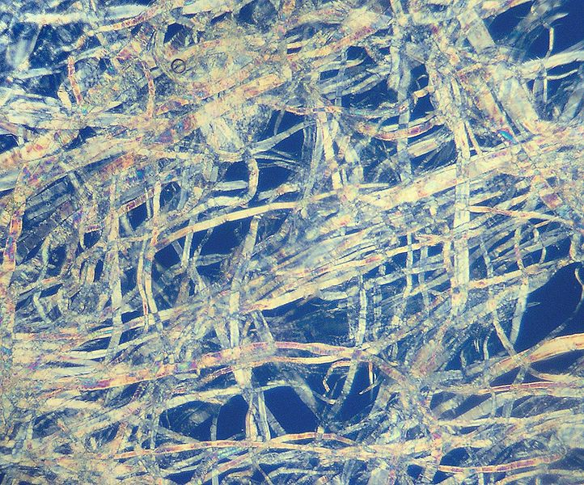

Il est des jours où l'on ne trouve pas comment commencer. La page blanche. La fameuse angoisse.

Alors pour la contrer, certains vont faire un tour. Ou vont mettre des mots sur des cartes mentales. Ou bien vont prendre la feuille, la plier en deux, en quatre, en huit…

Et là la question survient. Jusqu'où peut-on aller ?[^question-jugement] On se rend vite compte qu'en pliant et re-pliant le papier devient assez rapidement réfractaire… mais quid d'un monde idéal sans ce problème ? D'autres contraintes physiques vont tout de même venir nous embêter…

Eh bien qu'à cela ne tienne — c'est décidé, aujourd'hui je plie du papier. Encore, encore, et encore, jusqu'aux limites du possible :pirate:

[^question-jugement]: Ne jugez pas mes questionnements, je vous prie. Si si, je vous vois venir, vous là dans le fond :eyes:

# Notre beau papier

Le papier que nous utilisons en France et dans le monde[^usage-norme-iso-216] a généralement une taille a peu près constante. On a tous entendu parler des formats A4, A3, A5…

Dans ce format, qui commence à A0 avec une page de quasiment un mètre carré, plus le nombre est grand, plus la page est petite. A5 est une demi-page A4. A6, une carte postale. A7, une carte d'identité dans certains pays. A8, le format classique d'une carte de visite ou de cartes à jouer. Et ainsi de suite…

[^usage-norme-iso-216]: Plus précisément, ce format de papier est utilisé dans tous les pays sauf aux États Unis et au Canada.

## La logique des noms des formats de papier

Avant de plonger vers le monde des toutes petites pages, il nous faut comprendre comment on passe d'un nom de format à sa taille. Il y a une logique plutôt simple, en réalité.

Tout commence avec le format **A0**, la plus grande page définie habituellement. A0, c'est une page de 841 mm × 1189 mm. Ensuite, chaque page est conçue afin que plier en deux une page dans le sens de la longueur donne deux pages du format suivant (ainsi, une page A0 pliée en deux donne deux pages A1).

Alors, pour obtenir la taille du format A1, on prend comme longueur la largeur du format A0 (841 mm) et comme largeur, la longueur d'A0 divisée par deux (594,5 mm).

Et ainsi de suite, on utilise la même logique pour, successivement, A2, A3, A4, etc.

On peut donc assez facilement calculer toutes les tailles de papier :

- Format A1 : 841 mm × 594.5 mm
- Format A2 : 594.5 mm × 420.5 mm
- Format A3 : 420.5 mm × 297.25 mm
- Format A4 : 297.25 mm × 210.25 mm
- Format A5 : 210.25 mm × 148.625 mm
- Format A6 : 148.625 mm × 105.125 mm
- etc.

Maintenant, il est temps d'emprunter la réductrice. Ou le massicot, selon vos techniques favorites. Je ne juge pas.

# Première limite : l’épaisseur du papier

Une technique un peu naïve pour passer d'un format de papier au suivant, c'est de plier la feuille en deux — comme nous l'avons vu plus haut. Mais le pli successif a une limite, si on conserve la page entière à chaque fois : on peut considérer qu'on ne peut plier décemment une page si son épaisseur est supérieure à sa largeur.

Et ça arrive bien plus vite qu'on ne le pense, surtout si on part d'une page A0 : sachant qu'une page a une épaisseur d'environ 100 micromètres, que le nombre de pages superposées double à chaque pli, et que bien sûr la largeur des pages est à chaque fois divisée par deux… on se rend compte qu'à partir du format A0, on ne peut pas aller plus loin qu'**A8** ! Soit seulement huit plis avant d'être dépassé…

Et en réalité, on constate que cette limite de huit plis est toujours approximativement la même, et en soit c'est logique : si on part d'une feuille plus petite, on pourra aller plus loin, mais comme on divise toujours par deux à la même vitesse, on arrive au moment fatidique où l'épaisseur est supérieure à la largeur au même moment. Par exemple en partant du classique format A4 :

```
1 pli  : format A5 : 210.25 mm × 148.625 mm versus 0.2 mm d'épaisseur
2 plis : format A6 : 148.625 mm × 105.125 mm versus 0.4 mm d'épaisseur
3 plis : format A7 : 105.125 mm × 74.3125 mm versus 0.8 mm d'épaisseur
4 plis : format A8 : 74.3125 mm × 52.5625 mm versus 1.6 mm d'épaisseur
5 plis : format A9 : 52.5625 mm × 37.15625 mm versus 3.2 mm d'épaisseur
6 plis : format A10 : 37.15625 mm × 26.28125 mm versus 6.4 mm d'épaisseur
7 plis : format A11 : 26.28125 mm × 18.578125 mm versus 12.8 mm d'épaisseur
8 plis : format A12 : 18.578125 mm × 13.140625 mm versus 25.6 mm d'épaisseur
```

…et on n'atteint pas l'A12. ~~Nous n'iront donc pas vers la Bretagne.~~

# Seconde limite : les fibres

Mais cessons de plier nos feuilles pour nous intéresser aux tailles des formats elles-même. On utilise souvent des formats assez grands : A3, A4, A6… mais jusqu'où peut-on descendre ? Eh bien, ça va dépendre de ce qu'on prend comme limite…

Une feuille de papier n'est pas un matériau parfaitement lisse : il est composé de fibres microscopiques de cellulose, cette dernière étant la même qui compose la paroi des cellules végétales ou le bois.


Figure: Des fibres de cellulose, ici extraites d'un mouchoir en papier grossi 200 fois. ([Source](https://commons.wikimedia.org/wiki/File:Zellstoff_200_fach_Polfilter.jpg?uselang=fr))

Ces fibres ont une taille, donc si on réduit trop, on va finir par avoir une feuille de papier plus petite qu'une fibre qui la compose : ça passe difficilement. C'est une première limite ! Mais à quelle vitesse on y arrive ?


# Troisième limite : la lumière

# Quatrième limite : l'ultime Planck…

