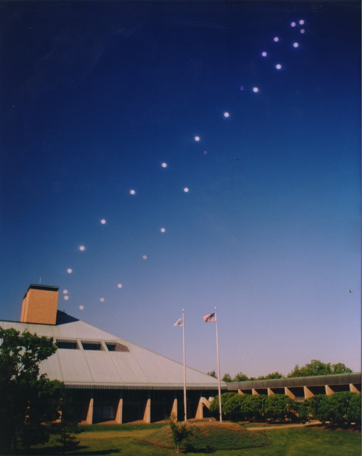
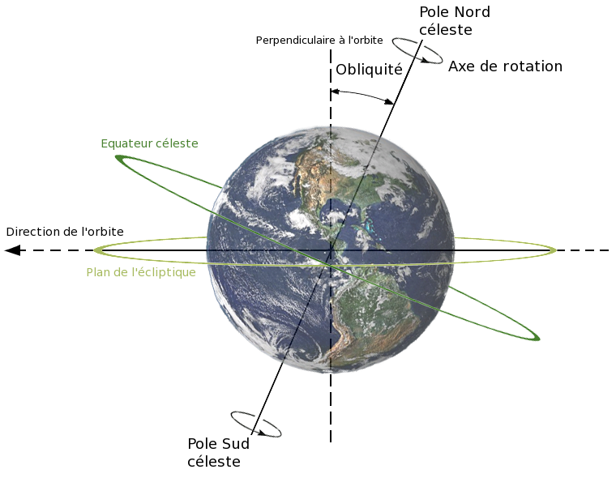
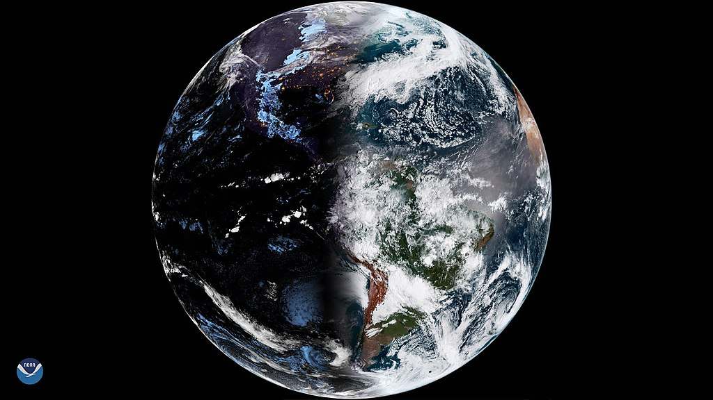
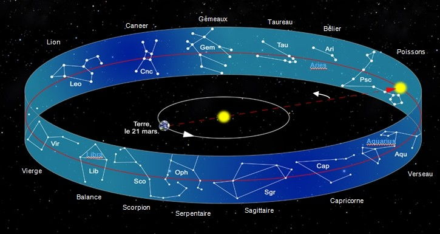

La diversité des civilisations a fait que l'Homme a répondu de plein de manières différentes à cette même problématique qu'est le fait de suivre le temps qui passe. Pour ce faire, il n'y a pas trente-six possibilités : il faut se baser sur un événement naturel, répétitif, et visible à l'œil nu — il faut s'imaginer les moyens de l'époque !

De tels événements facilement repérables, il n'y en a pas tellement… en fait, il y en a principalement deux : la Lune et ses phases ; et le Soleil et les saisons.

Nous sommes beaucoup plus habitués au second et pour cause — notre calendrier, le [calendrier grégorien](../03-gregorien), se base dessus : c'est un _calendrier solaire_. C'est assez naturel si on observe le cycle du Soleil au fil des mois, des saisons et des années : la position apparente de notre étoile dans le ciel semble osciller de haut en bas (avec des variations selon les zones géographiques, bien sûr).

Figure: La position du Soleil au fil de l'année 1998 – 1999 à Murray Hills, NJ, par [Jfishburn](https://commons.wikimedia.org/wiki/File:Analemma_fishburn.tif).

Le point de référence que l'on attend de voir revenir pour marquer une année est souvent le **point vernal** : c'est le moment où la position apparente du Soleil dans le ciel semble passer au dessus de l'équateur céleste (c'est à dire, une ligne dans le ciel au dessus de l'équateur terrestre).

Figure: L'équateur céleste, au dessus de l'équateur terrestre (par [DNA-Webmaster & Daelomin53](https://commons.wikimedia.org/wiki/File:Obliquite_plan_ecliptique.png?uselang=fr)). Au point vernal, le plan de l'écliptique, qui pointe en permanence vers le Soleil, est aligné avec l'équateur céleste (sur cette illustration, on n'est donc pas au point vernal).

Pourquoi ce moment précis ? Car il correspond en fait à ce que l'on connaît mieux sous le nom d'**équinoxe de printemps**. Et l'équinoxe de printemps, c'est facile à repérer : c'est l'un des deux seuls jours de l'année où le jour et la nuit ont exactement la même durée (l'autre étant celui d'automne, mais il est simple de les différencier grâce aux saisons). Pratique !

C'est pour cela que les premiers calendriers solaire commençaient en mars : ils démarraient… au point vernal ;) .

Figure: Juste pour le plaisir des yeux : la Terre au point vernal, parfaitement coupée en deux par le jour et la nuit, prise par le satellite [GOES East](https://fr.wikipedia.org/wiki/Geostationary_Operational_Environmental_Satellite) ([NOAA](https://www.flickr.com/photos/noaasatellites/47418902822/), domaine public).

## L'année tropique

Ce que l'on appelle l'année tropique, c'est justement la durée entre deux passages du Soleil au point vernal, et c'est ce sur quoi se basent la plupart des calendriers solaires (si ce n'est tous). Elle a, aujourd'hui, pour durée moyenne[^tropique-durée-moyenne] 365,242 190 4 jours, soit environ 365 jours, 5 heures, 48 minutes et 45 secondes.

La position du point vernal dans le ciel a légèrement tendance à bouger au fil du temps, car notre planète n'est pas parfaitement ronde, et que ça déséquilibre légèrement son axe de rotation[^précession-équinoxes]. On parle de _précession des équinoxes_.

Le printemps débutant _au passage du Soleil au point vernal_, il n'en est pas décalé dans notre calendrier, mais par rapport aux constellations, il a chaque année environ vingt minutes d'avance (tout de même)[^vingt-minutes].

[^précession-équinoxes]: Le Soleil et la Lune ont tendance à attirer de façon irrégulière la Terre à cause de ces déformations, ce qui a tendance à faire bouger l'axe de rotation.
[^vingt-minutes]: C'est à dire que si on regarde une année donnée le ciel précis au moment de l'équinoxe de printemps, l'année d'après, on retrouvera le même ciel _vingt minutes après_ l'équinoxe.
[^tropique-durée-moyenne]: On parle de durée _moyenne_ car l'année tropique a tendance à varier en durée (sur une soixantaine de secondes tous les 17 millénaires approximativement) ; on prend la durée moyenne entre les deux extrêmes. Actuellement, [d'après l'Institut de Mécanique Céleste et de Calcul des Éphémérides](ftp://ftp.imcce.fr/pub/misc/annee_tropique/annee_tropique.doc), on perd une demi-seconde par siècle (ça va).

## Une autre référence ?

Une autre façon de repérer une année, c'est de se baser sur la toile de fond du ciel : les constellations, et notamment celles du Zodiaque, qui sont alignées avec la course du Soleil dans le ciel. Le Soleil semble être “devant” une de ces treize constellations en permanence[^astrologie], donc on peut se dire que dés qu'il revient devant une constellation, il s'est écoulé un an ! Cette année a d'ailleurs un nom : _l'année sidérale_.

Figure: Le Soleil semblant, vu de la Terre, passer devant les différentes constellations du Zodiaque au fil de l'année.

**Mais en pratique ça ne marche pas.** Pourquoi ? À cause de la précession des équinoxes ! Chaque année, l'année tropique (celle qui se base sur le point vernal) a vingt minutes d'avance sur l'année sidérale (basée sur les constellations derrière le Soleil). Ce qui voudrait dire que chaque année, les saisons auraient vingt minute d'avance par rapport à l'année précédente… et au bout de quelques temps, on retrouverait le début du printemps en août. Gênant.

C'est pour ça que nos calendriers utilisent l'année tropique : on préfère garder des saisons alignées, car ça nous importe plus que les constellations du ciel, qui donc se décalent, petit à petit, faisant un tour complet tous les 26 000 ans…

## Et la Lune dans tout ça ?

Je mentionnais en introduction une autre façon de synchroniser un calendrier : la Lune. Eh bien ça, ce sera pour demain… ;)