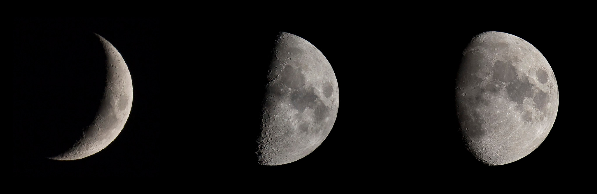

Pourquoi pas la Lune ?

C'est ce qu'on dû se dire les premiers concepteurs de calendriers basés non sur notre étoile — tel notre calendrier grégorien — mais sur notre satellite naturel et ses phases.

Avec le Soleil, on s'intéressait à [l'année tropique](../04-calendriers-solaires) pour fixer le point de retour du cycle d'une année. Pour la Lune, il est quelque chose de bien plus simple à repérer : les _phases_ de cette dernière. Les calendriers lunaires sont donc basés sur un _mois_ et non une année, car les phases de la Lune cyclent sur une durée d'une trentaine de jours.

Un mois d'un calendrier lunaire correspond à la durée que met la Lune à retrouver une même phase. On peut aussi voir ça comme la durée entre deux alignements successifs  dans cet ordre de la Terre, la Lune, et le Soleil (ce qui correspondrait à une nouvelle lune).

La Lune tourne autour de la Terre en un peu plus de 27 jours (le mois lunaire). Mais pendant ce temps, la Terre a un peu tourné autour du Soleil ! Pour retrouver la même _phase_, il faut que le Soleil soit à la même place par rapport à la Terre et à la Lune (ainsi, vu de la Terre, la Lune est éclairée par le Soleil de la même façon) : on parle de mois lunaire *synodique*. Il faut deux jours de plus : un mois lunaire synodique dure environ 29 jours et demi[^mois-lunaire].

Le premier jour des calendriers lunaires est souvent celui de la nouvelle lune, ou bien de la première apparition du fin croissant après la nouvelle lune : c'est en effet beaucoup plus simple à repérer dans le ciel que la pleine lune, délicate à différencier d'une lune quasiment pleine mais-pas-tout-à-fait :p .

[^mois-lunaire]: Plus précisément 29,530588853 jours (la précision c'est important).

## Décalages & ajustements

Les calendriers basés sur la Lune essaie d'avoir des mois d'une durée la plus proche possible d'une lunaison. Cependant, comme il n'y a pas un nombre entier de jours, on retrouve les mêmes problèmes qu'avec nos calendriers solaires et leurs années bissextiles : il faut ajouter des jours intercalaires pour rester synchronisé avec les phases de la Lune.

Les différents calendriers utilisent des stratégies variées pour ajouter des jours. Mais concrètement, si les mois font 29 jours, il faut ajouter environ un jour tous les deux mois, et en plus, trois jours tous les 100 mois, pour être approximativement synchronisé.

Et autre problème : comme il n'y a pas un nombre entier de lunaisons par an, ces calendriers se décalent petit à petit par rapport aux saisons, ce qui n'est pas bien pratique, par exemple pour l'agriculture ! C'est pour quoi il n'y a plus beaucoup de calendriers purement lunaires[^calendrier-purement-lunaire] : la majorité utilisent des astuces pour avoir le “meilleur des deux mondes”. Mais ça, c'est au programme de demain !

[^calendrier-purement-lunaire]: Parmi les plus connus, il y a le calendrier hégérien (musulman) que nous croiserons dans pas si longtemps :)