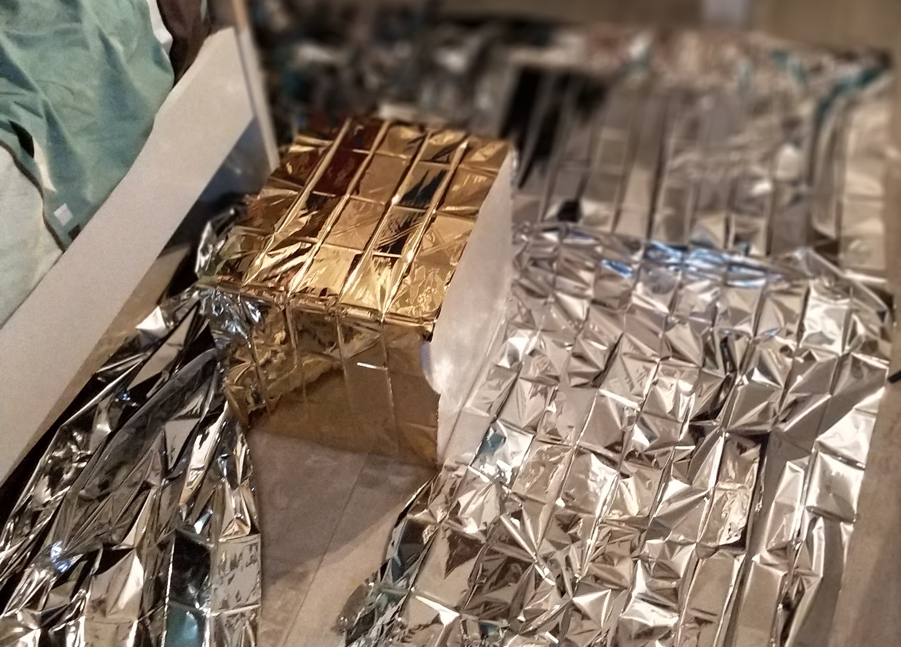
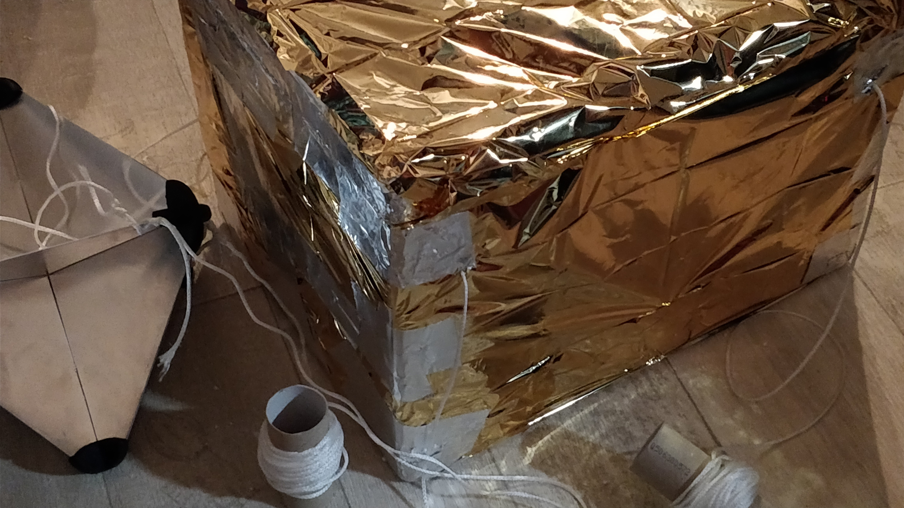
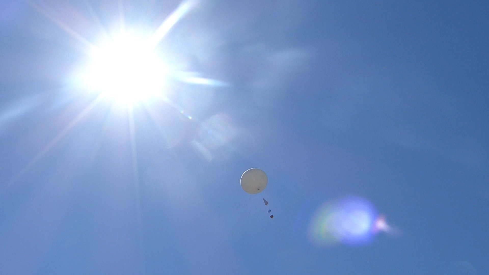
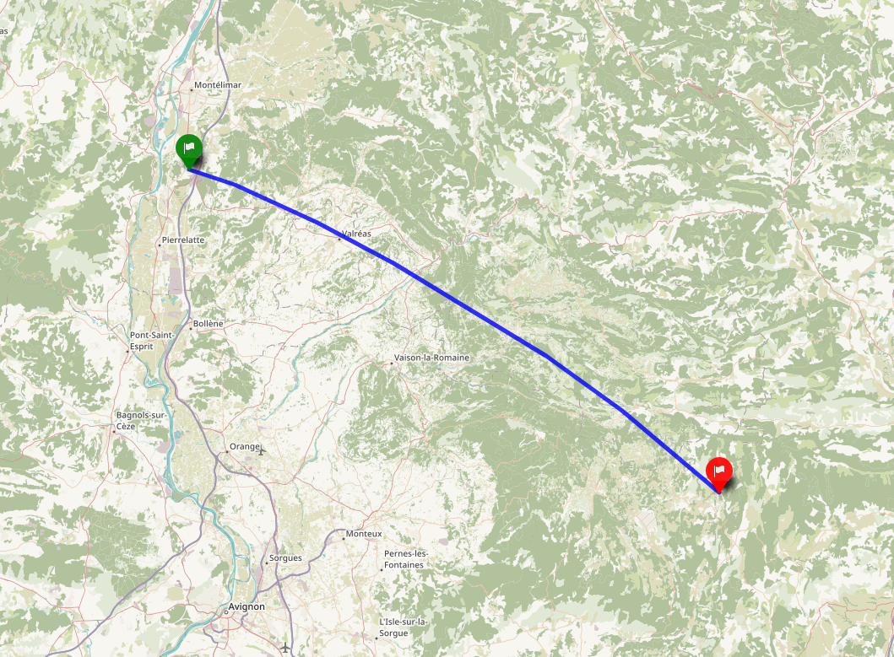

_Cette page est en cours de rédaction. Revenez plus tard ! Le site n'est pas encore officiellement lancé._

Lancer un ballon-sonde ne s'improvise pas la veille pour le lendemain. En l'occurrence, le projet SABLET a débuté au début de l'année 2017 (pour un lancement en août de la même année). Initialement, [Timothée Bailly](https://twitter.com/Yoku_Sama) était seul sur le projet, rejoint au milieu de la préparation par [Amaury Carrade](https://amaury.carrade.eu).

Oh, six mois n'étaient pas vraiment nécessaires pour mener le projet à bien — mais nous n'avions pas 100 % de notre temps à consacrer, et (mais ce sera évoqué plus tard) certains soucis administratifs ont décalé le lancement.

# Préparer l'envol

[tweet="https://twitter.com/Yoku_Sama/status/870725624268193793"]

Les premiers mois furent consacrés à la mise au point de ce que l'on voulait faire, et aux renseignements et contacts concernant les possibilités que l'on avait. L'objectif initial était clair : réussir l'envol (le premier de cette envergure pour Timothée), et obtenir de belles photographies et films de la Terre vue de la stratosphère, incluant idéalement la courbure de notre planète. Après discussions, s'ajouta celui de prendre des mesures de température, pression, et proportion d'ozone régulièrement dans l'atmosphère grâce à des capteurs intégrés au ballon.

Mais concrètement, que lance-t-on exactement ? L'ensemble des différentes parties du ballon et de ce qu'il transporte s'appelle la _chaîne de vol_, et elle est constituées de différentes parties ayant chacune son intérêt.

- Le ballon, gonflé d'hélium, sert à… transporter tout ce petit monde en haute atmosphère.
- Le parachute permet d'éviter que la nacelle ne retombe trop violemment au sol et ne se brise ou n'abîme les composants embarqués : une fois arrivé à l'altitude maximale, le ballon explose et sans ça, la nacelle chuterait à grande vitesse depuis une altitude d'environ 30 kilomètres !
- Le rélfecteur radar est une obligation légale ; il sert à ce que le ballon puisse être visible sur les radars des autres appareils volants ou non.
- Enfin, la nacelle contient ce que l'on veut concrêtement envoyer en l'air : caméra, capteurs, batteries…

Figure: La chaîne de vol

Nous nous sommes entendus sur cette [liste de matériel](/sablet/materiel) : 

- un **ballon** (oui) pour soulever jusqu'à 1200 grammes, de 3,5 m³ ;
- un **parachute** ;
- un **réflecteur radar** ;
- une **boîte en polystyrène expansé**, formant la nacelle et contenant tout ce qu'on embarquera dans le ciel ;
- une **couverture de survie**[^mylar], utilisée pour renforcer l'isolation thermique de la nacelle en polystyrène ;
- un **GPS** contactable à distance (dans notre cas par GSM) pour pouvoir retrouver le ballon (sinon, comment savoir où il est tombé ?) ;
- une **caméra** autonome et résistante, filmant en 720p 60 FPS pendant toute la durée du vol ;
- un **RaspberryPi**, un ordinateur miniature, pour servir de cerveau à bord ;
- deux **capteurs de température** (un à l'intérieur et un à l'extérieur de la nacelle) ;
- un **capteur de pression** placé à l'extérieur ;
- une cinquantaine de mètres de **cordelette** pour lier tous les éléments entre eux ;
- et enfin **3 400 litres d'hélium** pour gonfler le ballon[^quantité-helium].

[^mylar]: Fabriquée en mylar, autrement dénommé polytéréphtalate d'éthylène.
[^quantité-helium]: Le calcul permettant de déterminer la quantité d'hélium est détaillé [sur la page dédiée au matériel](/sablet/materiel).

En juin, nous commençâmes à [recevoir les pièces](/sablet/materiel), commandées sur Internet. Il s'agissait de tester le matériel, s'assurant par exemple que la caméra pouvait tenir suffisamment longtemps, mais aussi réfléchir à comment tout assembler proprement. Nous avions trois principales contraintes : 

- le **poids** de la charge utile[^charge-utile], qui était très limité, car il fallait que le ballon puisse décoller et aller haut[^limite-poids] ;
- les **limites du matériel** : la température descend très bas en haute altitude, et tout ce que nous voulions embarquer ne supportait pas de telles conditions ; aussi, il fallait que les appareils devant communiquer avec le sol… puissent le faire[^blocage-gps] ;
- la **loi**, eh oui, qui [impose d'embarquer certains éléments et de respecter certaines normes](/sablet/loi), notamment de vitesse d'ascension.

[^charge-utile]: La charge utile, c'est simplement ce que le ballon transporte… _d'utile_, en plus de lui-même (la nacelle, la caméra, le GPS, les capteurs…).
[^limite-poids]: Quand on monte ce genre de projets, on se retrouve très vite à chercher à économiser le moindre gramme. Ce fut d'ailleurs un des critères du choix des capteurs embarqués, et de tout le reste du matériel d'ailleurs (vous trouverez [plus de détails sur la page dédiée au matériel](/sablet/materiel)). _In fine_, nous sommes arrivés à une masse tout juste au delà du kilogramme (pour la nacelle uniquement).
[^blocage-gps]: Plus de détails sur ça un peu plus bas…

## Tester les limites du matériel

Il fut plus simple de tester certains éléments que d'autres. Les composants électroniques embarqués furent assez simple à tester, dans les limites que nous le faisions sur Terre et non aux températures réelles auxquelles ils allaient être exposés. Cela nous a d'ailleurs donné l'occasion de publier certains de ces tests lorsqu'ils se révélèrent jolis — par exemple, cet innocent _timelapse_ initialement publié sur Instagram a été tourné pour s'assurer que la batterie de la caméra tournerait suffisamment longtemps.

Figure: Tester la caméra avec de jolis _timelapses_ (trois heures compressées en trente secondes).

Pour d'autres éléments, il n'était pas vraiment possible de tester, ou de manière très limitée. Difficile, par exemple, de s'assurer du bon déploiement du parachute… sans envoyer un autre ballon (et ce bien que nous annoncions avant le lancement que nous comptions faire ce test !). Aussi, nous n'avions pas de chambre froide pour tester l'isolation de notre nacelle en polystyrène face à une température extérieure de -50 °C, ni pour nous assurer que nos capteurs exposés résisteraient à de telles températures. Cela dit, ce ne fut pas un réel problème étant donné que les limites étaient généralement précisées sur les notices ou _datasheets_ des éléments utilisés.

[tweet="https://twitter.com/Yoku_Sama/status/871437949853982723"]

On pourrait penser que ce qui limite la résistance de l'électronique embarquée, ce sont les parties actives (caméras, capteurs…). En réalité le facteur bloquant est tout autre, ces parties actives fonctionnant généralement sans problème à des températures très basses. Non, ce à quoi il faut faire attention quand on envoie de l'électronique à très basse température, ce sont les **batteries**.

Les batteries fonctionnent grâce à des réactions chimiques qui sont beaucoup moins efficaces lorsqu'il fait froid. Dans notre cas et d'après nos relevés, l'intérieur isolé de la nacelle est tombé à -20 °C, une température que nous avions approximativemnt anticipé. Nous n'avions pas jugé nécessaire de chauffer au delà de l'isolation pour éviter que les batteries ne meurent (même si nous l'avions envisagé sérieusement), et tout s'est finalement bien passé, mais avec des batteries plus sensibles au froid ou par simple prudence, il peut être un bonne idée d'y songer (par exemple grâce à des lingettes chauffantes, ou une seconde couche d'isolant autour des batteries).

## Trouver le bon endroit

Notre objectif était certes de lancer le ballon, mais aussi de le récupérer, tant pour pouvoir éventuellement le réutiliser que pour pouvoir récolter les données collectées (film et mesures). Il fallait donc soigneusement choisir le lieu de lancement afin qu'il ne finisse pas, par exemple, dans la mer[^note-mer]… En effet, impossible de contrôler sa trajectoire : une fois lancé, il vogue au gré des vents des différentes altitudes qu'il traverse.

Il existe des outils pour simuler, en prenant les prévisions relatives aux vents d'altitude en compte, la trajectoire et le point de chute d'un ballon stratosphérique, et nous nous en sommes servis pour choisir le point précis de lancement. Seul problème : les prévisions se limitent à quelques jours, et la DSAC exige une déclaration de vol _incluant la localisation précise du décollage_ au moins un mois auparavant…

En réalité ce fut un problème plutôt simple à contourner : nous avons déclaré un lieu suffisamment loin de la mer avec une grosse marge (en l'occurrence, dans la région de Valence), localisation qui fut affinée (sans déclaration) par la suite — pas très légal strictement parlant, mais sans conséquences non plus. _In fine_, nous sommes partis beaucoup plus au sud, vers Montélimar.

Pour anticiper le point de chute du ballon et, de là, choisir le lieu et l'heure idéaux du lancement, nous avons utilisé [_ASTRA Planner_](http://astra-planner.soton.ac.uk/), un utilitaire mis à disposition par l'université de Southampton, dont je présente un exemple de prédiction ci-dessous. En utilisant les données récoltées par les stations métérologique et les modèles de l'atmosphère, et en connaissant les propriétés du ballon (masse, type de parachute, aérodynamisme…), il simule des trajectoires probables du ballon, ce qui permet d'avoir une idée du point de chute. La position précise n'est pas très importante, tant que c'est loin de l'eau : elle nous permettra surtout de s'assurer donc qu'on pourra retrouver le ballon, et de savoir approximativement dans quelle direction se diriger.

Figure: Une simulation réalisée plus récemment, en août 2018, pour donner un exemple. Le point rouge montre le décollage, les points bleus les aterrissages hypothétiques, et les jaunes les lieux d'explosion du ballon, en altitude.  
On notera que les vents, dans cette simulation, vont dans la direction opposée de ce que nous avions en août 2017 pour le vol de notre ballon. Ils se dirigeaient alors vers le sud est, en passant au dessus du Mont Ventoux pour aterrir un peu derrière. Un plan de la réelle trajectoire du ballon sera donné plus bas.  
On peut également y voir la direction différente des vents d'altitude, au revirement de la trajectoire au milieu (lorsque le ballon est haut) par rapport à sa trajectoire lorsqu'il est plus bas en altitude, au début et à la fin.

[^note-mer]: Notre localisation de base étant proche de la mer, c'était quelque chose qu'il fallait tout particulièrement prendre en compte.

## Se conformer à la loi

En plus des contraintes de matériel embarqué et de vitesse sus-mentionnées, la loi nous contraint également à une déclaration de lancement auprès de la DSAC.

[tweet="https://twitter.com/Yoku_Sama/status/871302979479105536"]

Nous nous sommes un peu fait avoir à ce niveau car nous attendions une réponse, alors que la demande est sous-entendue acceptée en cas de silence de l'administration de plus de trois semaines. Ils ne répondent généralement que s'ils ont quelque chose à redire — ou si ça leur chante, comme ce fut le cas pour notre seconde demande.

[tweet="https://twitter.com/Yoku_Sama/status/898245818364329988"]

Vous trouverez tous les détails relatifs à la loi [sur la page dédiée à ce sujet](/sablet/loi) ;) .

*[DSAC]: Direction de la sécurité de l'Aviation civile

## Préparer les codes

Nous embarquions des capteurs ; il fallait bien monter un système pour collecter les données et les stocker pendant le vol afin de les récupérer ensuite. Pour ce faire, nous avons utilisé un [Raspberry Pi](https://www.raspberrypi.org/) qui contrôlait les capteurs de température et de pression et stockait les données sur sa carte SD. (Aucun système d'envoi en continu des données n'était prévu, donc en cas de perte du ballon, on perdait les données avec…) Les caméras et GPS, quant à eux, fonctionnaient indépendemment.

Le détail du fonctionnement du RaspberryPi et les codes sources expliqués sont disponibles [sur la page dédiée à la technique](/sablet/technique).

# La veille du lancement

[tweet="https://twitter.com/Yoku_Sama/status/897826883949264896"]

Comme pour tout projet qui se respecte, l'essentiel de l'assemblage des composants (testés autant que faire se peut) fut réalisé la veille[^réalisé-la-veille]. La veille, car fondamentalement, il n'était pas si utile de le faire des dizaines de jours avant (ça reste assez simple à monter), mais aussi car c'était un jour où nous étions physiquement au même endroit (en temps normal, des centaines de kilomètres nous séparent).

[^réalisé-la-veille]: C'est faux, tous les bons projets ne font pas ça — ne suivez pas ce conseil, il n'est pas bon :-°

Ce fut également l'occasion de finaliser les montages électroniques et les codes sources associés, intégrés dans la nacelle et en dehors (pour les capteurs extérieurs), afin de s'assurer que tout aille bien et se goupille et d'ajouter quelques sécurités sur le stockage des données (mentionnées dans [la page dédiée](/sablet/technique)).

[tweet="https://twitter.com/AmauryPi/status/897874033374613506"]

Au delà de cela, ce fut également l'occasion de fixer (définitivement) sur la nacelle sa protection thermique secondaire (en l'occurrence, une couverture de survie)[^note-erreurs-couverture-survie], sans oublier de laisser une ouverture pour placer la caméra[^ouverture-camera].

Figure: La couverture thermique du ballon sonde en cours de fixation

Enfin, le couvercle de la nacelle est fixé au reste via une charnière en adhésif métallique, afin de pouvoir placer le lendemain tous les composants à l'intérieur ; le couvercle sera scellé juste avant l'envol. Il ne reste plus qu'à fixer les cordelettes à l'élément suivant de la chaîne de vol (le réflecteur), et on est bon pour la journée ! Au passage, la nacelle a prit un magnifique air de satellite…

Figure: La nacelle reliée au réflecteur radar via quatre cordelettes de dix mètres chacune.

[^note-erreurs-couverture-survie]: Et de se planter de bien trop nombreuses fois sur le bon sens des couvertures, les couleurs variant selon les constructeurs… mais chhhht (cela dit faites attention à ce détail si vous faites votre ballon ! se tromper de sens ruine complètement l'intérêt de la couverture de survie, et revient à ne pas en mettre du tout).
[^ouverture-camera]: Nous nous accorderons sans difficulté sur le fait que filmer une couverture de survie pendant deux heures n'a que peu d'intérêt.

# Le jour J

Ça y est, le jour tant attendu est arrivé… mais il reste à faire avant de pouvoir lancer le ballon ! Tous les composants embarqués, les codes, sont prêts, mais il reste à tout assembler et à (accessoirement) gonfler le ballon… Ce sera fait une fois sur le lieu de lancement. En route !

En direction de Valence, nous nous arrêtons vers Montélimar. Notre objectif : repérer un terrain dégagé et sans lignes électriques passant au dessus — ce que nous trouvons finalement après un peu de route dans la campagne drômoise. Le trajet est également l'occasion de corriger les derniers détails des programmes qui vont tourner sur le RaspberryPi afin de les rendre plus robustes… ah, la joie des correctifs de dernière minute :p .

## Assemblage final

Il ne restait plus grand chose à faire concernant la charge utile embarquée. Tout était lié, connecté ; une fixation à la nacelle et on était bons. J'ai bien dit « fixation » : afin d'éviter tout problème pendant le vol, tous les éléments sont attachés solidement au sol ou aux paroies de la boîte. Seuls trois éléments sortent de la nacelle : la caméra, bien sûr, et deux capteurs (un de température, pour mesurer la température extérieure et un de pression). Les capteurs sont maintenus un peu écartés de la paroie, pour ne pas fausser les mesures (surtout de température). Maintenus écartés… un peu comme on peut, mais tant que ça marche eh…

Figure: Le contenu de la nacelle (sauf la caméra, qui n'était pas encore placée au moment de la prise de la photo). RaspberryPi et batteries ne sont pas encore fixées sur cette prise, mais ça ne saurait tarder…

Comme vous pouvez le constater, une platine d'expérimentation (_breadboard_) est utilisée pour connecter les capteurs aux RaspberryPi, car nous n'avions pas de matériel de soudure, et que c'était beaucoup plus simple à gérer ainsi. Les programmes d'acquisition du RaspberryPi étant [configurés pour démarrer automatiquement avec le micro-ordinateur](/sablet/technique), le Pi est laissé débranché et ne sera allumé que juste avant le décollage, afin d'épargner la batterie le plus possible. En effet, sa durée de vie sera altérée par la température bien en deça de ses conditions normales de fonctionnement, donc autant ne pas tenter le diable et rester économe.

À l'extérieur, les capteurs se préparent à capter. Sur la photographie ci-dessous, le capteur de température n'est pas à sa position définitive : il sera placé de biais, appuyé sur la diode électroluminescente rouge que l'on aperçoit, de façon à ce que le capteur (l'extrémité noire) soit la plus éloignée possible de la surface, afin donc d'éviter de perturber la mesure. À la réflexion, il y aurait eu d'autres façons bien plus propre d'arriver à cet objectif… mais ça s'est fait ainsi, avec ce dont on disposait sur le moment.

![Vue de près de la paroie extérieure de la nacelle abritant les capteurs. On y voit un capteur de pression sous la forme d'une plaque bleue scotchée à la paroie perpendiculaire à cette dernière, duquel partent quatre fils (verts, jaunes, rouges et noirs), à droite, un capteur de température, tout petit composant noir approximativement cubique, duquel partent trois fils (noirs, rouges et blancs), au centre, ainsi qu'une diode électroluminescente rouge, ne servant qu'à éloigner le capteur de température de la paroie, à gauche.](Contenu-externe-nacelle-annot%C3%A9.jpg)
Figure: Les capteurs externes à la nacelle.

Le dernier “capteur” testé est le GPS. Contactable à distance via le réseau GSM (concrètement, par SMS), il est indispensable pour pouvoir retrouver le ballon. Initialement, nous prévoyons de le mettre dans la nacelle… mais ce serait oublier que la couverture externe de cette dernière bloque les communications GPS et GSM ! Nous aurions alors un GPS embarqué mais inutile. C'est pour cette raison que notre balise fut finalement attachée au réflecteur radar, directement à l'air libre. Il résistera sans le moindre problème aux basses températures et pressions.

Concernant la nacelle, il ne reste qu'à ajouter une petite note en cas de perte (bien qu'équipé d'un GPS, nous préférons être prudents…), et c'est prêt !

[tweet="https://twitter.com/AmauryPi/status/898129002321379329"]

## Gonflage

La dernière étape est la plus évidente : gonfler le ballon, notre moyen de propulsion pour atteindre la stratosphère, à partir d'une bouteille d'hélium. La seule chose à laquelle il faut faire attention est le niveau de gonflage : pas assez gonflé, et il n'aura pas une vitesse suffisante d'ascension (cette dernière doit être, au moins, de 5 mètres par seconde) ; trop, et il n'ira pas aussi haut que possible.

En effet, plus le ballon monte et plus il se dilate, car la pression de l'air diminue avec l'altitude. Le diamètre initial de deux mètres (nous concernant) pourra se voir multiplié par sept. Arrivé à une certaine altitude, lorsque la résistance du ballon devient inférieure à la pression de l'hélium qu'il contient, il explose, et naturellement la nacelle retombe, scellant alors l'altitude maximale de la croisière. Si dés le départ, le ballon est très gonflé, sa paroie très tendue, l'altitude à laquelle sa résistance sera insuffisante diminuera logiquement. Il faut donc trouver un juste milieu entre vitesse minimale légale d'ascension et altitude maximale.

Figure: Le ballon en train d'être gonflé.

Pour calculer la quantité d'hélium à insufler dans le ballon, il faut prendre en compte le poids total de la chaine de vol, qu'il aura à soulever. Notre objectif est d'atteindre une vitesse d'ascension tout juste supérieure à la limite légale, afin de minimiser la quantité d'hélium et donc de maximiser l'altitude, tout en restant dans les clous de la loi française.

Vous pouvez réaliser le calcul à la main (les détails sont donnés ci-dessous dans le bloc masqué), ou encore utiliser des outils existants qui font le calcul pour vous. Par exemple, le [_Balloon Performances Calculator_](http://tools.highaltitudescience.com) de _[High Altitude Science](http://highaltitudescience.com)_, mais il y en a bien d'autres. Dans notre cas, pour atteindre une vitesse d'ascension de 5 mètres par seconde, et au vu de la masse transportée (1743 grammes tout inclu), il nous fallait 4,27 mètres cube d'hélium.

Et c'est en gonflant que l'on se rend bien compte que oui, la poussée d'Archimède, elle tire (fort !).

[[s]]
| Le calcul à la main n'est qu'une simple application du principe d'Archimède, prenant en compte les masses du ballon lui-même et de la charge utile (nacelle, parachute, réflecteur, …).
|
| Si l'on suppose qu'il n'y a pas de vent, la chaîne de vol est soumis à trois forces :
| - son poids $P$ ;
| - la poussée d'Archimède que je noterai $\Pi$ ;
| - et la force de traînée $T$.
|
| Le poids de la chaîne est elle-même constituée des poids du ballon, de l'hélium, et de toute la charge utile. On note : 
| - $m$ et $m_{hélium}$ les masses des différentes parties de la chaîne de vol (resp. la masse et l'hélium) ;
| - $\rho_{air} = 1,170\, \mathrm{kg\, m^{-3}}$ et $\rho_{hélium} = 0,178\,  \mathrm{kg\, m^{-3}}$ les masses volumiques respectives de l'air et de l'hélium ;
| - $C_x$ le [cœfficient de traînée](https://fr.wikipedia.org/wiki/Coefficient_de_tra%C3%AEn%C3%A9e) du ballon ($1 \over 2$ pour une sphère) ;
| - $S$ la surface de l'enveloppe du ballon gonflée projetée sur le sol ;
| - $g = 9,81 \, \mathrm{m\, s^{-2}}$ l'accélération de pesanteur terrestre.
|
| On a :
| - $P = g \left(m + m_{hélium} \right)= g \left(m + \rho_{hélium} \cdot V_{hélium} \right)$ ;
| - $\Pi = g \left(\rho_{air} \cdot V_{hélium}\right)$ (égale au poids de l'air déplacé) ;
| - $T = \frac{1}{2} \rho_{air} C_x S v^2$.
|
| Afin que le ballon décolle, il faut que $\Pi > P$. Il est alors simple de calculer le volume minimal d'hélium que l'on devra mettre en résolvant l'inégalité. On note, afin d'aérer les calculs, $m = m_{charge} + m_{enveloppe}$.
|
| $$ \Pi > P \Longleftrightarrow \rho_{air} \cdot V_{hélium} > m + \rho_{hélium} \cdot V_{hélium} $$
|
| Ce qui revient à dire que le volume minimal pour que le ballon décolle est :
|
| $$ \displaystyle V_{hélium,\ minimal} = \frac{m}{\rho_{air} - \rho_{hélium}} $$
|
| Mais, le travail ne s'achève pas ici. En effet, ce volume est le volume _minimal_, comprendre que si le ballon est rempli de ce volume exactement, il sera stationnaire en l'air, la poussée d'Archimède compensant exactement le poids de l'ensemble. Or, nous voulons que le ballon décolle, et plus encore, qu'il se stabilise à une vitesse donnée $v = 5\, m s^{-1}$.
|
| Pour cela il y a deux façons de procéder. On peut s'embêter à résoudre l'équation différentielle donnée par la deuxième loi de Newton, ou simplement considérer qu'une fois la vitesse du ballon stabilisée, l'accélération devient nulle et la traînée, égale à la force ascentionnelle : $T = \Pi - P$. Alors : 
|
| $$ T = \frac{1}{2} \rho_{air} C_x S v^2 = \Pi - P$$
|
| Et donc, si l'on veut calculer la vitesse à partir d'une quantité d'hélium :
|
| $$ \displaystyle v = \sqrt{\frac{\Pi - P}{\frac{1}{2} \rho_{air} C_x S}} = \sqrt{g \frac{V_{hélium}(\rho_{air} - \rho_{hélium}) - m}{\frac{1}{2} \rho_{air} C_x S}} $$
|
| Ou, si l'on veut le volume à partir de la vitesse $v$ de croisière cible :
|
| $$ \displaystyle V_{hélium} = \frac{\frac{v^2 \rho_{air} C_x S}{2g} + m}{\rho_{air} - \rho_{hélium}} $$
|
| Aux approximations près sur le cœfficient de traînée ou la surface exposée du ballon, on retrouve numériquement des valeurs proches de volume d'hélium qu'avec un calculateur. Bien que ces derniers restent, je l'admets, plus simples à utiliser…

## Le moment est venu de quitter le nid

Le ballon est gonflé ? Fermé ? Attaché au reste ? Tout est scellé, fixé, les appareils électroniques démarrés ? Eh bien qu'attendons-nous, lançons ! Tout le travail étant fait au préalable, il ne reste plus grand chose à vérifier, si ce n'est que les câbles ne sont pas emmelés et que le ciel est dégagé de tout obstacle. Et c'est parti… les quelques efforts portent enfin leurs fruits — plus qu'à espérer que l'aventure se termine bien !

Figure: Le ballon s'envole dans le ciel, avec son parachute, son réflecteur et sa nacelle (hors cadre).

[tweet="https://twitter.com/Yoku_Sama/status/898142436228296704"]

Une fois le ballon parti, il peut être une bonne idée de refaire [une simulation de trajectoire](#trouver-le-bon-endroit) afin de prévoir l'emplacement approximatif d'atterrissage en utilisant les dernières données météorologiques, et de pouvoir s'y diriger en anticipant la position avant que le GPS ne réponde. En effet, celui-ci étant contacté par SMS, il cesse très vite d'être dans la portée du réseau, qui ne monte pas très haut en altitude. Pendant la majorité du vol, on est complètement  en aveugle, sans rien pouvoir faire d'autre qu'espérer que tout se passe bien.

[tweet="https://twitter.com/Yoku_Sama/status/898162512306335744"]

Vient donc le moment de l'attente, ponctué de régulières tentatives de contact du GPS.

Le ballon se tait.

Silence.

Silence assourdissant.

Une heure s'écoule… une heure et demi… Silence. On ne peut que deviner ce qui se passe, supposer l'emplacement et l'altitude approximatives du ballon.

[tweet="https://twitter.com/Yoku_Sama/status/898166630815068160"]

Quand soudain !

[tweet="https://twitter.com/AmauryPi/status/898174435420712962"]

À ce moment, le vol n'est pas encore achevé, mais la nacelle, sous son parachute, est descendue assez bas pour que le GPS puisse se connecter au réseau GSM et répondre aux SMS. En envoyant des demandes régulièrement, on voit qu'il se déplace toujours doucement. Il est par ailleurs dans la zone anticipée par simulation, bien que proche de la plus lointaine des prédictions (tout ne peut pas être parfait !). Un peu plus tard, la position GPS retournée finit par se stabiliser : le ballon a touché terre ! Plus qu'un peu de route puis de marche…

[tweet="https://twitter.com/AmauryPi/status/898194677077331968"]

…et c'est un succès !

[tweet="https://twitter.com/Yoku_Sama/status/898219584129576960"]

En réalité, nous avons eu beaucoup de chance dans cette aventure : les conditions météo étaient très favorables, ciel sans nuage, le vent a permis au ballon d'aller à une certaine distance mais pas non plus trop loin, et au sol, le ballon est tombé dans un champ non cultivé, soit ni dans une propriété privée, ni fermée, ni dans un arbre ou une forêt… Quant aux outils embarqués, à deux détails près, tout a très bien marché ! Le vol s'achève d'une manière plus que satisfaisante.

_In fine_, le ballon aura parcouru un peu plus de 80 kilomètres, passant au dessus du Mont Ventoux pour finir dans un champ de lavande, après s'être élevé jusqu'à 38 kilomètres au dessus de la surface de notre bonne vieille planète. Pas assez pour être considéré comme “dans l'espace”[^karman], mais tout de même très satisfaisant pour un ballon sonde (nous sommes très proche du maximum théorique pour ce genre d'aérostats).

[^karman]: La limite arbitraire entre la Terre et l'espace, appelée _ligne de Kármán_, est située à 100 kilomètres au dessus de la surface terrestre.

Figure: Le trajet du ballon-sonde. [Cliquez ici pour ouvrir une version interactive.](https://framacarte.org/fr/map/trajet-de-sablet_29584)

# Et après ?

L'aventure ne s'arrête pas là ! Le ballon a accumulé plein de données et d'images, ce serait dommage de les laisser dans la boîte ;) .

La caméra a filmé presque tout du long, s'arrêtant sans raison connue quelques minutes avant l'atterrissage, ce qui est dommage, mais bien moins grave que si elle s'était interrompue en plein vol. Vous trouverez les vidéos complètes ou découpées [sur la page dédiée aux vidéos](/sablet/videos).

Figure: _The Blue Marble_ (vu de très près)